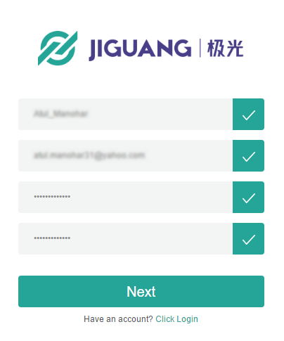
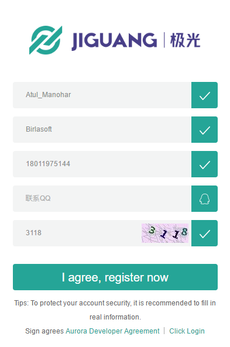
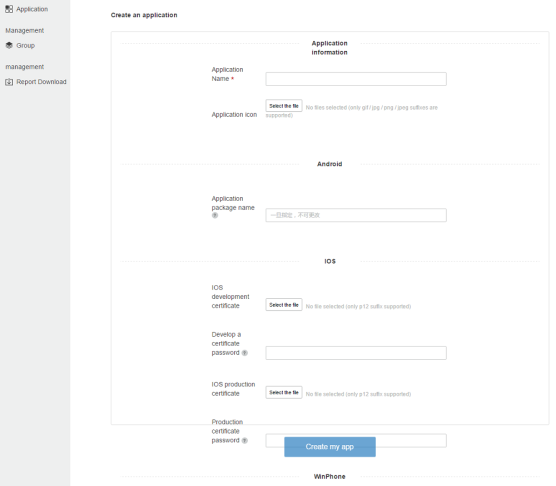
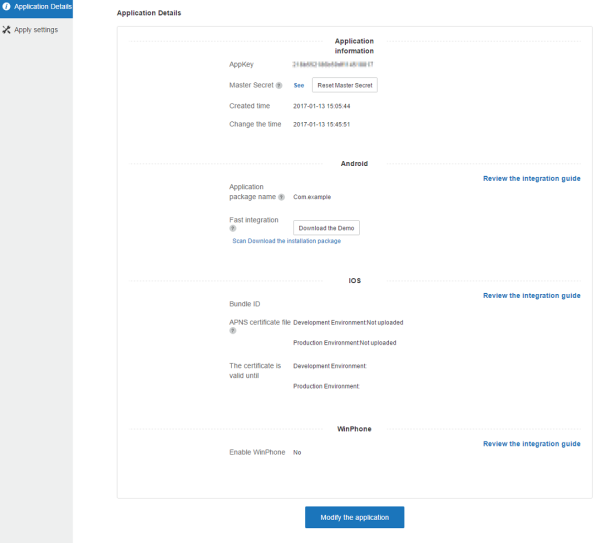
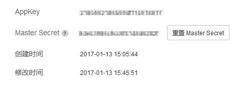
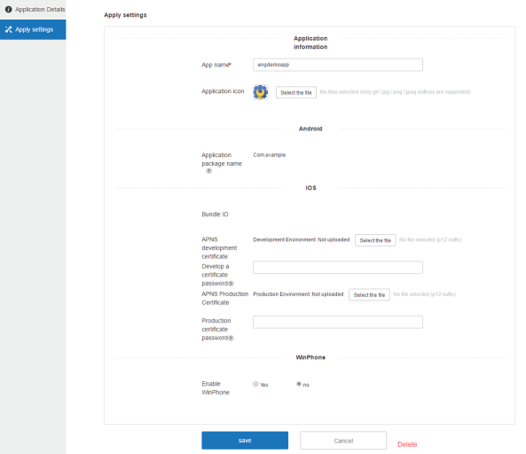
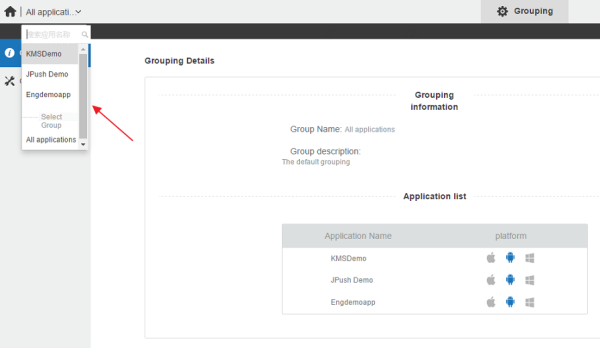

                            

Creating a JPush API Key and Master Secret
==========================================

JPush is a push notification service that performs push notifications to Android, iOS and Windows Phone apps in geographies where Google services are not allowed. Currently the Engagement Server supports the push notifications via Jpush for Android devices only.

To create a JPush key, follow these steps:

1.  In a browser, enter the URL of the JPush website `https://jpush.cn.`
    
    The **JIGUANG** home page appears.
    
    
    
    > **_Note:_** For readability, use the Google Translate option available in the menu bar.
    
2.  Click the **registered** button next to the **log - in** button at the top right corner of the home page.
    
    The first **Register** page appears.
    
3.  To register with **JPush**, complete the following fields:
    
    *   **User Name**: Enter the user name to register with JPush. The user name should include between five to 20 characters.
        
        > **_Note:_** Do not include special characters in a user name. You can use a combination of letters, numbers, and underscores.
        
    *   **Email**: Enter your personal mail address.
    *   **Password**: Enter a password to create your account.
    *   **Confirm Password**: Re-enter the password to confirm it.
    
    
    
4.  Click **Next** to continue.
    
    The second **Register** page appears.
    
5.  Enter details for the following fields:
    
    *   **User Name**: Enter the user name that you entered in the **Register** window.
    *   **Organization**: Enter name of the organization, where you work.
    *   **Email**: Enter your personal mail address.
    *   **Phone Number**: Enter your contact number.
    *   **QQ Verification Code:** Enter the supplied QQ verification code to authenticate your phone number.
    *   **Security Code**: Enter the displayed security code to confirm your authenticity.
    
    
    
6.  Click the **I agree, register now** button to continue.
7.  The JPush page appears with a confirmation message that the authentication message is sent to the registered email address. Access your email account, and open the email sent through JPush to authenticate your user account.
8.  Log in into your account. The **Applications** page appears.
    
    
    
9.  Click **Create an application** to create your own application.
    
    The **Create an application** page appears.
    
10.  Enter details for the following fields:
    *   **Application Information**:
        *   **Application Name**: Enter a name for the application.
        *   **Application Icons**: To provide an icon for the application, click **Select the File** to browse the icon from its location. The selected icon name appears next to the **Select the File** button.
    *   **Android**:
        
        *   **Application Name**: Enter the application package name, such as `com.example.BankingApp`
        
        
        
        > **_Note:_** The current procedure explains about how to register with Android platform and details about iOS and WinPhone are not stated here.
        
11.  Click **Create my app** to continue.
    
    The **Application Details** page appears.
    
    
    
12.  Record the **Appkey** and **Master Secret** for your reference.
13.  To view **Master Secret**, click **Master Secret**.
    
    
    
14.  Click the **Modify the application** button to continue.
15.  The **Apply settings** page appears.
    1.  Click **Cancel**, if you do not want to update any details.
    2.  Click **Delete** to delete the application.
16.  Based on your requirement, complete the changes to update the application. Click **Save** to update the application details. You can change the app name and application icon.
    
    
    
17.  Click the drop-down list in the upper right corner to view all applications.
    
    
