                             

Adding Campaigns
================

You add a campaign to promote a service. For example, you add Amazon campaign to send festive offers to their customers. You can also save a campaign to send it in the future, or execute the campaign immediately after filling details.

To add a campaign, follow these steps:

1.  In the **Campaigns** screen, click the **Add Campaign** button.
    
    The **Add Campaign** screen appears. The Add Campaign screen includes following tabs:
    
    *   [Campaign Information](#campaign-information)
    *   [Select Users](#select-users)
    *   [Define Message](#define-message)
    
    Campaign Information
    --------------------
    
    By default, the **Campaign Information** tab is set to active.
    
2.  Enter following details in the **Campaign Information** section:
    
    
    
    *   **Campaign Name**: Enter a campaign name of no more than 255 characters. This is a mandatory field.
    *   **Campaign Owner**: This field displays the name of the person who creates the campaign. You cannot change the owner details.
    *   **Campaign Type**: Select the appropriate campaign type from the drop-down list.
        
        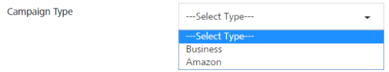
        
    *   **Campaign Start Date**: This field is auto-populated with the current date and the current time, when a campaign is created. Based on when the campaign execution must start, you can modify the start date of the campaign.
        
        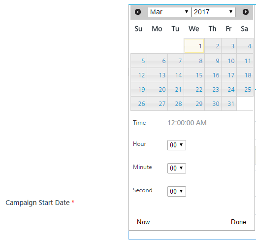
        
    *   **Campaign End Date**: To select the campaign end date, click in the text field.  
        The system displays the standard calendar. This is a mandatory field.  
        Select the date you want to end the campaign and click **Done**. The system inserts the date in the **Campaign End Date** field.
        
        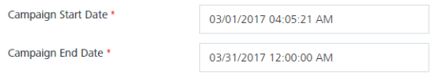
        
        You cannot select a **Campaign End Date** prior to the **Campaign Start Date**. The following error will be displayed on the screen.
        
        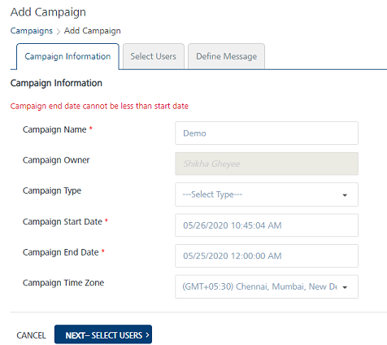
        
    *   **Campaign Time Zone**: Select the required time zone to start the campaign from the drop-down list.
        
        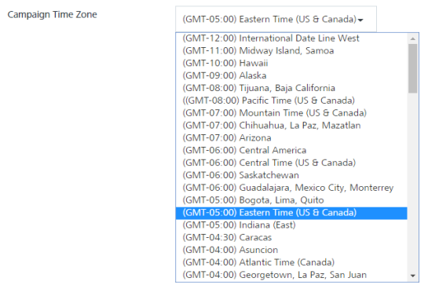
        
3.  Click **Cancel**, if you do not wish to add a campaign.
4.   Click **Next - Select Users** to navigate to the **Select Users** screen.
    
    > **_Note:_** You cannot move to the Select Users screen without providing the Campaign Name and Campaign End Date. The following error will be displayed on the screen.
    
    
    
    Select Users
    ------------
    
    The **Select Users** page displays the **Select Users** list-view with two columns: **Segments(s)** and **Segment Users** with default number of segment users. The list-view includes the **Delete** option to delete segments from the list-view. There is a drop-down list below **Segment(s)** column to select an already created segment or create a new segment
    
    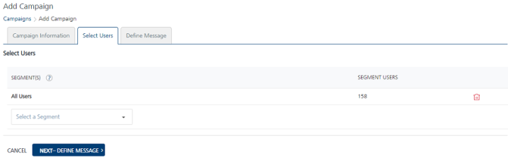
    
5.  Select the following details in the **Select Users** screen:
    *   **Select a Segment**: Define the segment definition that suits your campaigns. You can add a new segment or select a published segment from the drop-down list. The **Engagement** services does not allow you to publish a campaign without a segment.
        
        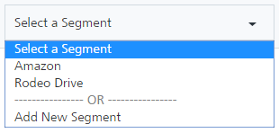
        
        The selected segment appears in the **SEGMENT(S)** list view with the total number of associated users.
        
        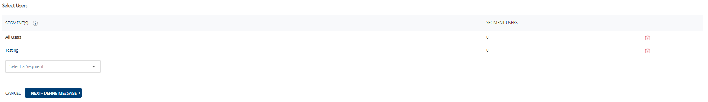
    *   Click the **Delete** icon to remove the selected segment from the list-view.
    *   To add a new segment, select the **Add New Segment** option from the drop-down list
        
        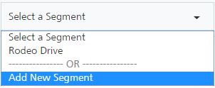
        
        The **Add New Segment** window appears.
        
        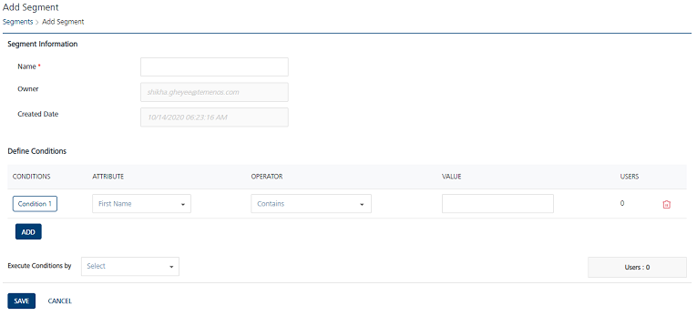
        
        For more information about how to add Segments, see [Adding Segments to Campaigns](../Segments/Adding_a_Segment.md)
        
6.  Click **Next - Define Message** to navigate to the **Define Message** screen.
    
    > **_Note:_** You cannot move to the Define Message screen without selecting any users for the campaign. Providing a user Segment(s) is mandatory. If you do not provide a Segment the following error will be displayed on the screen.
    
    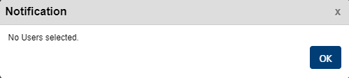
    
    Define Message
    --------------
    
    You can create a multi-channel campaign to send users. To send a campaign message, you can choose from the four notification types:
    
    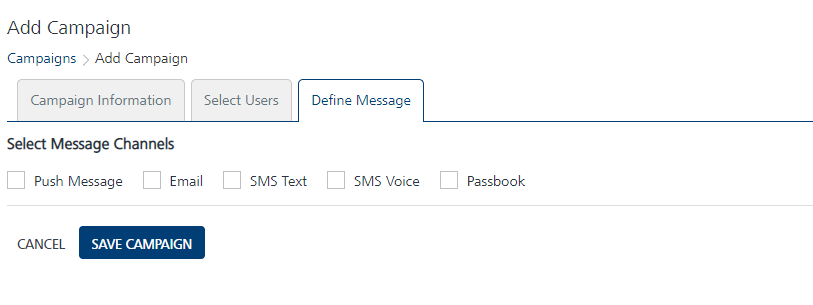
    
    *   [Push Message](Defining_Notification_Types_for_a_Campaign_-_Push_Message.md)
    *   [SMS Text](Defining_Notification_Types_for_a_Campaign_-_SMS.md)
    *   [SMS Voice](Defining_a_Voice_SMS_Campaign.md)
    *   [Email](Defining_Notification_Types_for_a_Campaign_-_Email.md)
    *   [Passbook](Defining_a_campaign_Type_Passbook.md)

Draft Status
------------

When you do not define any message for the campaign and save it, the campaign status changes to the **Draft** under the **Status** column in the list-view.

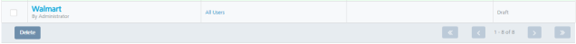
