                             

Email
=====

To configure your campaign message, you can use a pre-defined template or create a new email. You can do the following tasks from the Add Campaign > Define Message section:

*   [Adding an Email Message](#adding-an-email-message)
*   [Modifying an Email Message](#modifying-an-email-message)
*   [Deleting an Email Message](#deleting-an-email-message)

Adding an Email Message
-----------------------

To compose a new email message for a campaign, follow these steps:

1.  **Select Message Channels**: Select the type of notification as email.  
    The Email Message grid appears. The email message grid includes an Email label and the compose email button to compose email messages. If no email message is found, the system displays the message: No emails configured.  
    
    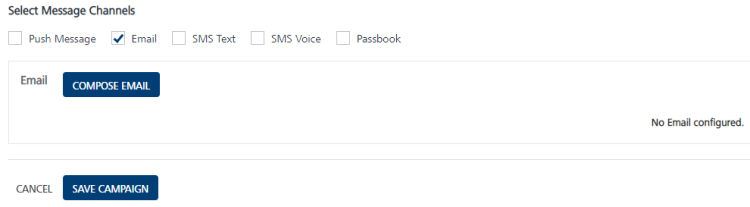
    
2.  Click the **Compose** **Email** button to compose a new email message for a campaign.
    
    The **Compose Email Message** drop-down window appears.  
    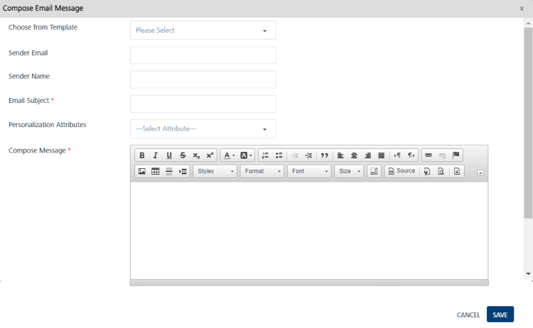  
    
    You can create an email message through following options:
    
    *   [Compose New Email](#compose-new-email)
    *   [Compose from Template](#compose-from-template)
        
        ### Compose New Email
        
        To compose a new email, follow these steps:
        
        1.  **Sender Email**: Enter the email ID of the sender in the **Sender Email** field.
            
            > **_Important:_** The default sender ID is used when the Sender email address is not provided. Some mail servers (example Gmail) always represent the sender email ID as authenticated ID regardless of **From** email address.
            
        2.  **Sender Name**: Enter the name of the sender in the **Sender Name** field.
        3.  **Email Subject**: Enter the subject of the email in the **Email Subject** field. The subject must convey the essence of the email message.
        4.  **Personalization Attributes**: Select the required personalization attributes from the drop- down list.
            
            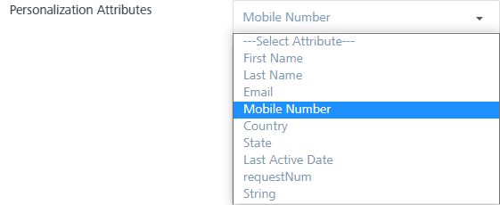
            
            The system inserts the selected attributes at the cursor position in the **Compose Message** Box text area.
            
        5.  Based on your requirement, place the cursor in the message box to insert personalization attributes. You can click X icon next to each attribute to remove the attribute from the message box.
            
              
            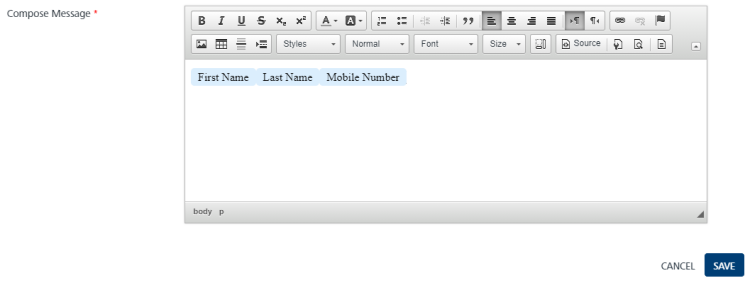
            
        6.  **Compose Message**: Enter the email message. You can customize the email message through the rich text tool bar available on the top of the compose message window. You can also put HTML content in the source mode, and check the view in the view mode.
            
            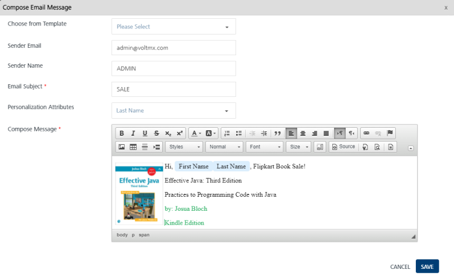
            
            To know more about key-value pair attributes refer, [Entering Attributes Values](Entering_Value_for_the_Attributes.md)
            
        7.  Click the **Cancel** button, if you do not want to save any details. The system displays the **Add Campaign** screen.
        8.  Click **Save**. The newly added email message appears in the **Email Message** list-view on the Add Campaign page.
        
        ### Compose from Template
        
        **To compose an email message from the template, follow these steps:**
        
        1.  **Sender Email**: Enter the email ID of the sender in the **Sender Email** field.
        2.  **Sender Name**: Enter the name of the sender in the Sender Name field.
        3.  **Choose from Template**: Select the required template from the drop-down list.
            
            Based on chosen template, the email subject, and the compose message text area is populated.
            
            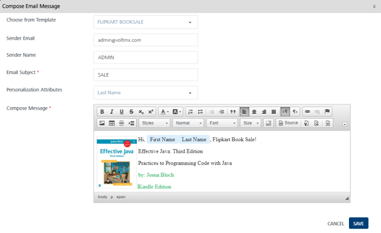
            
        4.  Click the **Cancel** button to close the window without saving any settings. The system displays the **Add Campaign** page.
        5.  Click the **Save** button to save the settings. The newly added email appears in the email list-view on the **Add Campaign** page.
            
            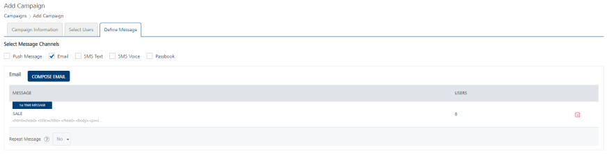
            
            The email list-view displays the following details:
            
            | Email Message Element | Description |
            | --- | --- |
            | Message | \- Label: Displays the current status of the email message as first time message or repeat message- Email Message Name: Displays the email message name- Displays the associated attributes below email message name |
            | Users | Displays the total number of valid subscribers who are eligible to receive the email messages |
            | Delete button | The button helps you delete an email message |
            
3.  The following options can be set when you add an email in the grid view:
    
    1.  **Repeat Message**: To repeat an email message, select the option as Yes from the Repeat Message drop-down list. By default, the **Repeat Message** option is set to **No.**
        
        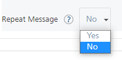
        
    2.  **Duration**: Select the email's duration from the drop-down list such as, immediate, hours, days or weeks. Next, enter the duration in numbers such as 10 days or 10 weeks.
        
        
        
        > **_Important:_** The immediate option regularly monitors the user updates and sends email messages to the user. For example, a campaign includes a segment with location attributes. When a user enters the specified geofence, the user falls in to the segment. So the campaign gets triggered immediately, and the user receives the email messages.
        
    3.  **Repeat Same Message**: Based on your requirement, select the option as Yes or Different Message.
        
        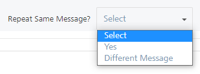
        
    4.  To update the existing email message, select the option as **Different** **Message** from the drop-down list. For more details about how to compose an email message, see [Adding an Email Message](#adding-an-email-message)
        
        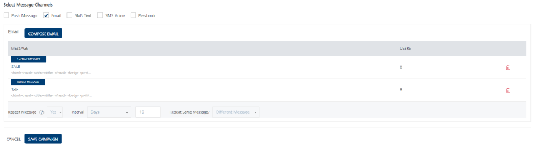
        
4.  Click the **Cancel** button to close the window without saving any settings. The system displays the Campaign home screen.
5.  Click **Save Campaign**. The saved campaign appears in the Campaigns list-view. The system displays the confirmation message that the campaign is saved successfully.

Modifying an Email Message
--------------------------

The feature allows you to manage email message details. For example, you want to modify the email subject or the template type. The View Campaign page displays the following details:

  
| Email Message Element | Description |
| --- | --- |
| Compose Email button | The button helps you compose a new email message |
| Message | Displays the email message details |
| Open/Sent | Displays the number of email messages opened or sent |
| Delete button | The button helps you delete an email message. |
| Pause button | The button helps you pause a campaign |
| Stop button | The button helps you stop a campaign. |
| Cancel button | The button helps you cancel changes in a campaign. |
| Update button | The button helps you update a campaign |

To modify an email message, follow these steps:

1.  In the **View Campaign** > **Define Message** page, under the **Email Message** column, click the required email.
    
    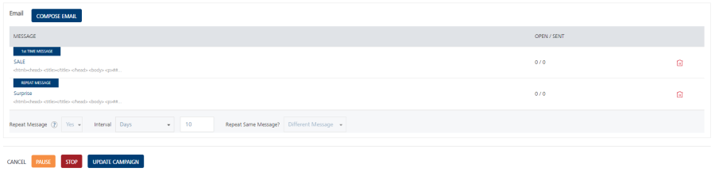
    
2.  The Compose Email Message window appears. The Compose Email Message window displays all fields that you have used while adding the email message details.
    
    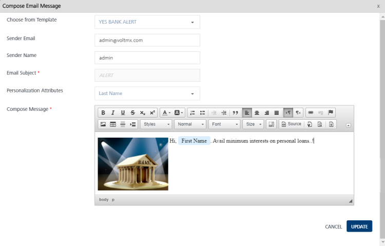  
    
3.  Based on your requirement, you can update the following details:
    
    | Email Message Element | Description | Modification Allowed |
    | --- | --- | --- |
    | Sender Email | Email ID of the sender | Yes |
    | Sender Name | Name of the sender | Yes |
    | Email Subject | Subject of the email | No |
    | Personalization Attributes | There are default personalization attributes: First name, Last name, Email, Mobile number, Country, and State  | Yes |
    | Compose Message | Compose message box to update the existing email message | Yes |
    | Choose from Template | Template drop-down list. | Yes |
    
4.  Click **Cancel**, if you do not want to update the email message. The compose email message window closes without saving any details.
5.  Click **Update** to continue.
    
    The updated email message appears in the email message list-view on the Add Campaign page.
    

Deleting an Email Message
-------------------------

As an administrator, you can delete any email message as required.

To delete an email message, follow these steps:

1.  To remove an email subject, select the **Delete** icon next to the email message.  
    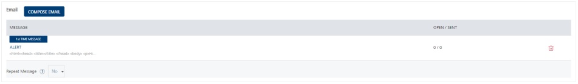
2.  The **Confirm Delete** alert message appears asking if you want to delete the selected campaign message.
3.  Click **Cancel**. The confirm delete dialog closes without deleting any email message.
4.  Click **Ok** to continue  
    
    The selected email message is removed from the list-view.  
    
    > **_Note:_** If you delete the first message, then both the first message and the repeat message are deleted. If you delete the repeat message, then only repeat message is deleted.
