                             

SMS
===

To configure your campaign message, you can use a pre-defined template or create a new SMS. You can do the following tasks from the Add Campaign > Define Message section:

*   [Adding an SMS Message](#adding-an-sms-message)
*   [Modifying an SMS Message](#modifying-an-sms-message)
*   [Deleting an SMS Message](#deleting-an-sms-message)

Adding an SMS Message
---------------------

To add an SMS message for a campaign, follow these steps:

1.  **Select Message Channels**: Select the type of notification as SMS.
    
    The **SMS Message** grid appears. The SMS message grid includes an SMS label and a compose SMS button to compose SMS messages. If no SMS message is found, the system displays the message: No SMS configured.
    
    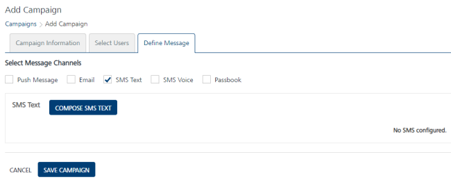
    
2.  Click the **Compose SMS** button to create a new **SMS message** for a campaign.
    
    The **Compose SMS Message** drop-down window appears.
    
    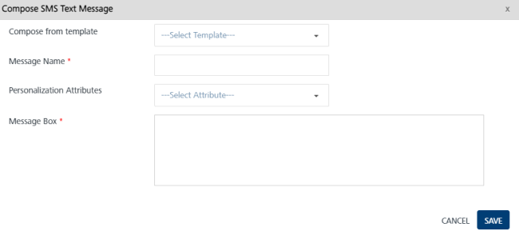
    
    You can define an SMS message through following options:
    
    *   [Compose New SMS](#compose-new-sms)
    *   [Compose from Template](#compose-from-template)
        
        ### Compose New SMS
        
        To compose a new SMS, follow these steps:
        
        1.  **SMS Message Name**: Enter the message name in the SMS Message Name field.
        2.  **Personalization Attributes**: Select the required personalization attributes from the drop- down list.
            
            The system inserts the selected attributes at the cursor position in the **Message Box** text area.
            
        3.   Based on your requirement, place the cursor in the message box to insert personalization attributes and SMS message. You can click X icon next to each attribute to remove the attribute from the message box.
            
            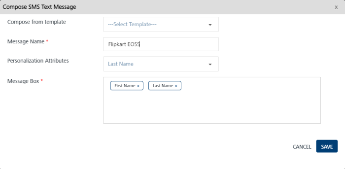
            
        
        ### Compose from Template
        
        To compose from a template, follow these steps:
        
        1.  **Compose from Template**: To create a new SMS message from a template, select the required template from the drop-down list.
            
            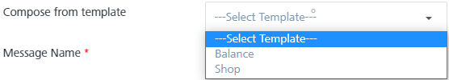
            
            The associated attributes and message with the selected template appear in the message box.
            
        2.  **SMS Message Name**: Enter an appropriate name for the SMS Message.
        3.  **Personalization Attributes**: If required, select the personalization attributes from the drop-down list to customize the SMS template.
            
            The selected attributes are appended in the message box.
            
            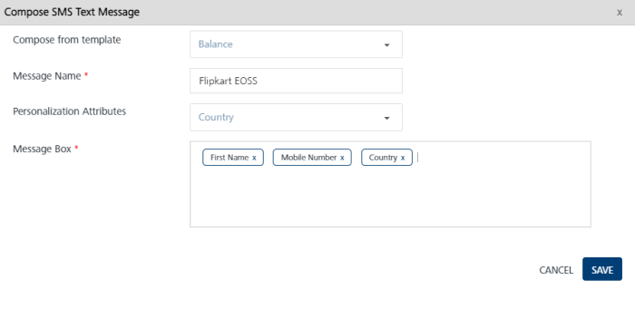
            
            To know more about key-value pair attributes refer, [Entering Attributes Values](Entering_Value_for_the_Attributes.md)
            
        4.  Based on your requirement, place the cursor in the message box to insert personalization attributes and an SMS message. You can click the X icon next to each attribute to remove attributes from the message box.
        5.  Click the **Cancel** button to close the window without saving any settings. The system displays the Add Campaign screen.
        6.  Click the **Save** button to save the settings. The newly added SMS appears in the **SMS Message** list-view on the **Add Campaign** screen.
        
        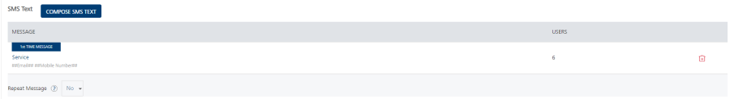
        
        The SMS Message list-view displays the following details:
        
        | SMS Message Element | Description |
        | --- | --- |
        | Message | \- Label: Displays the current status of the SMS message as first time message or repeat message- SMS Message Name: Displays the SMS message name- Displays the SMS message text |
        | Users | Displays the total number of users associated with SMS messages |
        | Delete button | The button helps you delete an SMS message |
        
3.  The following options can be set when you add an SMS in the grid view:
    1.  **Repeat Message**: If you want to repeat an SMS, then select the option as **Yes** from the Repeat Message drop-down list. By default, the **Repeat Message** is set to **No**.
        
          
        
    2.  **Duration**: Select the type of duration for the SMS from the drop-down list such as, immediate, hours, days or weeks. Next, enter the duration in numbers, such as 10 days or 10 weeks.
        
        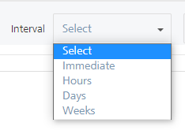
        
        > **_Important:_** The immediate option regularly monitors the user updates and sends SMS to the user. For example, a campaign includes a segment with location attributes. When a user enters the specified geofence, the user falls in to the segment. So the campaign gets triggered immediately, and the user receives the SMS.
        
    3.  **Repeat Same Message**: Based on your requirement, select the option as Yes or Different Message.  
        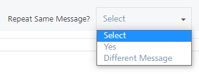  
        
        To update the existing SMS message, select **Different** **Message** from the drop-down list. For more details about how to compose an SMS message, see [Adding an SMS Message](#adding-an-sms-message)
        
        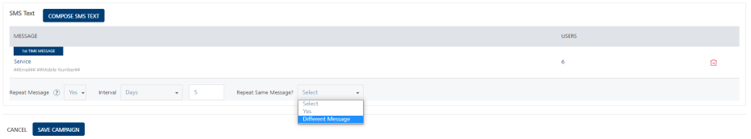  
        
4.  Click the **Cancel** button, if you do not want to save any settings. The system displays the Campaign home screen.
5.  Click **Save Campaign**. The saved campaign appears in the Campaigns list-view. The system displays the confirmation message that the campaign is saved successfully.

Modifying an SMS Message
------------------------

The feature allows you manage SMS message details. You may need to modify an SMS message for specific reasons, for example, you want to modify the SMS name or message details. The View Campaign page displays the following details:

  
| SMS Message Element | Description |
| --- | --- |
| Compose SMS button | The button helps you compose a new SMS message |
| Message | Displays the SMS message details |
| Open/Sent | Displays the number of SMS messages opened or sent |
| Delete button | The button helps you delete an SMS message |
| Pause button | The button helps you pause a campaign |
| Stop button | The button helps you stop a campaign |
| Cancel button | The button helps you cancel the changes in a campaign |
| Update button | The button helps you update a campaign |

To modify an SMS message, follow these steps:

1.  In the **Add Campaign** screen, under the SMS Name column, click the required **SMS Name**.
    
    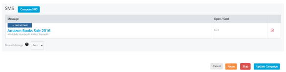
    
2.  The **Compose SMS Message** window appears. The **Compose SMS Messag**e window displays all fields that are used to add the SMS message.
    
    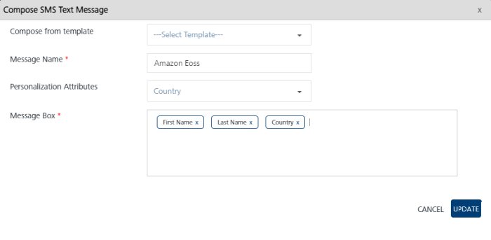
    
3.  You can update following fields:
    
    | SMS Message Element | Description | Modification Allowed |
    | --- | --- | --- |
    | SMS Message Name | SMS message name | No |
    | Compose from Template | Pre-defined SMS template | Yes |
    | Personalization Attributes | There are default personalization attributes: First name, Last name, Email, Mobile number, Country, and State | Yes, you can select the required attributes from the drop-down list |
    | Message Box | SMS message box | Yes, Message Box displays the selected personalization attributes and SMS message if any |
    
4.  Click **Cancel**, if you do not want to save the updates. The system closes the window without saving any updates.
5.  Click **Update** to continue.
    
    The updated SMS message appears in the SMS Message list-view.
    

Deleting an SMS Message
-----------------------

As an administrator, you can delete any SMS as required.

To delete an SMS message, follow these steps:

1.  To remove an SMS, select the **Delete** button next to **SMS Names(s).**
2.  The **Confirm Delete** alert message appears asking if you want to delete both the first message and the repeat message.
3.  Click **Cancel**. The confirm delete dialog closes without deleting any SMS message.
4.  Click **Ok** to continue. The SMS message is removed from the list-view.
    
    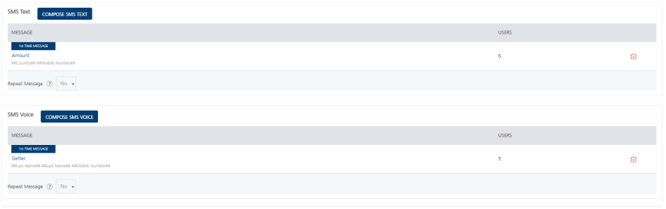
    
    > **_Important:_** If you delete the first message, then both the first message and the repeat message are deleted. If you delete the repeat message, then only repeat message is deleted.
