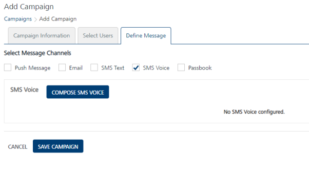
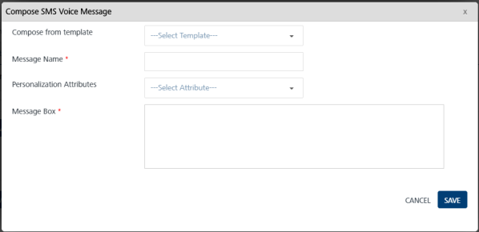
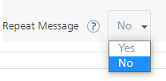
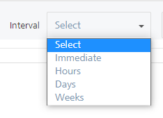
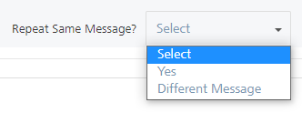

                             

Voice SMS
=========

To configure your campaign message, you can use a pre-defined template or create a new Voice SMS. You can do the following tasks from the Add Campaign > Define Message section:

*   [Adding an SMS Voice Message](#adding-an-sms-voice-message)
*   [Modifying an SMS Voice Message](#modifying-an-sms-voice-message)
*   [Deleting an SMS Voice Message](#deleting-an-sms-voice-message)

Adding an SMS Voice Message
---------------------------

To add an SMS Voice message for a campaign, follow these steps:

1.  **Select Message Channels**: Select the type of notification as SMS Voice.
    
    The **SMS Voice Message** grid appears. The SMS message grid includes an SMS label and a compose SMS button to compose SMS messages. If no SMS message is found, the system displays the message: No SMS configured.
    
    
    
2.  Click **Compose SMS Voice** to create a new **SMS Voice message** for a campaign.
    
    The **Compose SMS Voice Message** window appears.
    
    
    
    You can define an SMS message through following options:
    
    ### Compose from Template
    
    To compose from a template, follow these steps:
    
    1.  **Compose from Template**: To create a new SMS Voice message from a template, select the required template from the drop-down list.
        
        
        
        The associated attributes and message with the selected template appear in the message box.
        
    2.  **SMS Message Name**: Enter an appropriate name for the SMS Voice Message.
    3.  **Personalization Attributes**: If required, select the personalization attributes from the drop-down list to customize the SMS Voice template.
        
        The selected attributes are appended in the message box.
        
        To know more about key-value pair attributes refer, [Entering Attributes Values](Entering_Value_for_the_Attributes.md).
        
    4.  Based on your requirement, place the cursor in the message box to insert personalization attributes and an SMS message. You can click the X icon next to each attribute to remove attributes from the message box.
    5.  Click the **Cancel** button to close the window without saving any settings. The system displays the Add Campaign screen.
    6.  Click the **Save** button to save the settings. The newly added SMS appears in the **SMS Voice Message** list-view on the **Add Campaign** screen.
    
    The SMS Voice Message list-view displays the following details:
    
    | SMS Message Element | Description |
    | --- | --- |
    | Message | \- Label: Displays the current status of the SMS Voice message as first time message or repeat message- SMS Voice Message Name: Displays the SMS Voice message name- Displays the SMS Voice message text |
    | Users | Displays the total number of users associated with SMS Voice messages |
    | Delete button | The button helps you delete an SMS Voice message |
    
3.  The following options can be set when you add an SMS Voice in the grid view:
    1.  **Repeat Message**: If you want to repeat an SMS Voice, then select the option as **Yes** from the Repeat Message drop-down list. By default, the **Repeat Message** is set to **No**.
        
          
        
    2.  **Duration**: Select the type of duration for the SMS Voice from the drop-down list such as, immediate, hours, days or weeks. Next, enter the duration in numbers, such as 10 days or 10 weeks.
        
        
        
        > **_Important:_** The immediate option regularly monitors the user updates and sends SMS Voice to the user. For example, a campaign includes a segment with location attributes. When a user enters the specified geofence, the user falls in to the segment. So the campaign gets triggered immediately, and the user receives the SMS Voice.
        
    3.  **Repeat Same Message**: Based on your requirement, select the option as Yes or Different Message.  
          
        
        To update the existing SMS Voice message, select **Different** **Message** from the drop-down list. For more details about how to compose an SMS Voice message, see [Adding an SMS Voice Message](#adding-an-sms-voice-message).
        
4.  Click the **Cancel** button, if you do not want to save any settings. The system displays the Campaign home screen.
5.  Click **Save Campaign**. The saved campaign appears in the Campaigns list-view. The system displays the confirmation message that the campaign is saved successfully.

Modifying an SMS Voice Message
------------------------------

The feature allows you manage SMS Voice message details. You may need to modify an SMS Voice message for specific reasons, for example, you want to modify the SMS Voice name or message details. The View Campaign page displays the following details:

  
| SMS Message Element | Description |
| --- | --- |
| Compose SMS Voice button | The button helps you compose a new SMS Voice message |
| Message | Displays the SMS Voice message details |
| Open/Sent | Displays the number of SMS Voice messages opened or sent |
| Delete button | The button helps you delete an SMS Voice message |
| Pause button | The button helps you pause a campaign |
| Stop button | The button helps you stop a campaign |
| Cancel button | The button helps you cancel the changes in a campaign |
| Update button | The button helps you update a campaign |

To modify an SMS Voice message, follow these steps:

1.  In the **Add Campaign** screen, under the SMS Voice Name column, click the required SMS Voice **Name**.
2.  The **Compose SMS Voice Message** window appears. The **Compose SMS Voice Messag**e window displays all fields that are used to add the SMS Voice message.
    
3.  You can update following fields:
    
    | SMS Message Element | Description | Modification Allowed |
    | --- | --- | --- |
    | SMS Message Name | SMS message name | No |
    | Compose from Template | Pre-defined SMS Voice template | Yes |
    | Personalization Attributes | There are default personalization attributes: First name, Last name, Email, Mobile number, Country, and State | Yes, you can select the required attributes from the drop-down list |
    | Message Box | SMS message box | Yes, Message Box displays the selected personalization attributes and SMS Voice message if any |
    
4.  Click **Cancel**, if you do not want to save the updates. The system closes the window without saving any updates.
5.  Click **Update** to continue.
    
    The updated SMS Voice message appears in the SMS Voice Message list-view.
    

Deleting an SMS Voice Message
-----------------------------

As an administrator, you can delete any SMS Voice as required.

To delete an SMS Voice message, follow these steps:

1.  To remove an SMS Voice, select the **Delete** button next to SMS Voice **Names(s).**
2.  The **Confirm Delete** alert message appears asking if you want to delete both the first message and the repeat message.
3.  Click **Cancel**. The confirm delete dialog closes without deleting any SMS Voice message.
4.  Click **Ok** to continue. The SMS Voice message is removed from the list-view.
    
    
    
    > **_Important:_** If you delete the first message, then both the first message and the repeat message are deleted. If you delete the repeat message, then only repeat message is deleted.
