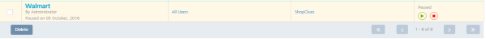

                              

Deleting Campaigns
==================

You can delete any campaign except for the ones in running state.

To delete a campaign, follow these steps:

1.  Select the check box next to the required campaign in the **Campaigns** list-view. You can delete one campaign or multiple campaigns in one action.
    
    Paused Campaign  
      
    
2.  Click the **Delete** button.
    
    The system displays the **Confirm Delete** dialog box, asking if you want to delete the campaign.
    
3.  Click **Cancel**, if you do not want to delete the campaign. The system closes the **Confirm Delete** dialog box and returns to the **Campaigns** home screen.
4.  Click **OK** to continue.
    
    The system displays the confirmation message that campaigns deleted successfully. The deleted campaign is removed from the list-view.
    

  
| Rev | Author | Edits |
| --- | --- | --- |
| 7.2 | AU | AU |
