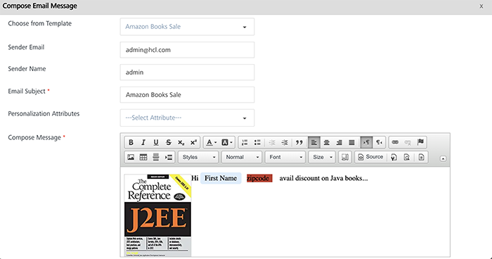
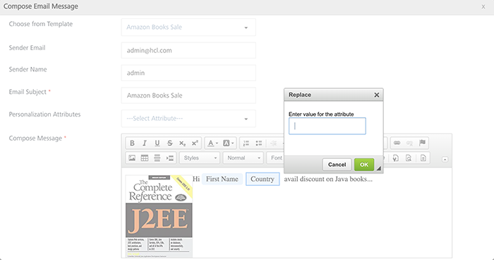
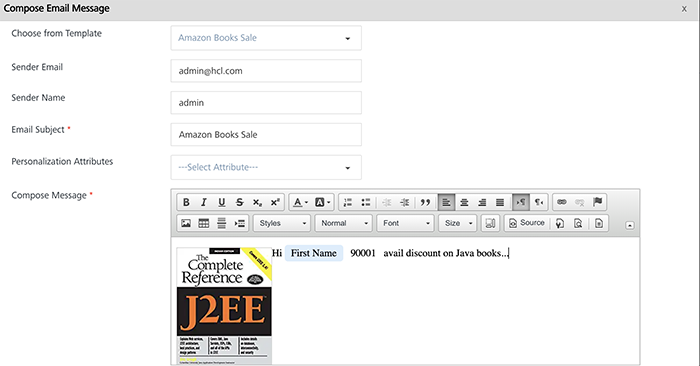

                           

Entering Attribute Values
=========================

You can create a pre-defined template with a key-value pair attribute to use for push messages, emails and SMS messages. When you use a pre-defined template, you need to replace the place-holder attribute with a real value.

> **_Note:_** The following procedure is applicable for push messages, emails and SMS messages. The example uses an email message template.

To enter a value for place-holder attribute, follow these steps:

1.  Choose from Template: Select the template from the copy from template drop-down list.
    
    The compose message box populates with the pre-defined template details.
    
    
    
2.  For the Amazon Books Sale template, the key-value pair attribute is a zip code value. Click zip code to enter a value.
    
    The **Replace** alert dialog appears.
    
    
    
3.  Enter a value for the attribute. Click **OK** to continue.
4.  The entered value appears in the message box. Click **Save** to continue.
    
    
