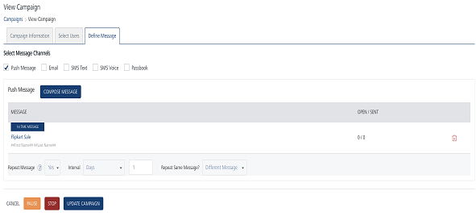
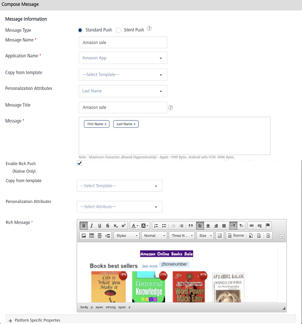

                            

Modifying a Push Message
========================

The feature helps you manage and modify push message details. For example, you want to modify the push message text. The **View Campaign** page displays the following details:

  
| Push Message Element | Description |
| --- | --- |
| Compose Message button | The button helps you compose a new push message |
| Message column | Displays the push message details |
| Open/Sent column | Displays the number of pushes opened or sent |
| Delete button | The button helps you delete a push message. |
| Pause button | The button helps you pause a campaign |
| Stop button | The button helps you stop a campaign. |
| Cancel button | The button helps you cancel changes in a campaign. |
| Update button | The button helps you update a campaign |

To modify a push message, follow these steps:

1.  In the **View Campaigns** screen, click the required push message under the **Push Message** column.
    
    
    
2.  The **Compose Message** window appears.
    
    
    
3.  Based on your requirement, you can update the following details:
    
    | Push Message Element | Description | Modification Allowed |
    | --- | --- | --- |
    | Message Name | Push message name | No |
    | Application Name | Application name | Yes, You can select a new app from the Application Name drop-down list. |
    | Personalization Attributes | There are default personalization attributes: First name, Last name, Email, Mobile number, Country, and State | Yes, You can add new personalization attributes from the Personalization Attributes drop-down list. The new attributes are appended with the existing attributes. |
    | Message Title | Message title | Yes |
    | Compose from Template | Push template | Yes, You can select a new template from the Compose from Template drop-down list |
    | Message Box | Push message box | Yes, Message Box displays the selected personalization attributes and push message if any |
    | Enable Rich Push | Enable rich push option | Yes, Based on your requirement, you can select or deselect already existing rich content from the push message |
    | Platform Specific Properties | There are four platforms: iOS, Android, Windows, and Web | Yes, Based on your requirement, you can add or remove platform- specific properties. |
    
4.  Click **Cancel**, if you do not want to update the push message details.
5.  Click **Update** to update the push message details.
    
    The updated push message appears in the push message list-view.
    
    > **_Note:_** You can cancel, pause, stop and update a campaign from the View Campaign page.
