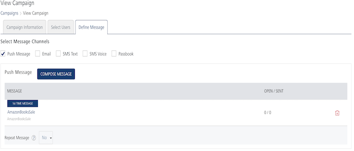
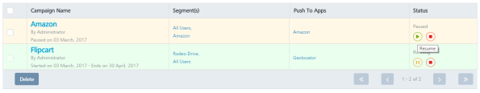
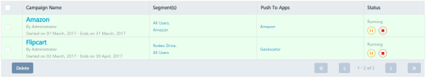

                           

Resuming Campaigns
==================

You can resume a campaign either from the Campaigns home page or from the View Campaign > Define Message page. You need to resume a campaign to send the campaign again.

To resume a campaign from the Campaigns home page, follow these steps:

1.  On Campaigns home page, in the Campaigns list view, hover the mouse over the required campaign under the Status column.
    
    
    
    The system displays the **Resume** button.
    
2.  Click the **Resume** button.
    
    The system displays the **Start Campaign** alert message, asking if you want to start the campaign.
    
3.  Click **Cancel**, if you do not want to resume the campaign. The system displays the Campaigns home page.
4.  Click **Yes** to continue. The system displays the confirmation message that the campaign is resumed successfully. The color and the status of the resumed campaign changes in the list-view.
    
    
