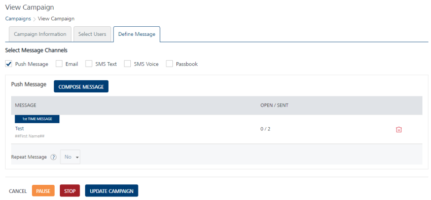
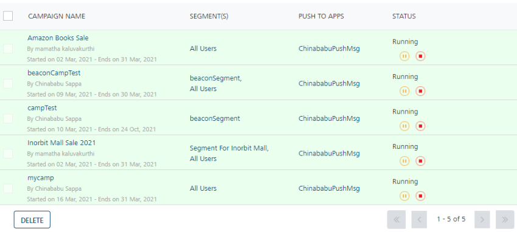
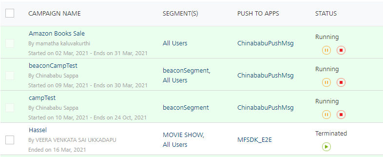
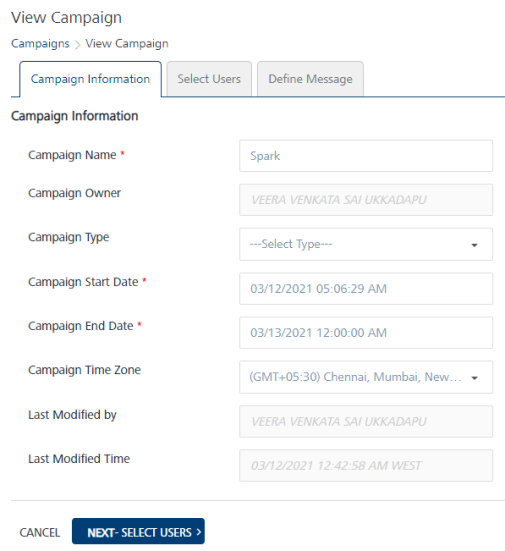
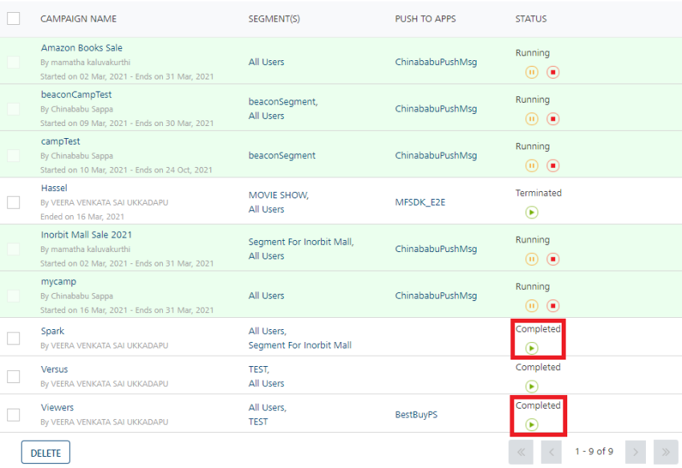

                            

Stopping/Terminating a Campaign
===============================

As an administrator, you can terminate a campaign. A terminated campaign cannot send any notifications. You can terminate a campaign manually before the set expiry date so that no notifications are sent for the campaign.

You can stop a campaign either from the Campaigns home page or from the View Campaign > Define Message page.

To stop/terminate a campaign, follow these steps:

1.  On Campaigns home page, in the Campaigns list view, hover the mouse over the **Stop** button under the **Status** column.
    
    
    
    The system displays the **Stop** button.
    
2.  Click the **Stop** button.
    
    The system displays the Stop Campaign alert message, asking if you want to stop the campaign.
    
3.  Click **Cancel** to close the dialog. The system displays the **Campaigns** home page.
4.  Click **Yes** to continue. The system stops the running campaign and displays the confirmation message that the campaign is terminated successfully.
    
    The status of the campaign changes to terminated in the list-view.
    
    
    
    > **_Note:_** You cannot delete the completed or a terminated campaign.
    

Completed Campaigns
-------------------

When a campaign is completed, it appears with the status as **Completed** under the **Status** column in the list view. You can restart a completed campaign.

The completed campaign is displayed for your record.

