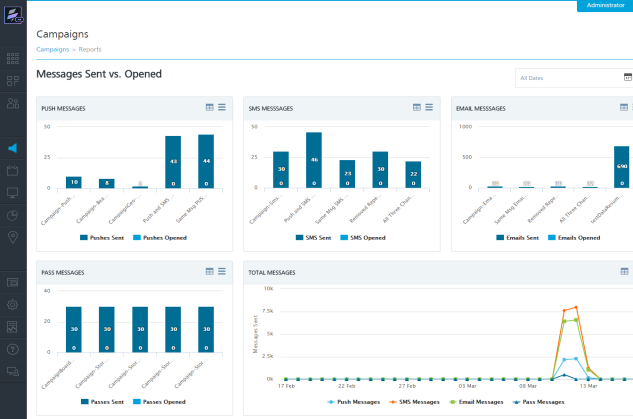
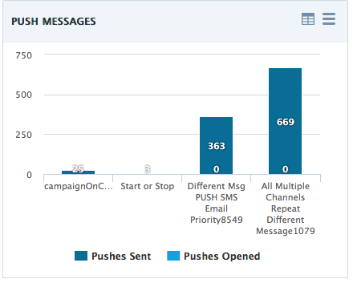
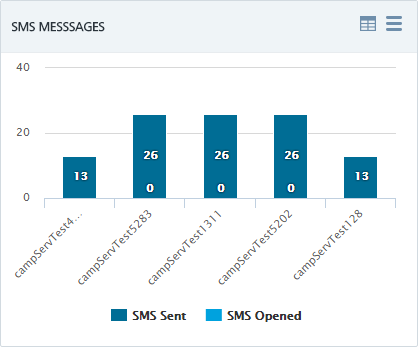
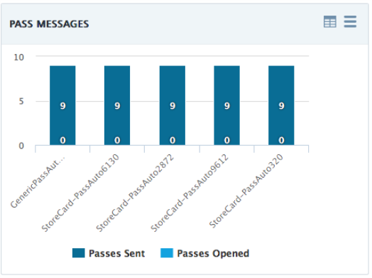
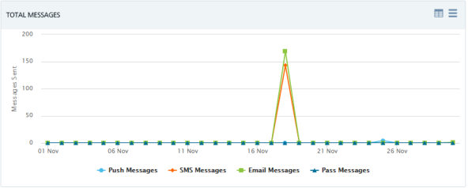

                             

Viewing Campaign Reports
========================

The campaign reports display the total number of sent messages, and messages opened for the various campaigns executed in the **Engagement** server.

To view campaign reports, follow these steps:

1.  Under **Engagement**, click **Campaigns**.
    
    The **Campaigns** home page appears.
    
2.  Click the **Reports** button. The **Campaign Reports** page displays the five types of reports. By default, the system displays reports in the graphic format. There is a standard calendar to view all the dates. For more details refer, [All Dates](../Dashboard/Dashboard.md#All_Dates)
    
    Pushes Sent vs. Opened – Campaign Level
    ---------------------------------------
    
    The **Pushes sent versus Opened at Campaign Level** graph displays the number of pushes sent and the number of, pushes opened for the last four campaigns. The default view presents the total of pushes sent versus opened per campaign since Engagement Services console is configured and used.  
    
    
    
    SMS Sent versus Opened – Campaign Level
    ---------------------------------------
    
    The **SMS sent versus Opened at Campaign Level** graph displays the number of SMS sent and the number of SMS opened per campaign. The default view presents the total of SMS sent versus opened per campaign since Engagement Services console is configured and used.
    
      
    
    Email Sent versus Opened – Campaign Level  
    
    --------------------------------------------
    
    The **Email sent versus Opened at Campaign Level** graph shows the number of emails sent and the number of emails opened per campaign. The default view presents the total of email sent versus opened per campaign since Engagement Services console is configured and used.
    
    
    
    Pass Messages Sent versus Opened – Campaign Level
    -------------------------------------------------
    
    The **Pass Messages Sent versus Opened at Campaign Level** graph displays the number of passes sent and the number of passes opened per campaign. The default view presents the total number of passes sent versus opened per campaign since Engagement Services console is configured and used.
    
    
    
    Total Messages
    --------------
    
    The **Total Messages** graph displays the total number of messages (push, SMS, Email and Pass) sent over last 30 days. The Y axis represents the number of sent messages while the X axis represents the dates on which the messages are sent.
    
    
    
3.  For more details about graphs, see [Dashboard](../Dashboard/Dashboard.md).
