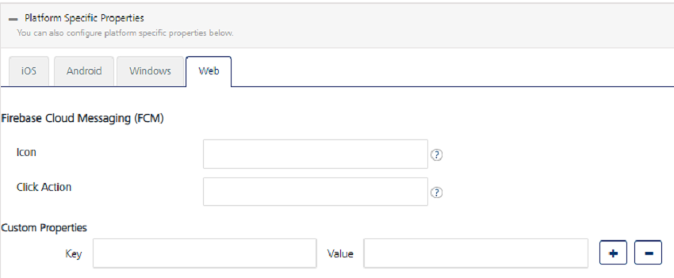

                           

Web Platform
============

Following is a list of the platform-specific properties for Web. You need to provide the values for the properties as required.

For Web devices, enter details for the following fields:

**Firebase Cloud Messaging (FCM)**
----------------------------------

The description of the properties is as follows:

*   **Icon**: The notification icon. It is the image that appears next to the title and body of the text.
*   **Click Action**: The action associated with a user click on the notification.

### Custom Properties

1.  **Key**: Enter the key.
2.  **Value**: Enter a value for the key-value pair.
3.  Click the blue plus button to add the additional **Key** and **Value** pair details.
4.  Click the blue minus button to remove the added **Key** and **Value** pair details.
