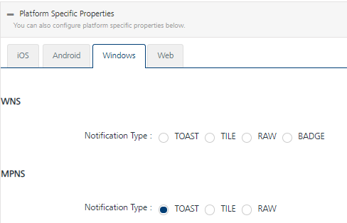
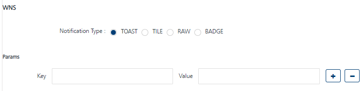
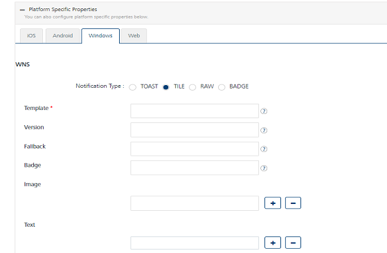
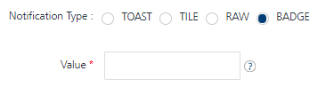
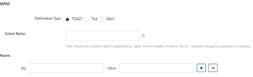
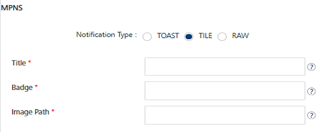

                           

Windows
=======

You need to specify the platform specific properties for those platforms your app supports.

**WNS**
-------

1.  **Toast**: For the notification type as **Toast**, enter details for the following fields:
    
    1.  **Screen Name**: Enter the screen name to display.
    2.  **Params**: Enter the key-value pair to link with the screen name. Params help you navigate to the specific screen.
    
    
    
2.  **Tile**: For the notification type as **TILE**, enter details for the following fields:
    
    1.  **Template**: Enter a name for the tile message template.
    2.  **Version**: Enter the version number of the current template in use.
    3.  **Fallback**: Enter the name of the template to fallback on.
    4.  **Badge**: Enter the badge number. The number displays the badge of the application icon. If this property is not provided, the badge is not changed. To remove the badge, set the value of this property as zero.
    5.  **Image**: Enter the image name in the image text field to display on a device. You can click the plus icon to add more images. Click the minus icon to remove added image fields.
    6.  **Text**: Enter the text to display below images on a device. You can click the plus icon to add more text. Click the minus icon to remove added text fields.
    
    
    
3.  **RAW:** Raw notifications are short, general purpose push notifications. Raw notifications are strictly instructional and do not include a UI component. **Windows Push Notification Services** (WNS) deliver raw notifications from your cloud service to your app.
4.  **Badge**: For the notification type as **Badge**, enter a value for the badge field. The badge value is a number or a window glyph to display on the notification badge.
    
    
    

MPNS
----

1.  **Toast**: For the notification type as **Toast**, enter details for the following fields:
    
    1.  **Screen Name**: Enter the screen name to navigate when the app starts.
    2.  **Params**: Enter the key-value pair to link with the screen name. Params help you navigate to the specific screen.
    
    
    
2.  **Tile**: For the notification type as **TILE**, enter details for the following fields:
    1.  **Title**: Enter a title for the tile notification.
    2.  **Badge**: Enter the badge number. The number displays the badge of the application icon. If this property is not provided, the badge is not changed. To remove the badge, set the value of this property as 0.
    3.  **Image Path**: Enter the path of the image file that must be used as the background for the application icon.
        
        
        
3.  **RAW:** Raw notifications are short, general purpose push notifications. They are strictly instructional and do not include a UI component. **Windows Push Notification Services** (WNS) deliver raw notifications from your cloud service to your app.
4.  Click **Cancel** to close the window.
5.  Click **Save** to save the platform details.

> **_Note:_** Windows push certificate is a purchased SSL certificate, which is converted into correct format to upload on Volt MX Foundry Engagement Services. Windows Secret is an associated secret key that contains strings used for authentication with Volt MX Foundry Engagement Services APIs. It is used for authentication on the client side during registration.

> **_Note:_** Windows SID is a security identifier that is a unique, immutable identifier of a user, user group, or other security principals. A security principal has a single SID for life, and all properties of the principal, including its name, are associated with the SID. This design allows a principal to be renamed (for example, from "John" to "Jane") without affecting the security attributes of objects that refer to the principal.
