                              

Dashboard
=========

The **Dashboard** is the default page that an admin views after signing into Volt MX Engagement Services console. The Dashboard allows for a quick access to the reports and metrics.

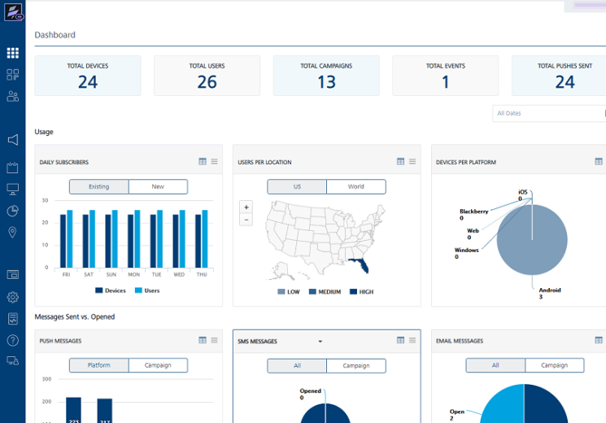

> **_Important:_** As a user, you must have the following permission to access the **Dashboard** screen and perform different tasks based on the role.  
-ROLE\_DASHBOARD\_ALL

The **Dashboard** home page includes the following sections:

*   [Certificate Expiry Warning Message](#certificate-expiry-warning-message)
*   [Labels](#labels)
*   [Reports](#reports)

Certificate Expiry Warning Message
----------------------------------

The upper middle portion of the Dashboard page displays the warning message about certificate expiry dates. The warning appears only if either the certificates are expired or are about to expire in next 30 days.

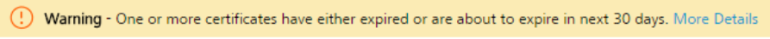

The warning message helps you renew certificates and avoid any inconvenience. For example, when a certificate expires, the subscribers are unable to receive the push and pass notifications from the Engagement server. You can view the expiry dates for the following certificates:

*   Apple Push Notification Service Certificate (APNS)
*   Microsoft Push Notification Service (MPNS) Certificate
*   Pass Certificate

To view the **Certificate Expiry** dates, follow these steps:

1.  Click the **More Details** link embedded in the warning message.
    
    The **Certificate Details** window appears. The **Certificate Details** window displays the following details:
    
    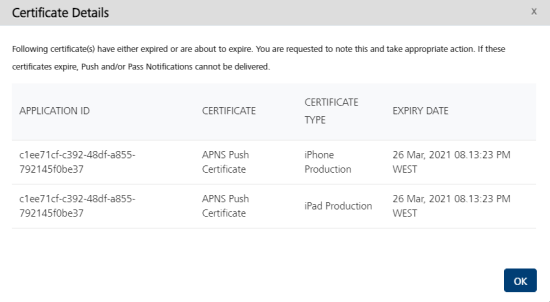
    
    The following **Certificate Details** window displays the pass certificate expiry date.
    
    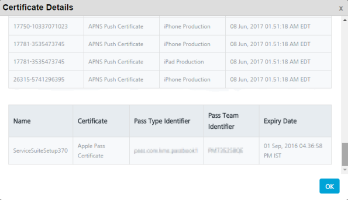
    
    The following table explains about the certificates.
    
    | Certificate Details | Description |
    | --- | --- |
    | Application ID | Every application (when an application is added) has a unique application ID. The application ID cannot be modified once the application is created and saved |
    | Certificate | The certificate, such as APNS Certificate, Pass Certificate, and Windows certificate |
    | Certificate Type | The type of certificate, such as iPhone Production or iPad Production |
    | Expiry Date | The expiry date of the certificate. |
    
2.  Click **Ok** to close the window.

Labels
------

You can view the following labels above the Usage section and below the Dashboard header on the **Dashboard** page.

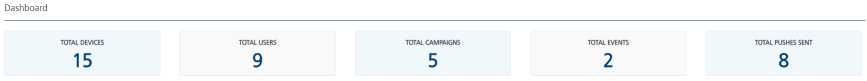

Total Devices: Displays the total number of unique devices on which applications are installed.

Total Users: Displays the total number of users available who are enabled to receive notifications.

Total Campaigns: Displays the total number of campaigns that are setup since Volt MX Engagement services console is configured and used excluding deleted campaigns.

Total Events: Displays the total number of events configured since Volt MX Engagement services console is configured and used excluding deleted events.

Total Push Sent: Displays the total number of pushes sent since Volt MX Engagement services console is configured and used.

Reports
-------

The **Dashboard** reports are grouped into the following sections:

*   [Usage](#usage)
*   [Messages Sent Vs. Open](#messages-sent-vs-open)

### Reports Design

You can filter the data and then view that information in interactive dashboard reports. The following table describes the types of reports on dashboard based on a report's design.

  
|   Reports Design | Reports Name(s) |
| --- | --- |
| Clustered column reports | Daily subscribers, subscribers per location, push messages, SMS, email messages, pass messages |
| Exploded pie reports | Device per platform |
| Stacked column reports | Pushes sent/opened at platform and campaign level. |

### Viewing Reports

Based on your requirements, you can view reports with the following options available on the Dashboard home page.

*   Hover the cursor over any blocks on the chart to view additional information such as **Users: 500** as seen in the below image.
    
    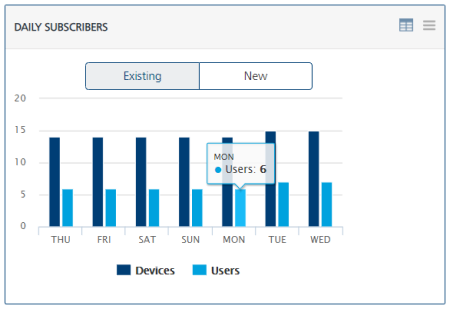
    
*   On the upper right corner of the chart, click the view as table icon to view the report as a table. Click the back arrow icon to view the report in the graphic format.
    
    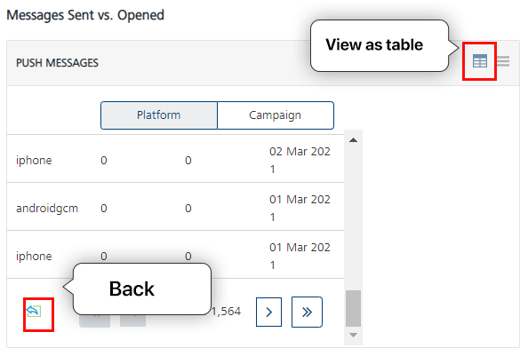
    
*   On the upper right corner of the chart, click the chart context menu drop-down list to generate reports based on various options.
    
    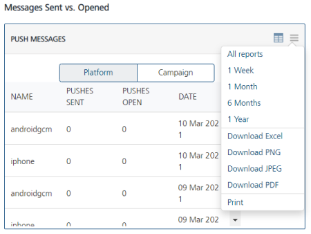
    
    The following table describes chart context menu options to generate a report in the various formats:
    
    |   Chart Context Menu Commands | Description |
    | --- | --- |
    | All reports | Displays a report with all data |
    | 1 Month | Allows you to view a report with data from the last month |
    | 6 Months | Allows you to view a report with data from the last six months |
    | 1 Year | Allows you to view a report with data from the last year |
    | Download Excel | Allows you to save a report in a Microsoft Excel file.To save a report as a Microsoft Excel file, click the **Download Excel Workbook**. The system displays the Windows **Save As** dialog box . Select the appropriate option and then click the **OK** button |
    | Download PNG | Allows you to save a report as a PNG file.To save the report as a PNG file, click the **Download PNG image**. The system displays the Windows **Save As** dialog box. Select the appropriate option and then click the **OK** button |
    | Download JPEG | Allows you to save a report as a JPEG file.To save the report as a JPEG file, click the **Download JPEG image**. The system displays the Windows **Save As** dialog box. Select the appropriate option and then click the **OK** button |
    | Download PDF | Allows you to save a report in a PDF file.To save the report as a PDF file, click the **Download PDF document**. The system displays the Windows **Save As** dialog box. Select the appropriate option and then click the **OK** button |
    | Print | Allows you to print the report.To print the report, click the **Print chart**. The system displays the **Windows Print** dialog box. Select your printer and click the **OK** button. |
    
*   To remove a legend from the chart, click the legend's icon available below the chart. The respective legend disappears, and you can view only the required data in the chart. For example, if you click the **User** legend icon in the **Daily Subscribers** chart.

    
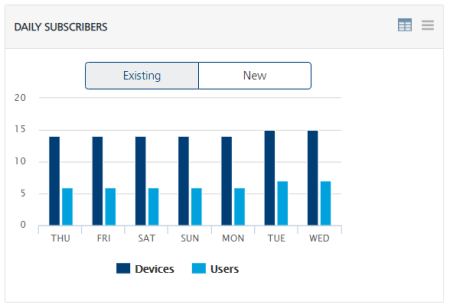

    
The **User** legend disappears and you can only view the devices in the **Daily Subscribers** chart.

    
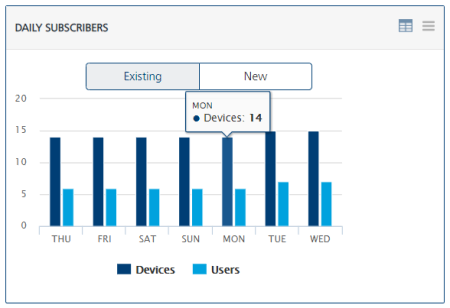

    
*   **All Dates**: Use the option to view Volt MX Engagement Services statistics for a certain period. To view data for a period, follow these steps:

1.  Click in the **All Dates** field to open the calendar. The calendar appears.

        
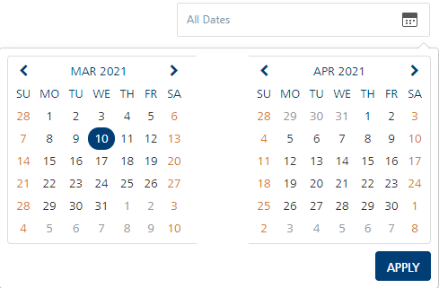

        
2.  To specify the period, select the **From** date from the left calendar. Select the **To** date from the right calendar.

        
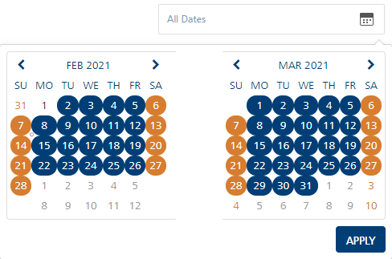

        
The selected period is highlighted in the calendars.
        
3.  Click **Apply t**o continue.
        
The system displays all charts within the specified period on the dashboard.
        

Usage
-----

The Usage section displays the current status of subscribers and devices metrics targeted for a single point of view. You can customize data using the following reports:

*   [Daily Subscribers - Existing](#daily-subscribers-existing)
*   [Daily Subscribers - New](#daily-subscribers-new)
*   [Users per Location - US](#users-per-location-us)
*   [Users per Location - World](#users-per-location-world)
*   [Devices per Platform](#device-per-platform)

### Daily Subscribers - Existing

The **Daily Subscribers - Existing** chart displays the total number of existing subscribers (users and devices) since Volt MX Engagement Services console is configured and used on your system. The chart displays the data for the last seven days.

### Daily Subscribers - New

By default, the **Daily Subscribers - New** chart displays newly added subscribers (users and devices) on a daily basis for the current week. For example, the following chart shows that 500 users were added on Friday.

### Users per Location - US

The **Users per Location - US** chart presents data of users in the United States since Volt MX Engagement services console is configured and used on your system. The graph also shows the concentration of users as low, medium or high in USA.  
The following colors represent the user's concentration in the U.S., based on the following legend:

*   **Blue**: Indicates a low concentration of users.
*   **Red**: Indicates a medium concentration of users.
*   **Green**: Indicates a high concentration of users.

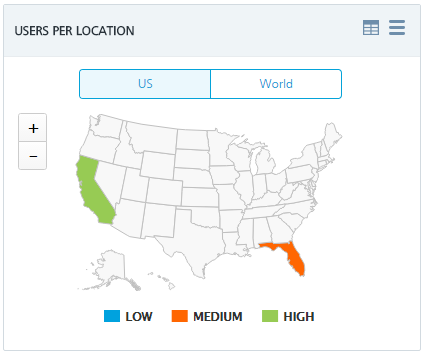

Click the plus icon to zoom in, and the minus icon to zoom out. Zooming is useful to see greater detail in a small area. Below example, displays larger view of California State.

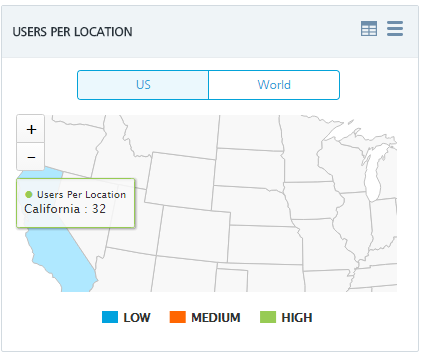

### Users per Location - World

The **Users per Location - World** chart presents data of users per country since Volt MX Engagement services console is configured and used on your system. The report also indicates the concentration of users as low, medium or high through following colors:

*   **Blue**: Represents a low concentration of users.
*   **Red**: Represents a medium concentration of users.
*   **Green**: Represents a high concentration of users.

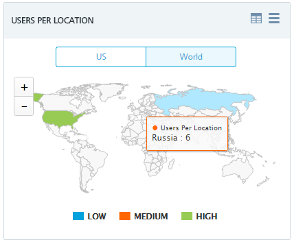

Hover the cursor over any country in the graph to view additional information such as **User per Location Russia**: 6

### Device per Platform

The **Device per Platform** chart provides data about the number of devices per platform , that have at least one Engagement server’s application installed, for example, the following graph displays following statistics:

*   **Android**: 8
*   **Windows**: 0
*   **iOS**: 3
*   **Web**: 0

Messages Sent Vs. Open
----------------------

The **Messages Sent vs. Open** section displays reports in a graphic format. The reports are:

*   [Push Messages Sent vs Opened – Platform](#Pushes_Sent_versus_Opened_%E2%80%93_P)
*   [Push Messages Sent vs. Opened – Campaign](#Pushes_Sent_versus_Opened_%E2%80%93_Ca)
*   [Email Messages Sent vs. Opened - All](#email-messages-sent-vs-opened-all)
*   [Email Sent vs. Opened – Campaign](#Email_sent_versus_Opened_%E2%80%93_Ca)
*   [SMS Sent vs. Opened- All (Outbound SMS Messages)](#sms-messages-sent-vs-opened-all-outbound-sms-messages)
*   [SMS Sent vs. Opened – Campaign (Outbound SMS Messages)](#SMS_sent_versus_Opened_%E2%80%93_Campaign_Level)
*   [SMS Inbound vs. Outbound ( Two Way SMS Messages)](#SMS_Messages_%E2%80%93_Inbound_vs_Outbound_(Two_Way_SMS_Messages))
*   [Voice SMS Messages](#sms-messages-voice-messages)
*   [Pass Sent vs. Opened- All](#pass-messages-sent-vs-opened-all)
*   [Pass Sent vs. Opened - Campaign Level](#pass-messages-sent-vs-opened-campaign)
*   [Total Messages](#total-messages)

### Push Messages Sent vs. Opened – Platform

The **Push Messages Sent vs. Opened - Platform** chart shows the number of pushes sent, and number of pushes opened per platform since Volt MX Engagement services console is configured and used on your system.

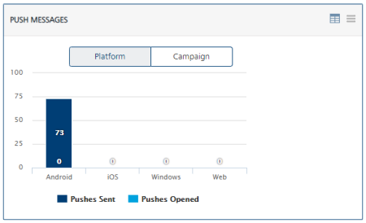

The sent pushes are represented by the dark blue color block, while pushes opened are represented by the light blue color block.

### Pushes Sent vs. Opened – Campaign Level

The **Pushes Sent vs. Opened at Campaign** chart shows the number of pushes sent and the number of, pushes opened for all the campaigns since Volt MX Engagement Services console is configured and used.

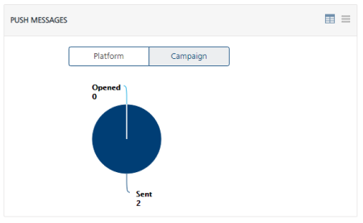

### Email Messages Sent vs Opened- All

The **Email Messages - All** chart shows the count of emails sent and emails opened since Volt MX Engagement services console is configured and used.

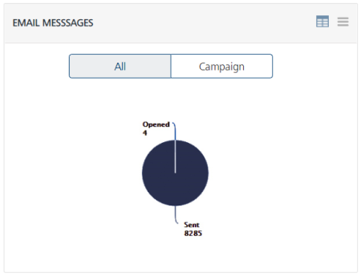

### Email Sent vs. Opened – Campaign

The **Email Sent vs. Opened – Campaign** chart shows the count of all the emails sent and emails opened by all the campaigns except terminated since Volt MX Engagement services console is configured and used.

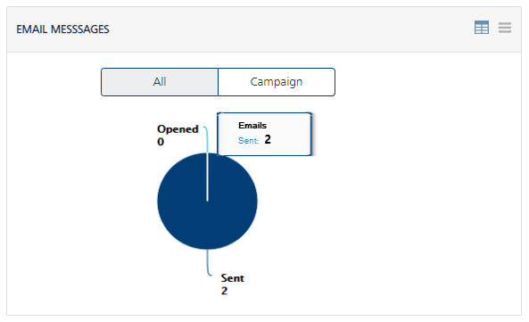

### SMS Messages Sent vs Opened-– All ( Outbound SMS Messages)

The **SMS Messages - All** chart shows the count of all SMS messages sent and SMS messages opened since Volt MX Engagement services console is configured and used.

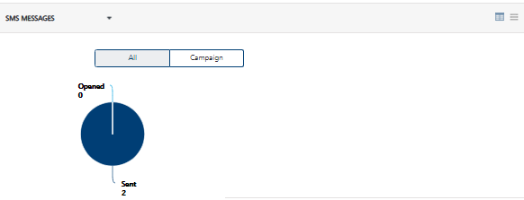

### SMS Sent vs. Opened – Campaign ( Outbound SMS Messages)

The **SMS Sent vs. Opened – Campaign** chart shows the count of all SMS messages sent and SMS messages opened by all campaigns except terminated since Volt MX Engagement services console is configured and used.

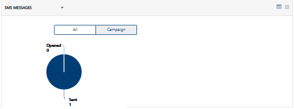

### SMS Messages – Inbound vs Outbound (Two Way SMS Messages)

To view the **Two Way SMS Messages**, click on the drop down on the top left corner of SMS Messages chart and select the option as **Two Way SMS Messages**. This shows the count of the total number of messages that were sent outbound (as part of the 2 way SMS) and the number of messages that were received (as part of the 2 way SMS) since the Volt MX Engagement server was setup.

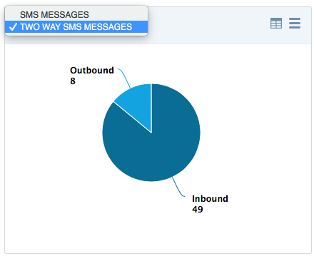

### SMS Messages – Voice Messages

The **Voice SMS Sent vs. Opened** has two charts, one for All and another for Campaign.

*   The **Voice SMS Sent vs. Opened - All** shows the count of all Voice SMS messages sent and Voice SMS messages opened since Volt MX Engagement services console is configured and used.
*   The **Voice SMS Sent vs. Opened - Campaign** shows the count of all Voice SMS messages sent and Voice SMS messages opened by all campaigns except terminated since Volt MX Engagement services console is configured and used.

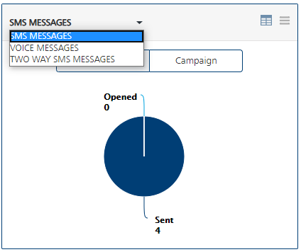

### Pass Messages Sent Vs Opened- All

The **Pass Messages - All** chart shows the number of passes sent and the number of passes opened since Volt MX Engagement Services console is configured and used.

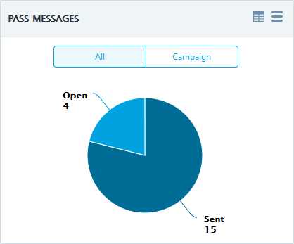

### Pass Messages Sent vs. Opened - Campaign

The **Passes Sent vs. Opened – Campaign** chart displays the relationship between passes sent, and passes opened at the campaign level since Volt MX Engagement Services console is configured and initiated its services.

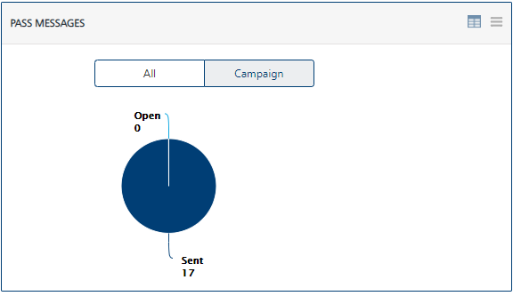

### Total Messages

The **Total Messages** chart displays the total number of messages (push, SMS, email and pass) sent over a period. The Y, or vertical axis represents the sent messages while the X, or horizontal axis represents the dates on which the messages were sent.

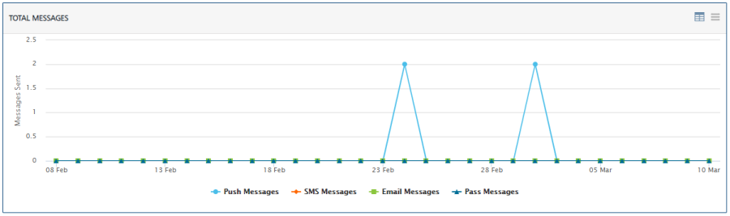
