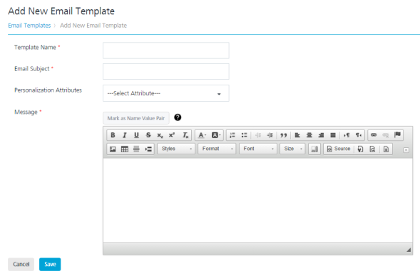
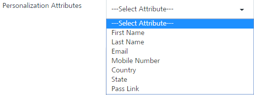
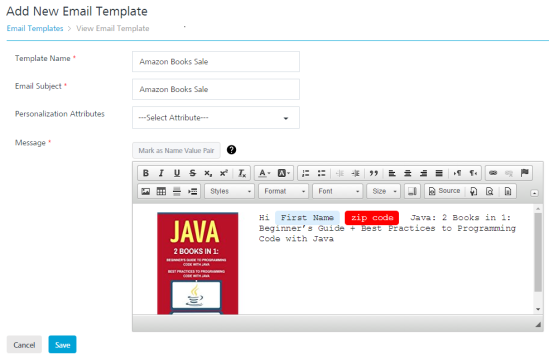
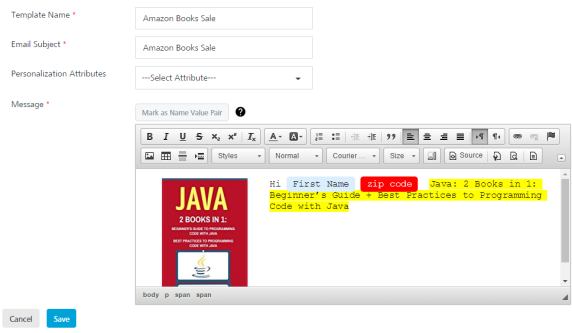

                           

Adding Email Templates
======================

You add email templates to use the same email template again and again for multiple campaigns and events with different content.

To add an email template follow these steps:

1.  In the **Email Template** home page, click the **Add Email Template** button.
    
    The **Add New Email Template** page appears.
    
    
    
2.  Enter details for the following fields:
    
    *   **Template Name**: Enter the template name in the **Template Name** field.
    *   **Email Subject**: Enter the subject of the email in the **Email Subject** field.
    *   **Personalization Attributes**: Select the required personalization attributes from the drop-down list.
        
        
        
        The system inserts the selected attributes at the cursor position in the **Message Box** text area.
        
    *   Based on your requirement, place the cursor in the message box to insert personalization attributes and email message. You can click X icon next to the attribute to remove the attribute from the message box.
    *   **Mark as Name Value Pair**: To set the Name\_Value pair, enter the key words in the email message text box and click the **Mark as Name Value Pair** button.  
        The marked text becomes highlighted. The text converts to a variable.
        
        
        
    *   **Message:** Enter the email message. You can customize the email message through the rich text tool bar available on the top of compose message window.
    
    
    
3.  Click the **Cancel** button to close the window without saving any settings. The system displays the **Email Template** home screen.
4.  Click **Save** . The saved template appears in the **Email Template** list-view. The system displays the confirmation message that the template is saved successfully.
    
    > **_Note:_** Fields with a red asterisk are mandatory fields.
