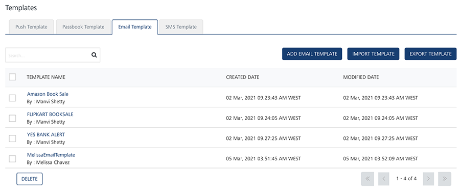
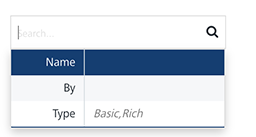
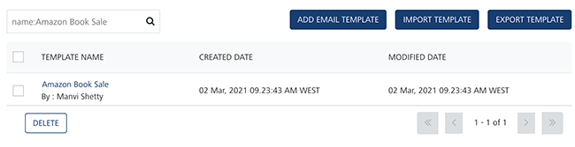
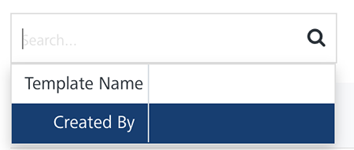
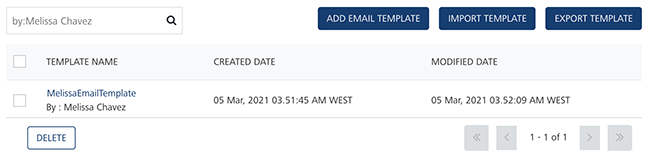
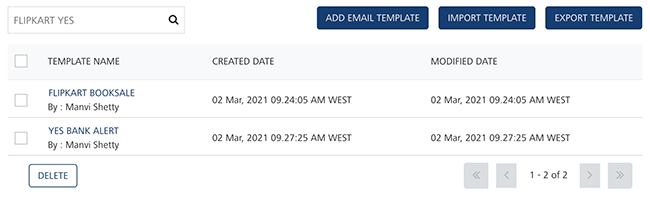

                              

Email Template
==============

As an administrator, you add various email message templates to use in campaigns and events. The email templates save creation time, because you can use the same template for sending similar email message to users.

From the **Settings** section, click **Template** from the left panel. The **Templates** page appears with the four tabs including **Push Template**, **Email Template**, **SMS Template** and **Passbook Template**. Click **Email Template** to open the **Email Template** home page.

The **Email Template** home page displays the the following details:

*   **Add Email Template** button: The button helps you add new email messages to the list.
*   **Import Template** button: The button helps you import email templates.
*   **Export Template** button: The button helps you export email templates.
*   **Search** field: Click in the search field to view options to search an email message template. You can search email message templates based on the following search criteria:
    *   **Template Name**: Enter the email message template name in the search field and click **Enter**.
        
        
        
        The email message template appears on the home page. To clear your search result, click in the search field to view the **Email Template** page.
        
        
        
    *   **Created By**: Enter the name of the template's creator in the search field.
        
        
        
        The email message template appears on the home page. To clear your search result, click in the search field to view the **Email Template** page.
        
        
        
    *   **Searching without Labelling with Multiple Parameters**: Enter the required parameters with a space in the search field. For example, the following image displays search result for two email templates based on entered parameters.
        
        
        

The **Email Template** list-view includes the following details:

  
| Email Message Template Element | Description |
| --- | --- |
| Template Name | Displays the following details: -The email template name- The name of the email template creator |
| Created Date | Displays the date and time when the email template is created. |
| Modified Date | Displays the date and time when the email template is last modified. |
| Delete button | The button helps you delete email templates from the list |
| Display controls | By default, the number range is set to 20 so that only 20 templates are displayed in the list-view. You can view more templates by navigating through the **Forward** arrow icon. You can navigate back through the **Backward** arrow icon. |

  
You can do the following tasks from the Email Message Template screen:

*   [Adding Email Templates](Adding_email_temp.md)
*   [Modifying Email Templates](Modifying_email_temp.md)
*   [Exporting Email Templates](Export_email_temp.md)
*   [Importing Email Templates](Import_email_temp.md)
*   [Deleting Email Templates](Deleting_email_temp.md)

  
| Rev | Author | Edits |
| --- | --- | --- |
| 7.2 | AU | AU |
