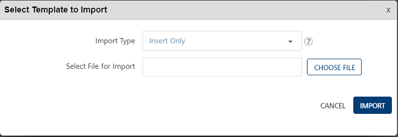
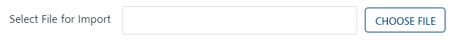
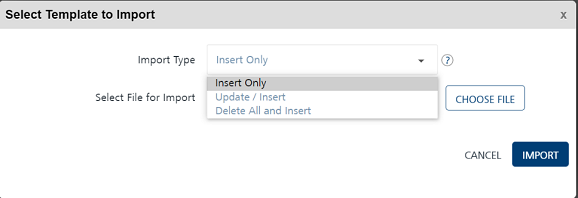

                           

Importing Email Templates
=========================

You can add email templates into Volt MX Engagement services by using the **Import Template** button. The feature helps you do a bulk import of email templates.

**To import email templates, follow these steps**:

1.  On the **Templates** page, **Import Template.**
    
    The **Select Template to Import** window appears.
    
    
    
2.  Click **Choose File** to select the templates zip file from your system.
    
    
    
3.  **Import Type**: Select the desired option from the drop-down list. There are three options to import email templates in bulk.
    
    *   **Insert Only**: By default, the **Import Type** option is set to **Insert Only**. The option reads the data in the file and inserts email templates in the Engagement server. If insert fails, the system displays an error.
    *   **Update/Insert**: The option reads the data in the file and tries to update each record first. If the record update fails, the system inserts the new records.
    *   **Delete All and Insert**: The option deletes existing email templates data and inserts new data in the Engagement server. As a prerequisite, you need to take backup of your data before selecting the option.
    
    
    
    If the file upload is successful, the system displays the confirmation message that the file uploaded successfully and import is underway. The system also displays the assigned request ID. The uploaded email message templates appears in the **Email Template** list-view on the **Templates** page.
    

File Status
-----------

1.  You can use the request ID supplied with the confirmation message to view the current status of the uploaded email message template file under the Settings > Status section.
2.  If the template files are not uploaded successfully, you can view the file status as bad data under the Status column. Hover the mouse over bad data to view the error message. Based on the error message, you can take the necessary action and import the email message templates successfully.
