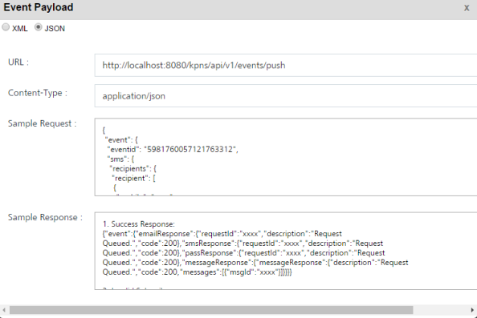

                            


API Payload
===========

To view the API payload, follow these steps:

1.  Click the **View API Payload** button to get details of the API call that can be used by a third-party system to send notifications.
    
    > **_Note:_** The **Event Payload** window details are used as a sample only. While sending event notifications, you need to enter the values for any defined name\_value pair.
    
2.  On the **View Event** page, click **View API Payload**.
    
    The **Event Paylaod** window appears.
    
      
    
    
3.  Click either the **XML** or the **JSON** option to view the sample API payload. By default, the API format option is set to the **XML** format, which you can modify to **JSON**. Both the formats contain the same field types. Following is the sample payload for your reference.
```
{
    	"event": {
    		"eventid": "5981760057121763312",
    		"sms": {
    			"recipients": {
    				"recipient": [{
    					"mobile": "xxxx",
    					"id": "xxxx"
    				}]
    			},
    			"content": {
    				"mimeType": "text/plain",
    				"priorityService": "false",
    				"eventNamePairs": {
    					"key": [{
    						"name": "County",
    						"content": "xxxx"
    					}]
    				}
    			}
    		},
    		"message": {
    			"subscribers": {
    				"subscriber": [{
    					"ksid": "xxxx",
    					"ufid": "xxxx",
    					"deviceId": "xxxx"
    				}]
    			},
    			"content": {
    				"mimeType": "text/plain",
    				"priorityService": "false",
    				"eventNamePairs": {
    					"key": [{
    						"name": "County",
    						"content": "xxxx"
    					}]
    				}
    			}
    		}
    	}
    }
```
4.  Click the **X** icon to close the window. The system displays the **View Event** screen.
