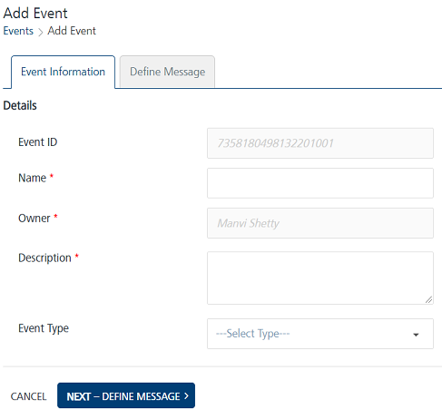
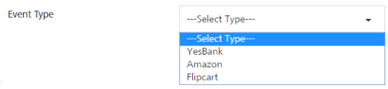
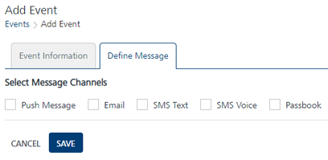

                             

Adding Events
=============

Adding an event involves the following steps:

1.  Enter event details.
2.  Compose the event message.
3.  Save the event.
4.  Activate the event.
5.  Call **API Payload** to enable events for notifications.

To add an event, follow these steps:

1.  On the **Events** home page, click the **Add Event** button.
    
    The **Add Event** page appears. The **Add Event** page includes two tabs: **Event Information** and **Define Message**. By default, the **Event Information** tab is set to **Active**.
    
    *   [Event Information](#event-information)
    *   [Define Message](#define-message)
    *   [API Payload](API_Payload.md)
    
    Event Information  
    
    --------------------
    
2.  In the **Details** section, enter details for the following fields:
    
    
    
    *   **Event ID**: The field displays the system-generated event identification number. You cannot modify an event ID.
    *   **Name**: Enter a name of the event. The event name can be a maximum of 50 characters.
    *   **Owner**: The field displays the name of an event creator. You cannot change the owner details.
    *   **Description**: Enter the event description. You can enter only alphanumeric characters. If the description exceeds the existing message box area, a scroll bar appears.
    *   **Event Type**: Select the event type from the **Event Type** drop-down list.
        
        
        
        > **_Note:_** The **Name** and **Description** fields are mandatory. If you do not enter the details, the system displays an error message that information is required.
        
3.  Click **Next-Define Message** to continue.
    
    The **Define Message** tab becomes active.
    
    Define Message
    --------------
    
4.  In the **Select Message Channels** section, do the following:
    
    Based on your requirement, select a channel to compose an event message. You need to select at least one channel: push, email, SMS, or pass to send event notifications.
    
    
    
    > **_Note:_** When an email, push, or SMS channel is selected, you can define name-value pairs in the message. The name-value pairs are replaced with the actual data when the event message is sent, such as county-zipcode (Los Angeles-91001).  
    For pass messages, you can choose an existing pass template or create a new pass to send as the event message.
    
    *   [Push Event Message](Defining_Notification_Types_for_an_event_-_Push_Message.md)
    *   [Email Event Message](Defining_Notification_Types_for_an_event_-_Email.md)
    *   [SMS Event Message](Defining_Notification_Types_for_an_event_-_SMS.md)
    *   [Pass Event Message](Defining_a_campaign_Type_eventPassbook.md)
    
    You can set channel priority to send messages to users through the **Settings** button available on the Events > Define Message page. For more details, see [Events: Setting Message Priority](setting_event_priority.md)
