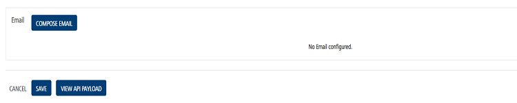
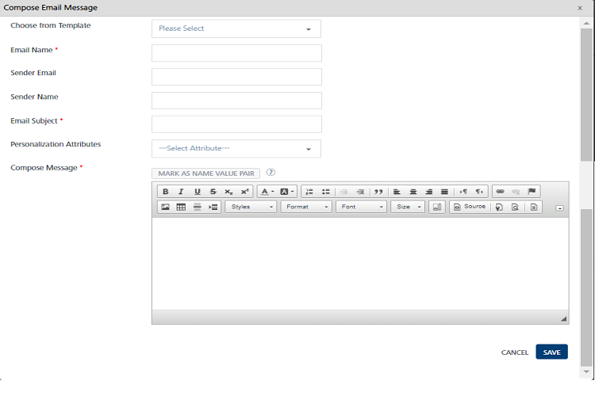
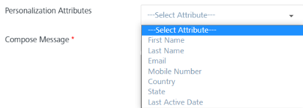
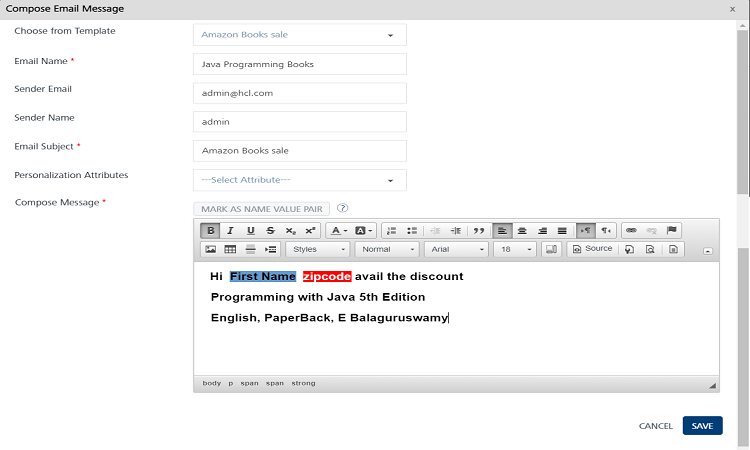
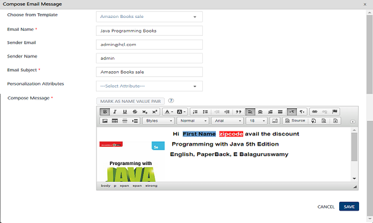
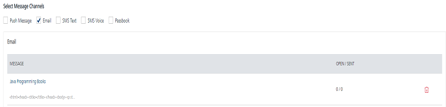
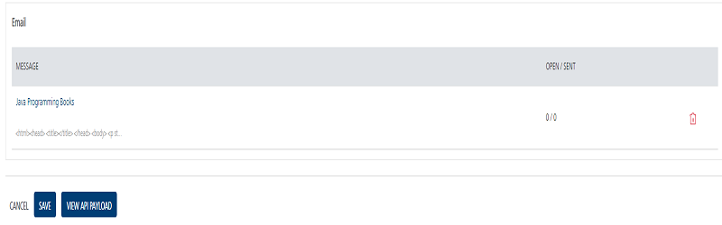
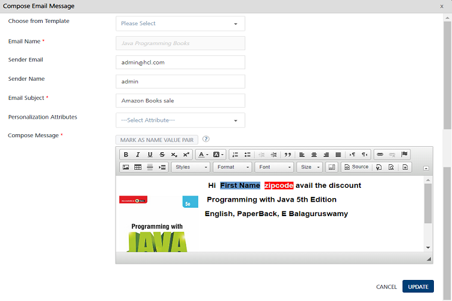
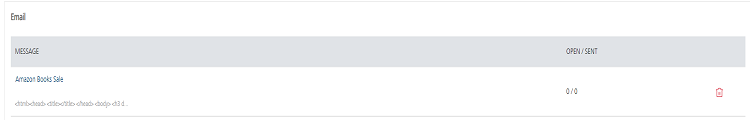

                             

Email
=====

To configure your event message, you can use a pre-defined template or create a new email. You can perform the following tasks from the **Add Event** > **Define Message** section:

*   [Adding an Email Message](#adding-an-email-message)
*   [Modifying an Email Message](#modifying-an-email-message)
*   [Deleting an Email Message](#deleting-an-email-message)

Adding an Email Message
-----------------------

To compose a new email message for an event, follow these steps:

1.  **Select Message Channels**: Select the type of notification as **Email**.  
    The **Email Message** grid appears. The email message grid includes an email label and the **Compose Email** button to compose email messages. If no email message is found, the system displays the message: **No emails configured**.  
    
    
    
2.  Click the **Compose** **Email** button to compose a new email message for an event.
    
    The **Compose Email Message** window appears.  
      
    
    You can create an email message through the following options:
    
    *   [Compose New Email](#compose-new-email)
    *   [Compose from Template](#compose-from-template)
        
        ### Compose New Email
        
        To compose a new email, follow these steps:
        
        1.  **Email Name**: Enter an appropriate name of the email.
        2.  **Sender Email**: Enter the email ID of the sender in the **Sender Email** field.
            
            > **_Important:_** The default sender ID is used when the sender email address is not provided. Some mail servers (Gmail) always show the sender email ID as the default ID regardless of the **From** email address.
            
        3.  **Sender Name**: Enter the sender's name in the **Sender Name** field.
        4.  **Email Subject**: Enter the subject in the **Email Subject** field. The subject must convey the essence of the email message.
        5.  **Personalization Attributes**: Select the attributes from the drop-down list to customize your email message.
            
            
            
            The system inserts the selected attributes at the cursor position in the **Compose Message box**.
            
        6.  Based on your requirement, place the cursor in the message box to insert personalization attributes and the email message. You can click X icon next to each attribute to remove the attribute from the message box.
        7.  **Mark as Name Value Pair**: To set the name\_value pair, enter the keywords in the message box. Click the **Mark as Name Value Pair** button. The marked text is highlighted to indicate that the text is converted to a variable.
            
            
            
        8.  **Compose Message**: Enter the email message. You can customize the email message through the **Rich Text** tool bar available on the top of the **Compose Message** window.
        
        ### Compose from Template
        
        **To compose an email message from the template, follow these steps:**
        
        1.  **Choose from Template**: Select the required template from the drop-down list.
            
            The email subject and compose text area are populated with the text chosen from the template.
            
        2.  **Email Name**: Enter an appropriate name of the email.
        3.  **Sender Email**: Enter the email ID of the sender in the **Sender Email** field.
        4.  **Sender Name**: Enter the sender's name in the **Sender Name** field.
        5.  **Personalization Attributes**: Select the attributes from the drop-down list to customize your email message.
            
            
            
        6.  Click the **Cancel** button to close the window. The system displays the **Add Event** page.
        7.  Click the **Save** button. The newly added email message appears in the email list-view on the **Add Event** page.
            
            
            
            The email list-view displays the following details.
            
            | Email Message Element | Description |
            | --- | --- |
            | Message | \- Displays the email message name- Displays the email message text |
            | Open / Sent | Displays the total number of email messages sent and opened by users |
            | Delete button | The button helps you delete email messages |
            
3.  Click the **Cancel** button to close the window. The system displays the **Event** home screen.
4.  Click **Save.** The saved event appears in the **Events** list-view. The system displays the confirmation message that the event is saved successfully.
    
    > **_Note:_** Fields with a red asterisk are mandatory.
    

Modifying an Email Message
--------------------------

you can manage email message details. For example, you want to modify the email subject or use a new template. The **View Event** page contains the following details.

  
| Email Message Element | Description |
| --- | --- |
| Message | \- Displays the email message name- Displays the email message text |
| Open / Sent | Displays the total number of email messages sent and opened by users |
| Delete button | The button helps you delete email messages |

To modify an email message, follow these steps:

1.  On the **View Event** screen, under the **Email Message** column, click the required email.
    
    
    
    The **Compose Email Message** window appears. The **Compose Email Message** window displays all the fields.
    
      
    
2.  You can update the following details.
    
    | Email Message Element | Description | Modification Allowed |
    | --- | --- | --- |
    | Email Name | Name of the email | No |
    | Sender Email | Email ID of the sender | Yes |
    | Sender Name | Name of the sender | Yes |
    | Email Subject | Subject of the email | Yes |
    | Personalization Attributes | There are default personalization attributes: First name, Last name, Email ID, Mobile number, Country, and State | Yes |
    | Mark as Name Vale Pair | A key-value pair is a set of two linked data items: a key, which is a unique identifier for some item of data, and the value, the data | Yes, you can insert variables to mark as name-value pairs |
    | Compose Message | Compose message box to update the existing email message | Yes |
    | Choose from Template | Template drop-down list. | Yes, you can select a new template from the drop-down list. |
    
3.  Click **Cancel** if you do not want to update the email message. The **Compose Email** message window closes without saving any details.
4.  Click **Update** to continue.
    
    The updated email message appears in the email message list-view on the **View Event** page.
    

Deleting an Email Message
-------------------------

As an administrator, you can delete any email message.

To delete an email message, follow these steps:

1.  To remove an email message, select the **Delete** button next to the email message.  
    
2.  The **Confirm Delete** dialog box appears asking if you want to delete the selected event message.
3.  Click **Cancel**. The **Confirm Delete** dialog box closes without deleting any email message.
4.  Click **Ok** to continue. The selected email message is removed from the list-view.
