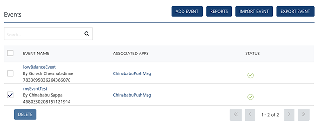

                              

Deleting Events
===============

As an administrator, you can delete an event as required.

To delete an event, follow these steps:

1.  Select the check box next to the event from the list-view on the **Events** screen.
    
    
    
2.  Click the **Delete** button. You can either select any one event or all the listed events to delete them.
    
    The **Confirm Delete** dialog box appears, asking if you want to delete the selected events.
    
3.  Click **Cancel** if you do not want to delete the event. The **Confirm Delete** dialog box closes without deleting the event.
4.  Click **OK** to continue.
    
    The system displays the confirmation message that the event with deactivated status is deleted successfully.
    
    > **_Important:_** You can delete only deactivated events. If you try to delete an active event, the system displays a warning message that only events with deactivated status can be deleted.
    

  
| Rev | Author | Edits |
| --- | --- | --- |
| 7.3 | AU | AU |
