                              

Events
======

Engagement services enable you to send event messages through any of the four channels to users. The channels are push notification (native and web), email, SMS, and pass. When an event is added and published successfully, you need to call the event through Event APIs to deliver event messages through configured channels.

To understand events, let us assume that a bank wants to inform its customers about the due date for credit card payments. The bank admin creates a name-value pair, such as first name and last name, for all customers who possess a credit card. Next, the admin sends an event message through a channel (push notification, or email, or SMS) to all bank customers.

> **_Note:_** For more details about Event APIs,  
refer to, Event APIs in the [Engagement Services API Programming Guide.](../../../../Foundry/engagement_api_guide/Content/Introduction_1.md)

> **_Important:_** As a user, you must have the following permissions to access the **Events** home page and perform different tasks based on the role:  
  
    - ROLE\_EVENTS\_ALL  
    - ROLE\_EVENTS\_PUBLISH

From the **Engagement** section, click **Events** from the left panel. The **Events** home page appears.

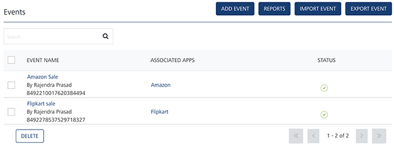

The **Events** home page displays the following details:

*   **Add Event** button: The button helps you add new events to the list.
*   **Reports** button: The button helps you view event reports.
*   **Import Event**: The button helps you import events in a zip file format.
*   **Export Event**: The button helps you export events in a zip file format.
*   **Search** field: Click in the **Search** field to view options to search an event. You can search an event based on the following criteria:
    *   **Registration ID**: Enter the registration ID in the **Search** field, and click **Enter**.
        
        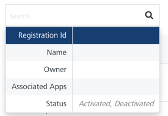
        
        The event appears in the list view.
        
        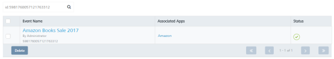  
        
    *   **Event Name**: Enter the event name in the **Search** field, and click **Enter**.
        
        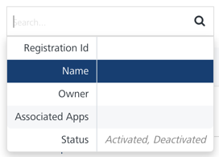
        
        The event appears in the list view.
        
        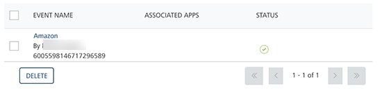
        
    *   **Owner**: Enter the name of the event's creator in the **Search** field, and click **Enter**.
        
        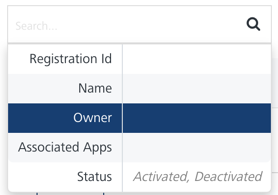
        
        The event appears in the list view.
        
        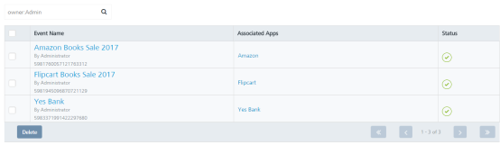
        
    *   **Associated Apps**: Enter the name of the associated app with the event in the **Search** field, and click **Enter**.
        
        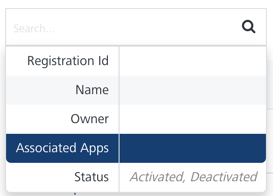
        
        The event appears in the list view.
        
        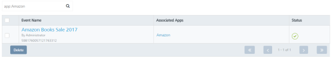
        
    *   **Status**: Based on your requirement, enter the event status as **Activated** or **Deactivated** in the **Search** field, and click **Enter**.
        
        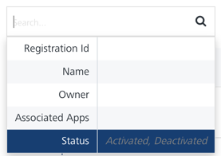
        
        The event appears in the list view.
        
        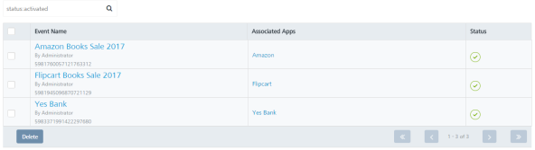
        
        > **_Note:_** To clear your search result, click in the **Search** field to view the **Events** page.
        
    *   **Searching without Labelling with Multiple Parameters**: Enter the required parameters with a space in the **Search** field. For example, the following image displays search results for two events based on the entered parameters.
        
        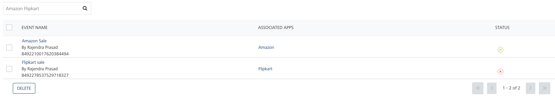
        

The **Events** list-view displays the following details.

  
| Event Element | Description |
| --- | --- |
| Event Name | Displays the following details:- Event name: Name of the event - ID: The event identification number. The event ID is a system- generated number added in **Engagement** Services when you add a new event - Owner: The names of users who add or update the events |
| Associated Apps | Displays all the applications that are associated with an event to receive the event messages |
| Status | Displays the completion status of events as **Activate** or **Deactivate**. Events configured as **Activate** are only used to send event messages |
| Delete button | The button helps you delete events from the list |
| Display controls | By default, the number range is set to 20 so that only 20 events are displayed in the list-view. You can view more events by clicking the forward arrow icon. You can navigate back by clicking the backward arrow icon. |

  

> **_Note:_** If no event is added, the system displays the following message under the **Status** column: **No events found**.  

You can perform the following tasks from the **Events** screen:

*   [Adding Events](Adding_an_Event.md)
*   [Setting Event Message Priority](setting_event_priority.md)
*   [Activating Events](Publishing_an_Event.md)
*   [Modifying Events](Modifying_an_Event.md)
*   [Reactivating the Modified Events](Republishing_the_Modified_Events.md)
*   [Exporting Events](Exporting_events.md)
*   [Importing Events](Importing_event.md)
*   [Viewing Event Reports](Viewing_Events_Reports.md)
*   [Deleting Events](Deleting_an_Event.md)
