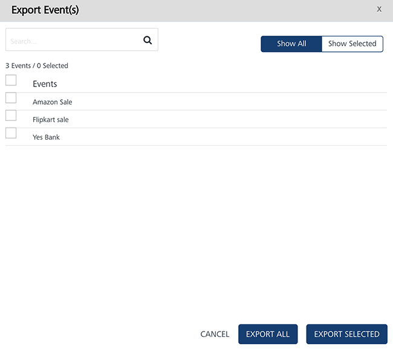
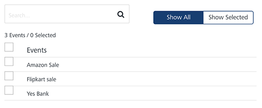
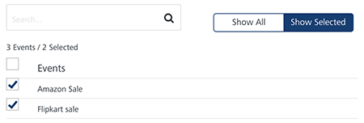
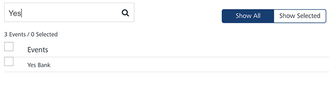

                           

Exporting Events
================

You can export events from **Engagement** services using the **Export Event** button. The feature enables you to export events in bulk at one time.

To export events, follow these steps:

1.  On the **Events** screen, click the **Export Event** button.
    
    The **Export Event(s)** window appears.
    
    
    
    The **Export Event(s)** window displays the following details:
    
    *   **Show All**: The **Show All** tab displays all the events in the list-view. By default, the **Show All** tab is set to **Active**.
        
        
        
    *   **Show Selected**: The **Show Selected** tab displays the selected events in the list-view.
        
        
        
    *   **Search** field: Enter a keyword in the **Search** field to search for a particular event.
        
        The required event appears in the list-view.
        
        
        
    *   **Export All**: Helps you export all the event records present in the **Engagement** server to a zip file.
    *   **Export Selected**: Helps you export selected event records present in the **Engagement** server to a zip file.
    *   **Cancel**: Click **Cancel** to close the window.
2.  Based on your requirement, click **Export All** or **Export Selected**.
    
    The system downloads the event records in a zip file format on your system.
