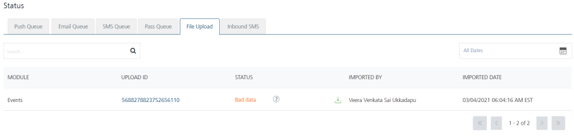

                            


Importing Events
================

You can add events into Volt MX Engagement services by using the **Import Event** button. The feature helps you do a bulk import of events.

Prerequisites
-------------

Before you import any event, make sure that all the event dependencies are taken care of. The following table displays the event dependencies.

  
| Event Dependencies | Description |
| --- | --- |
| Application | The application associated with an event push message. |
| Event Type | The defined event type. To define the event type, navigate to **Settings** > **Configuration** > **General** > **Events** > **Event Type**. |

Importing Events
----------------

To import events, follow these steps:

1.  On the Events page, click **Import Even**t.
    
    The **Select Template** to Import window appears.
    
    
    
2.  Click **Choose File** to select the events zip file from your system.
    
    
    
3.  **Import Type**: Select the desired option from the list. There are three options to import events in bulk.
    
    *   **Insert Only**: The option reads the data in the file and inserts events in the Engagement Server. If the insert fails, the system displays an error. The **Import Type** option is set to **Insert Only** by default.
    *   **Update/Insert**: Initially, the server reads the data in the existing files and updates the records for any changes. If there are no updates, the system inserts the new records.
    *   **Delete All and Insert**: The option deletes existing data and inserts new data in the Engagement Server. As a prerequisite, you need to take backup of your data before selecting the option.
    
    
    ### Retaining the Event ID while Importing Events
    
    When you create an event in the Engagement server, the system assigns a unique event ID to an event. When you import an event from your local system to the Engagement server, the feature maintains the same event ID in the database.
    
    
    
4.  Click **Cancel** to close the window.
5.  Click **Import** to continue.
    
    If the file uploads successfully, the system displays a confirmation message with an assigned request ID.
    
6.  The newly added events appear with the status as **Inactive** in the list.  You need to activate events to send channel notifications to users.

Event File Upload Status
------------------------

To view the uploaded event file status, follow these steps:

1.  Use the assigned **Request ID** to view the current status of the uploaded event files under the **Settings** > **Status** section.
    
    The system displays the file upload status as **Success** under the **Status** column.
    
    
    
2.  If the event files are not uploaded successfully, you can view the file status as bad data under the **Status** column. Hover the cursor over the black icon next to bad data under the Status column to view the error message.
    
    
    
3.  Click **Download Errors** to download the `error.json` file on your system.
4.  The `error.json` file displays the event dependencies with description. For example, the following dependencies file displays that the required application to import the event does not exists in the system.
```
{
      "details" : {
        "dependencies" : {
          "applications" : {
            "message" : "application(s) required by importing event(s) does not exist or are not in a published state",
            "applicationIds" : [ "14019-9024042466" ]
          }
        }
      },
      "id" : 8845012016274524199,
      "message" : "Dependencies required to import data does not exist",
      "status" : "Bad data"
    }
```
5.  When you try to import the existing events in the Engagement Server, the system displays an error message that the events already exist in the system. The following error is applicable for the **Insert Only** option.
```
{
      "details" : {
        "existingEvents" : [ "Sellscart", "SellMe", "Cosmos Bank" ]
      },
      "id" : 8780128673056337115,
      "message" : "Event(s) you are trying to import already exist",
      "status" : "Bad data"
    }
```
