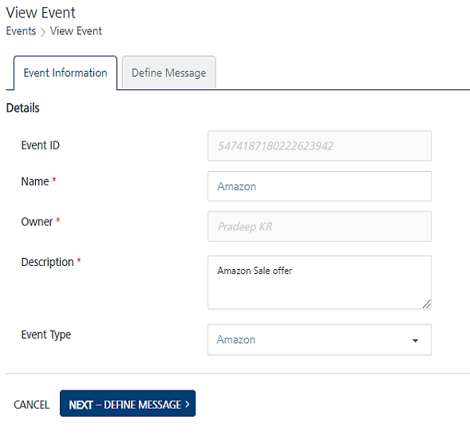
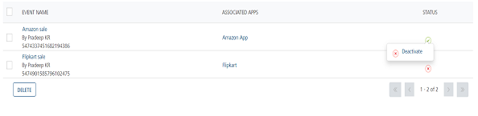

                              

Modifying Events
================

You can view and update events. For example, you may need to modify the name of an event or its description.

To view or modify an event, follow these steps:

1.  On the **Events** screen, under the **Event Name** column in the list-view, click the required event.
    
    The **View Event** screen appears. The **View Events** page includes two tabs: **Event Information** and **Define Message**. By default, the **Event Information** tab is set to **Active**.
    
    
    
    Event Information
    -----------------
    
2.  In the **Details** section, you can update the following fields.
    
    | Event Element | Description | Modification Allowed |
    | --- | --- | --- |
    | Event ID | The system-generated event identification number | No |
    | Name | Event name | Yes |
    | Owner | The name of an event creator | No |
    | Description | Event description | Yes |
    | Event Type | The event type defined under configuration settings | Yes |
    
    Define Message
    --------------
    
3.  You can add channels to configure event messages. For more details on how to add channels, refer to [Define Message](Adding_an_Event.md#define-message)
4.  Click the **Cancel** button to exit from the window without saving any information.
5.  Click the **Save** button to save the modifications.
    
    The updated event appears in the list-view. The system displays the confirmation message that the event is updated successfully.
    
6.  Click the **API Payload** button to get details of the API sample payload.The sample payload helps a third-party developer to enable events for push messages through the HTTP POST method only. For more details, refer to [API Payload.](API_Payload.md#API_Payload)
    
    > **_Note:_** When you update an event, the status icon changes under the status column. The icon signifies that the event is not reactivated after modification. For more details about how to activate the event refer, [Reactivating Modified Events](Republishing_the_Modified_Events.md)
    
    
