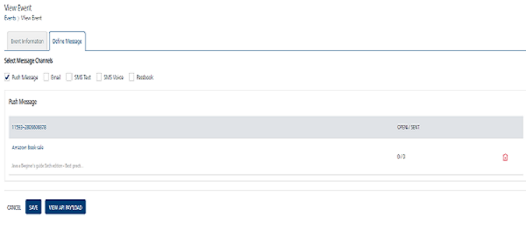
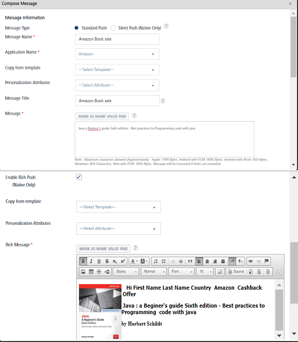

                            

Modifying a Push Message
========================

You can modify push message details. For example, you want to update the push message text or the associated application with the push message. The **View Event** page displays the following details.

  
| Push Message Element | Description |
| --- | --- |
| Push Message list-view | First column- **Event Push Message ID**: Displays the unique ID assigned to an event- **Push Message Name**: Displays the push message name- **Push Message**: Displays the push message textSecond column- **Open/Sent**: Displays the number of pushes opened or sent Third column- **Delete button**: The button helps you delete a push message |
| Cancel button | The button helps you cancel an event |
| Save button | The button helps you save an event |
| View API Payload | The button helps you view the API payload. |

To modify a push message, follow these steps:

1.  On the **View Event** screen, click the required push message under the **Push Message** column.
    
    
    
2.  The **Compose Message** window appears. The **Compose Message** window displays all fields that you have used while adding the push message details.
    
    
    
3.  You can update the following details:
    
    | Push Message Element | Description | Modification Allowed |
    | --- | --- | --- |
    | Message Name | Push message name | No |
    | Application Name | Application name | Yes, you can select a new app from the **Application Name** drop-down list |
    | Personalization Attributes | There are default personalization attributes: First name, Last name, Email, Mobile number, Country, and State | Yes, you can add new personalization attributes from the drop-down list. The new attributes are appended with the already existing attributes |
    | Message Title | Message title | Yes, you can update the message title |
    | Copy from Template | Push template | Yes, you can select a new template from the **Copy from Template** drop-down list. |
    | Message Box | Push message box | The feature displays the selected personalization attributes and push messages. |
    | Enable Rich Push | Enable rich push option | Yes, you can select a new rich push template from the **Copy from Template** drop-down list and add a new rich push message in the Rich Message box |
    | Platform Specific Properties | There are four platforms: iOS, Android, Windows, and Web | Yes, you can add or remove platform- specific properties. |
    
4.  If you do not want to update details, click **Cancel** to close the window
5.  To update the details, click **Update**.
    
    The updated push message appears in the push message list-view.
