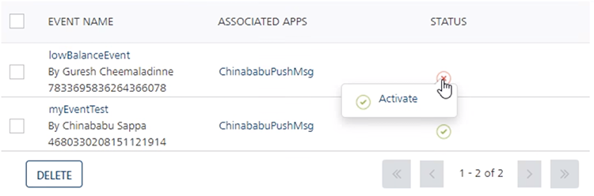
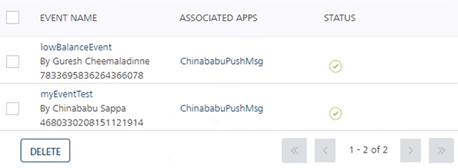

                            

Activating Events
=================

A newly added event appears with the status as **Inactive** in the list-view. You need to activate an event to send channel notifications to users.

To activate an event, follow these steps:

1.  Hover the cursor over the red cross icon under the **Status** column.
    
    
    
    The **Event Activate** dialog box appears.
    
2.  Click **Activate** to continue.
    
    The system displays the **Activate** dialog box asking if you want to activate the event.
    
3.  Click **Cancel** if you do not want to activate the event. The **Activate** dialog box closes without activating the event.
4.  Click **Ok** to continue.
    
    The event status under the **Status** column changes to active. The system displays the confirmation message that the event is activated successfully.
    
    
    

> **_Note:_** You can change the event status from **Activated** to **Deactivated**.
