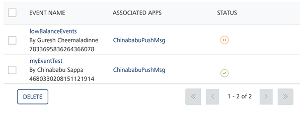
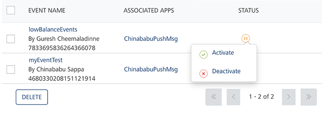
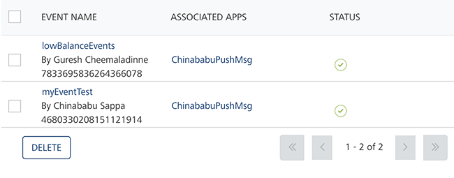

                            

Reactivating Modified Events
============================

You can update an active event. After updating an active event, the status changes to a red icon in the list-view. The red icon signifies that the definition of the event is modified. You must reactivate the event for the changes to take effect.

To reactivate a modified event, follow these steps:

1.  Hover the cursor over the red icon under the **Status** column.
    
    The system displays the dialog box with the **Activate** and the **Deactivate** options.
    
    
    
2.  Click **Activate** to continue.
    
    The system displays the **Activate** dialog box asking if you want to activate the event.
    
3.  Click **Cancel** if you do not want to activate the event. The **Activate** dialog box closes without activating the event.
4.  Click **Ok** to continue.
    
    The event status under the **Status** column changes to **Active**. The system displays the confirmation message that the event is activated successfully.
    
    
