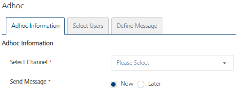

                             

Adhoc
=====

The **Adhoc** screen enables you to configure and send **Push**, **Email**, **SMS** and **Pass** messages.

From the **Engagement** section, click **Adhoc** from the left panel. The **Adhoc** screen appears with three tabs including **Adhoc Information**, **Select Users** and **Define Message**. By default, the **Adhoc Information** tab is set to active.

> **_Important:_** As a user, you must have the following permissions to access the **Adhoc** home page and perform different tasks based on the role:  
-ROLE\_ADHOC\_PUSH  
-ROLE\_ADHOC\_SMS  
-ROLE\_ADHOC\_EMAIL  
-ROLE\_ADHOC\_PASS

Click one of the following links to configure notifications for a specific channel type.

*   [Push Message](Adhoc/General_Channel_Type_Push_Message.md)
*   [Email Message](Adhoc/General_Channel_Type_Email_Message.md)
*   [SMS Message](Adhoc/General_Channel_Type_SMS_Message.md)
*   [Passbook Message](Adhoc/General_Channel_Type_PassBook_Message.md)

  
| Rev | Author | Edits |
| --- | --- | --- |
| 7.2 | AU | AU |
