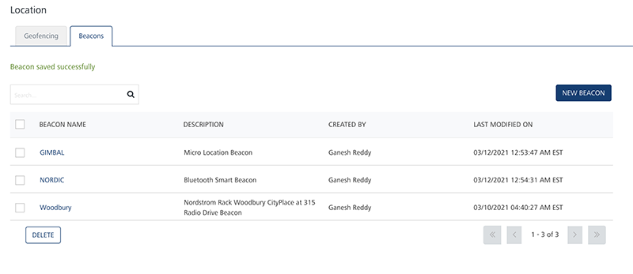
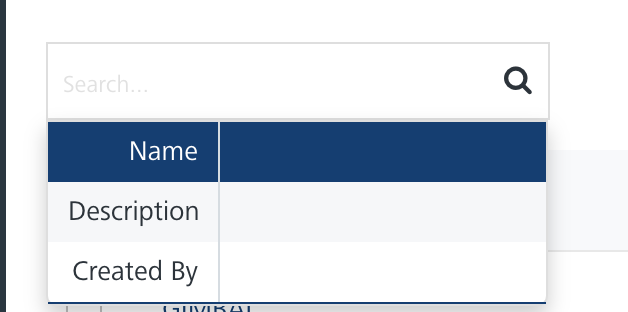
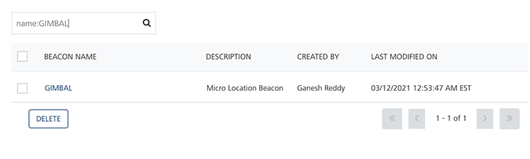
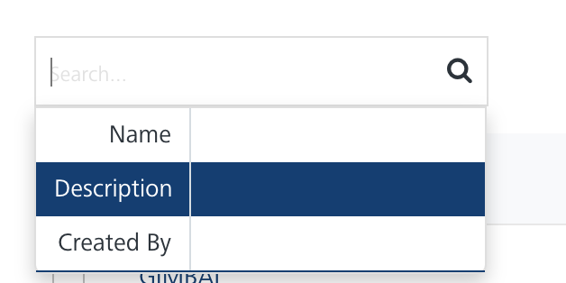
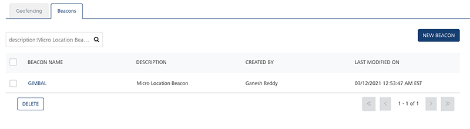
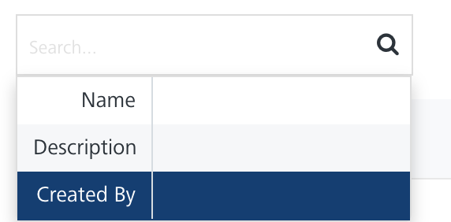
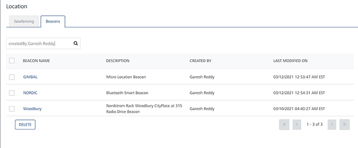

                             

Beacons
=======

iBeacon is an indoor location technology that transmits signals and can be received by other devices using Bluetooth LE (low energy) technology. In a real-world scenario, iBeacon technology helps end users. For example, passengers at an airport can receive personalized alerts about when their electronic boarding passes are issued. Similarly, buyers at a store can automatically receive location-specific rewards, discounts, and product notifications when they enter the range of a beacon. Currently, the **Engagement** server supports ibeacons only.

The **Beacon** list view includes the following details:

*   **New Beacon** button: Helps you add beacons to the console.
*   **Search** field: Click in the search field to view the options to search for a beacon. You can search beacons based on the following criteria:
    
    *   **Name**: Enter the name of the beacon.
        
        
        
        The required beacon appears in the list view.
        
        
        
    *   **Description**: Enter a description of the required beacon.
        
        
        
        The required beacon appears in the list view.
        
        
        
    *   **Created By**: Enter the name of the beacon's creator.
        
        
        
        The required beacon appears in the list view.
        
        
        
        > **_Note:_** To clear your search result, click in the search field to view the **Location** home screen.
        
    
    The **Beacons** list-view displays the following details:
    
    | Beacon Element | Description |
    | --- | --- |
    | Beacon Name | The column displays the names of the added beacons |
    | Description | The column displays the description of the added beacons |
    | Created By | The column displays the name of the owner who creates the beacons |
    | Last Modified on | The column displays the date on which the beacon is last modified |
    | Display Controls | By default, the number range is set to 20, so that only 20 beacons are displayed in the grid. You can view more beacons through the **forward** arrow icon. You can navigate back through the **backward** arrow icon. |
    

You can do the following tasks from the **Beacons** screen:

*   [Adding Beacons](Add_beacons.md)
*   [Modifying Beacons](Mod_beacons.md)
*   [Deleting Beacons](Del_beacons.md)
