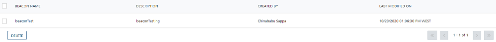

                            

Deleting Beacons
================

You can delete a beacon. You cannot delete a beacon associated with passes, campaigns, and segments,

To delete a beacon, follow these steps:

1.  Select the check box adjacent to the beacon name you want to delete, under the **Beacon Name** column. When you select multiple beacons to delete, only eligible beacons are deleted.
2.  Click the **Delete** button.
    
    The system displays the **Confirm Delete** dialog box with the warning message asking if you want to delete the selected beacons.
    
3.  If you do not want to delete a beacon, click **Cancel** to close the **Confirm Delete** dialog box.
4.  Click **OK** to continue.
    
    The system displays the confirmation message that beacons not assigned to passes, and campaigns or segments are deleted successfully. The deleted beacon is no longer displayed in the list view.
