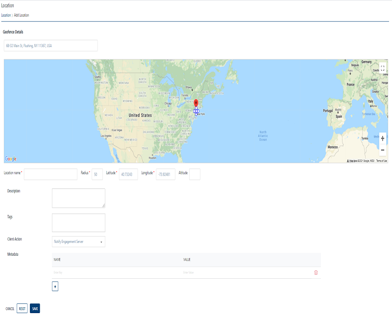
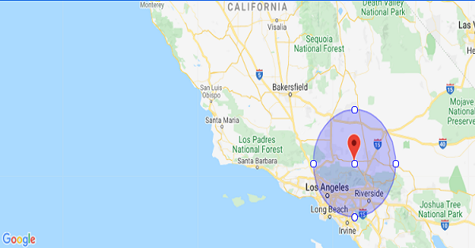
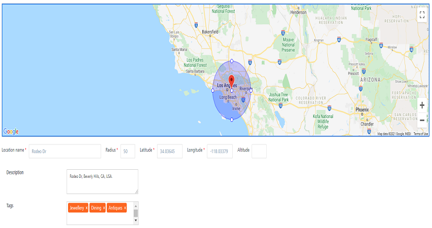
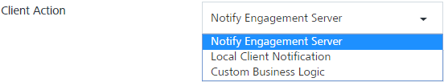
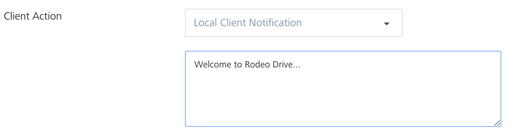
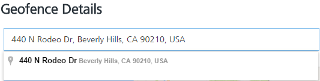
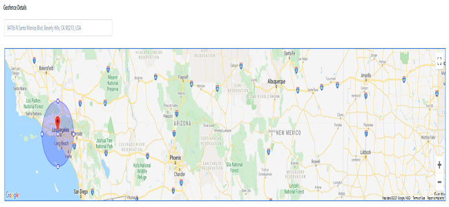

                            

Adding Geofences
================

Based on your requirement, you can add geofences in the **Engagement** server. For example, you add a new geofence, **Rodeo Drive**, in the Engagement server. Rodeo Drive in Beverly Hills, **California**, **USA** is well known for luxury goods stores.

To add a geofence, follow these steps:

1.  On the **Location** screen, click **Add New**.
    
    The **Add Location** screen appears.
    
    
    
2.  Enter details for the following fields:
    
    *   **Location Name**: Enter the location name, such as Rodeo Drive, in the **Location Name** field. You can enter alphanumeric characters only.
    *   **Radius**: Enter the radius details, such as 50 miles.
    *   **Latitude**: Enter the latitude details, such as 34.052235.
    *   **Longitude**: Enter the longitude details, such as -18.243683.
        
        > **_Note:_** The **Location**, **Name**, **Radius**, **Latitude**, and **Longitude** fields are mandatory. If you do not enter the details, the system displays an error message that information is required.
        
        The **Rodeo Drive** geofence area appears in the **Google** map. You can also use the search option to locate the geofence.
        
        
        
    *   **Altitude**: Enter the altitude details, such as 250.
        
        > **_Note:_** The altitude option is used only with a pass.
        
    *   **Description**: Enter a description for the geofence, such as **Rodeo Dr, Beverly Hills, CA**.
    *   **Tags**: Enter a tag value for a geofence. You can enter multiple tags for a geofence. The data is optional. A user can query a list of geofences based on the tags list.  
        For example, you want to visit **Rodeo Drive** to buy luxury items. You can add the required tags, such as luxury goods, antiques, and jewelry.
        
        
        
    *   **Client Action**: The client action is a drop-down list with the following options:
        
        
        
        *   **Notify Engagement Server**: By default, the drop-down list is set to the Notify Engagement Server option. The client action works as follows:
            1.  The app launched on your device communicates the geographic coordinates of a geofence to the **Engagement** server.
            2.  The **Engagement** server maintains a list of all geographic coordinates for the registered geofences. The **Engagement** server returns a set of configured geofences to the app.
            3.  The app communicates with **Iris** about the list of received geofences.
            4.  The **Framework** then regularly monitors the geofences and notifies the app when the device enters a particular geofence.
            5.  The app communicates with the **Engagement** server to check if there are notifications pending for that geofence.
                
            6.  The **Engagement** server pushes any notifications associated with the geofence. If no notification is received, the communication from the app is ignored.
                
        *   **Local Client Notification**: Select the option as Local Client Notification. The system displays the text box to enter the notification message.
            
            Enter a notification message. The message is displayed when the device enters a specific geofence for which the notification is configured. For example, when you reach **Rodeo Drive**, the app displays the local notification message: **Welcome to Rodeo Drive**…
            
            
            
        *   **Custom Business Logic**: Select the option as Custom Business Logic. The system displays the JavaScript editor to enter the JavaScript code. For example, you can add the Java script code to return the geolocation of a user's position.
            
            
            
    *   **Metadata**: Enter the metadata in the form of name-value pairs. Metadata provides basic information that helps you find the data related with a geofence. For example, you want to visit **Rodeo Drive** to buy clothes and dine. The pertinent metadata tags are:
        
        *   sea-food – monkfish
        *   clothings – stefano RICC
        
        
        
        Click the plus icon to add additional metadata name-value pairs. Click the trash icon to remove the added metadata name-value pairs.
        
    *   **Search field**: Enter the location name, such as **440 N Rodeo Dr, Baverly Hills, CA 90210, USA**. The Google search displays the location in a drop-down list. Select the location.
    *   
        
    
    The Google map displays the location with a red icon.
    
    
    
3.  Click **Cancel** to close the window.
4.  Click **Reset** to reset the entry fields.
5.  Click **Save**.
    
    The newly added geofence appears in the **Geofencing** list view. The system displays the confirmation message stating that the location is saved successfully.
