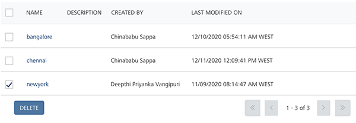
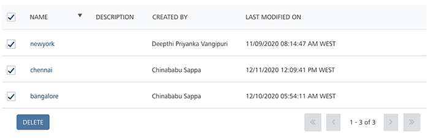

                             

Deleting Geofences
==================

You can delete a geofence. A geofence cannot be deleted if it is used in a segment, pass template, or pass.

To delete a geofence, follow these steps:

1.  Select the chec kbox next to the required geofence in the list view.
    
    
    
    > **_Note:_** When you select multiple geofences to delete, only eligible geofences are deleted.
    
2.  Click the **Delete** button.
    
    The **Confirm Delete** dialog box appears, asking if you want to delete the selected location.
    
3.  If you do not want to delete a geofence, click **Cancel** to close the window.
4.  Click **OK** to continue.
    
    The deleted geofence is no longer displayed in the list view. The system displays the confirmation message that the location or locations not assigned to segments deleted successfully.
    

Deleting Multiple Geofences
---------------------------

There are two additional options to delete geofences:

*   **Select Current**: The **Select Current** option selects all the geofences on the current page.
    
    
    
*   **Select All**: The **Select All** option selects all the gefences across the pages. For example, there are 30 pages. The **Select All** option selects geofences across all the 30 pages.

  
| Rev | Author | Edits |
| --- | --- | --- |
| 7.3 | AU | AU |
