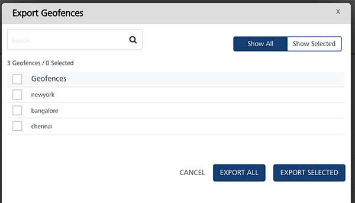
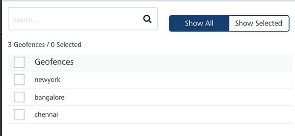
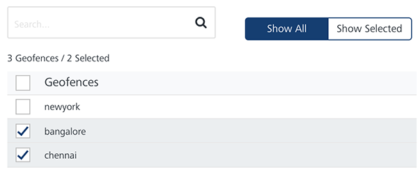
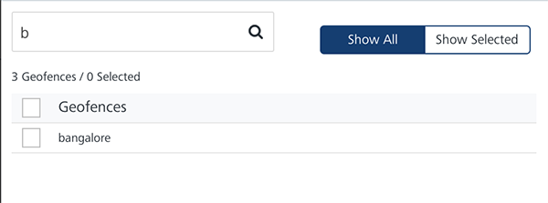

                           

Exporting Geofences
===================

You can export locations from the **Engagement** server by clicking the **Export Geofence** button. The feature helps you export geofences in bulk.

To export geofences, follow these steps:

1.  On the **Location** page, click the **Export Geofence** button.
    
    The **Export Geofences** window appears.
    
    
    
    The **Export Geofences** window displays the following details:
    
    *   **Show All**: The **Show All** tab displays all the geofences in the list view. By default, the **Show All** tab is set to active.
        
        
        
    *   **Show Selected**: The **Show Selected** tab displays the selected geofences in the list view.
        
        
        
    *   **Search** field: Enter a key-word to search for a particular geofence.
        
        The required geofence appears in the list view.
        
        
        
    *   **Export All**: Helps you export all geofence records from the **Engagement** server to a .`CSV` file.
    *   **Export Selected**: Helps you export the selected geofence records from the **Engagement** server to a .`CSV` file.
    *   **Cancel:** Click **Cancel** to close the window.
2.  Based on your requirement, click the **Export All** or **Export Selected** button.
    
    The system downloads geofence records in a .`CSV` file format to your system.
