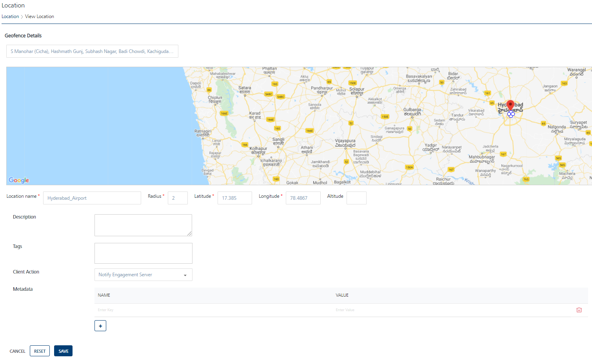

                             

Modifying Geofences
===================

Based on your requirement, you can modify geofences in the **Engagement** server.

To modify a Geofence, follow these steps:

1.  Click the required geofence in the **Geofencing** list view.
    
    The **View Location** page appears.
    
    
    
2.  **Geofence Details**: In the **Geofence Details** section, you can update the following fields:
    
    | Geolocation Element | Description | Modification Allowed |
    | --- | --- | --- |
    | Location Name | Location name | Yes |
    | Radius | Circumference with location area specified | Yes |
    | Latitude | Latitude is a geographic coordinate that specifies the north–south position of a location on the earth's surface. Geographic coordinates are specified in decimal degrees | Yes |
    | Longitude | Longitude specifies the east–west position of a location on the earth's surface. Geographic coordinate are specified in decimal degrees | Yes |
    | Altitude | The height of a location in relation to sea level or ground level | Yes |
    | Description | Location description | Yes |
    | Tags | The user-defined tags that assign a label to a geofence for the purpose of identification, such as a ZIP code or an area code | Yes |
    | Client Action | There are three **client** actions when a user interacts with the **Engagement** server:- Notify Engagement Server- Local Client Notification- Custom Business Logic | Yes |
    | Metadata | Metadata refers to geographical information about media. For example, fileType and colorMode can be used to identify an image associated with a geofence. | Yes |
    
3.  Click **Cancel** if you do not want to save the updated fields. The **Location** screen appears.
4.  Click **Reset** to remove the details in all the fields. You need to enter the new details in the respective fields.
5.  Click **Save**.
    
    The updated location appears in the **Geofencing** list view. The system displays the confirmation message that the location updated successfully.
