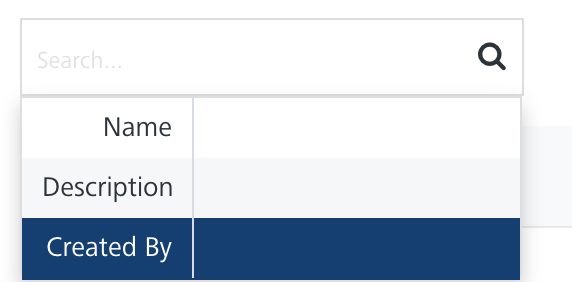

                             

Geofencing
==========

A geofence is based on a set of geographic coordinates, such as longitude, latitude, and radius. In a real-world scenario, a geofence uses geographic coordinates to determine a location, such as an area.  

For example, McDonald's wants to show all its branches in a city so that a user can search the nearest location to dine with friends or throw a party. You need to create geolocations in the Engagement server and invoke the **Fetch Nearest Location** API that returns the list of geo-boundaries based on the distance.

The **Geofencing** page displays the following details:

*   **Add New** button: Helps you add new geofences in the console.
*   **Import Geofence** button: Helps you import geofences to the Engagement server through a zip file.
*   **Export Geofence** button: Helps you export geofences from the Engagement server through a zip file.
*   **Search** field: Click in the **Search** field to view available options for searching a geofence. You can search for a geofence based on the following criteria:
    
    *   **Name**: Enter the name of the geofence, and click **Enter**.
        
        
        
        The required geofence information appears in the list view.
        
        
        
    *   **Description**: Enter the description of the geofence, and click **Enter**.
        
        
        
        The required geofence information appears in the list view.
        
        
        
    *   **Created By**: Enter the name of the creator, who creates a geofence.
        
        
        
        The required geofence information appears in the list view.
        
        
        
        > **_Note:_** To clear your search result, click in the **Search** field to view the Geofencing page.
        
    
    The **Geofencing** list view includes the following details:
    
    | Geofencing Element | Description |
    | --- | --- |
    | Name | The column displays the names of an added geofence |
    | Description | The column displays the description of added geofences |
    | Created By | The column displays the name of the owner who creates the geofence |
    | Last Modified on | The column displays the date on which the geofence is last modified |
    | Display Controls | By default, the number range is set to 20 so that only 20 geofences are displayed in the list view. You can view more geofences through the **forward** arrow icon. You can navigate back through the **backward** arrow icon. |
    

You can perform the following tasks from the **Geofencing** screen:

*   [Adding Geofences](Ge_Adding.md)
*   [Importing Geofences](Ge_Importing.md)
*   [Exporting Geofences](Ge_Exporting.md)
*   [Modifying Geofences](Ge_Modifying.md)
*   [Deleting Geofences](Ge_Deleting.md)
