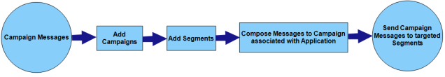

                            

You are here: How Volt MX Foundry Engagement Services Works

Introduction
============

Using Volt MX Foundry Engagement Services, you can send notifications (both native and web) to subscribed applications by any one of the following three ways:

*   Messages to either subscribers or segments: Using Volt MX Foundry Engagement Services, messages can be sent either to the individual subscribers or segments (group of subscribers) that are associated with applications.
*   Campaign messages to subscribed applications: Using Volt MX Foundry Engagement Services, messages can be sent via campaigns to segments by defining the message target as segments. For native applications, this is done by associating the push message/email/SMS/Apple passes to a campaign. For the PWA applications, this is done via web push messages. For example, if you want to send festive seasonal sales messages to a group of users that match specific conditions and requirements (marital status, income, education) for a particular period, then a segment can be created with that specific criteria and campaign messages can be sent to that segment. Creation of segments ensures that subscribers are engaged and appreciate the content you are sending through various notification channels.
*   Event messages to subscribed applications: Using Volt MX Foundry Engagement Services, event messages can be sent to the subscribed applications via the same notification channels as in campaigns. For example, when you want to transfer money online you use a payment gateway system that is associated with your bank. A payment gateway facilitates the transfer of information between a payment portal (such as a website, mobile phone or Interactive voice response service) and the Front End Processor or acquiring bank, and performs a variety of tasks to process the transaction. During this whole process, the user can be updated with status of each step of the transaction by invoking the event that has been set up in the Engagement server.

> **_Note:_** For more hands-on approach on how to implement Engagement Services, import and preview the [Events app](https://marketplace.hclvoltmx.com/items/events) using Volt MX Iris.

How Volt MX Foundry Engagement Services Works
--------------------------------------------

Sending push notifications using Volt MX Foundry Engagement Services is a two-stage process:

*   Stage 1: Subscription
*   Stage 2: Messaging

Stage 1: Subscription involves the following process:

1.  The mobile application subscribes or registers for Push Notifications Service with a provider. If the subscription is successful, the Push Notifications Service provider returns a Unique Identifier to the mobile application.  
    
    The following is the list of platforms, corresponding push notifications services and the unique identifiers they return:
    
    | Platform | Push Notifications Services | Unique Identifier |
    | --- | --- | --- |
    | Android | Android Google Cloud Messenger (GCM) | Registration ID |
    | iOS Devices | Apple Push Notification Service (APNS) | Device Token |
    | Windows Phone | Windows Push Notification Service (WNS) | Unique URL |
    | Web | Firebase Cloud Messenger (FCM) | FCM Authorization Key |
    
    Volt MX Development Cloud provides APIs that you can use to enable push notifications for an application on a device and also an API to deregister from the push notifications service.
    
2.  The mobile application sends a subscription request along with the unique identifier to Volt MX Foundry Engagement Services, which in turn sends a Volt MX Subscription ID to the mobile application.

Stage 2: Engagement Services involves the following process:

1.  The message you send to the subscriber is first sent to Volt MX Foundry Engagement Services in a HCL specific format. Volt MX Foundry Engagement Services immediately sends a response containing a unique Volt MX Message Identifier (can be used for status queries).
2.  Volt MX Foundry Engagement Services processes the message and sends it to the push notifications service provider (Apple, Android, Windows, or Web).
3.  The push notifications service provider then sends the push notifications to the device.

Flow for Native Push Notifications

**Stage 1**

S1 - Mobile application subscribes to the Push Notification Service and receives an identifier.

> **_Note:_** You must implement the framework API to get the registration token.

S2 - Mobile application sends a subscription request and the identifier to Volt MX Foundry Engagement Services and receives a Volt MX Subscription ID.

**Stage 2**

M1 - The message you send to a subscriber is first sent to Volt MX Foundry Engagement Services. A response containing a unique Volt MX **Message Identifier** is returned.

M2 - Volt MX Engagement Services processes the message and sends it to the Push Notification Service Provider.

M3- The Push Notification Service provider sends the notification to the device.

Flow for Web Push Notifications

**Stage 1**

S1 - Web application subscribes to the Push Notification Service and receives an identifier.

S2 - Web application sends a subscription request and the identifier to Volt MX Foundry Engagement Services and receives a Volt MX Subscription ID.

**Stage 2**

M1 - The message you send to a subscriber is first sent to Volt MX Foundry Engagement Services. A response containing a unique Volt MX **Message Identifier** is returned.

M2 - Volt MX Engagement Services processes the message and sends it to the Push Notification Service Provider.

M3- The Push Notification Service provider sends the notification to the device.

Push Notifications Workflow
---------------------------

The workflow below describes different ways of sending push notifications by using Volt MX Foundry Engagement Services.

The table below details the differences between general messages and campaign messages.

<table>
<tr>
<th>General Messages</th>
<th>Campaign Messages</th>
</tr>
<tr>
<td>
<ul>
<li>Can define subscribers or segments as message targets.</li>
<li>Provides the capabilities to configure start and expiry dates.</li>
</ul>
</td>
<td>
<ul>
<li>Can associate messages to campaign, which in turn will use segments (you can use either old template message or add new message).</li>
<li>Provide the capabilities of templates and personalized attributes when authoring messages.</li>
<li>Provides the capabilities of configuring additional settings such as campaign start/ end dates and campaign time zone.</li>
</ul>
</td>
</tr>
<tr>
<td>

All the parameters set in the <b>General</b> tab <b>(Settings > Configuration> General > Basic</b> section) are applicable across all types of messages. It can be a message, campaign or an event message.

</td>
<td>
</td>
</tr>
</table>

What are Push Notifications
---------------------------

Push notifications are sent to targets, which can be all users of subscribed applications, or a group of users derived from different segments.

### How to send General Messages

This section provides an overview about push messages and process involved in sending push messages. Sending of the push messages could involve the following steps:

1.  Adding a subscribed application into the console along with the application details. Depending on the platforms to which the messages will need to be sent. Details for the platforms like iOS, Android, Windows, and Web need to be added.
2.  Composing simple messages to a subscriber or segments. If segments are used, then advanced features for segments such as assigning multiple segments or defining the segment definition to make the users more conditionalized can be performed.
3.  Composing push message formatted with the capabilities of templates and personalization attributes.
4.  Scheduling push messages to be sent to the applications on devices.
5.  Changing the application status in the View Application screen.

#### What is an Application?

A mobile application (or mobile app) is a software application designed to run on mobile devices (for example, smartphones and tablets). Mobile applications are used to manage different tasks for enterprises or consumers, for example, the **VoltMX Mobile Airlines** application allows customers to manage their travel experience using their mobile phone or a tablet.

You can use an application through application distribution platforms (also known as Application Store), which are typically operated by the owner of the mobile operating system, such as the Apple App Store, Google Play, Windows Phone Store. An application store is a kind of online store where you can browse through different app categories, for example, banking, airlines, or online-ticket booking.

> **_Important:_** In Volt MX Foundry Engagement Services, applications are the primary elements that you add in the console, and then you add other elements such as campaigns, events, segments, and then enable applications for push notifications. You can add any multi-channelled applications installed based on your mobile devices operating system, for example, Apple, Android, Web and Windows 8 and Windows RT.

To enable push notifications, you need to add a new application in Volt MX Foundry Engagement Services using an administrator role.

#### **Who are Subscribers?**

A subscriber is one of the users who subscribes an application to receive push notifications.  

#### Who are Users?

A user is a member whose data exists in the Engagement server and can be associated with an subscription to receive the push notification. Users can be any group who uses any particular services, for example, a group of members who hold accounts with a particular bank are the users for that bank. But, not all users are given access to receive push notification messages. If users want to receive push notifications, first, they need to install an application on a mobile device, and then subscribe the application for push notifications.

> **_Important:_** Reconciliation Key is used to match the user with subscriptions. Only matched subscribers will get the push notifications.

#### What is a Reconciliation Key?

When an application user subscribes to push notifications, one of the unique fields of the subscriber is considered as the reconciliation key, for example, Ufid of the subscriber is considered as reconciliation key to map a user with a subscription. Ufid will be sent with the subscription, subscription request or while subscribing with Volt MX Foundry Engagement Services. Ufid is used to validate common details between users and subscribers. Once the subscription is valid, push notification services are enabled for subscribed applications.

> **_Important:_** You can also configure any field of a user as a new reconciliation key only, but the new field is enabled as a mandatory field.   
Volt MX  Foundry Engagement Services allows you to configure only one reconciliation key. If you configured a new reconciliation key, the system replaces the old key, for example: _email_  with the new reconciliation key.  
By default, Volt MX Foundry Engagement Services uses email as the Reconciliation key  

Volt MX  Foundry Engagement Services allows a subscriber to receive push notifications on multiple devices when registered with a reconciliation key. For example, you own two mobile devices (a phone and a tablet), and download an application on multiple devices. To receive push notifications on multiple devices using your email as reconciliation key, the installed application has to be authenticated with your email id before you send request for a subscription. Additional details such as your login ID and password of your application can be used for authentication, so that, push notifications sent to the application installed on multiple devices can use the same reconciliation key.

> **_Note:_** Volt MX Foundry push notifications can be sent on multiple devices registered with one **Reconciliation Key**.

**To receive notifications on multiple devices, follow these steps:**

1.  As a User1, send subscription request from your device (a phone) to Volt MX Foundry Engagement Services by using **user1@hcl.com** as a reconciliation key.
2.  As a User2, send subscription request from your device (a tablet) to Volt MX Foundry Engagement Services by using the same email, **user1@hcl.com**, as a reconciliation key.
    
    Now, the system can be used to send push notification messages to both the devices.
    

#### What is a Segment?

A segment is a subset of target users. The Engagement server Admin user creates segments by defining criteria (condition numbers) based on attributes provided by users such as age, gender, location, or income, and also creates effective _segment definitions_ by using a combination of condition numbers and _logical operators_.

What are Campaign Notifications
-------------------------------

One of the three ways of sending push notifications to the targeted segments is through campaigns. A campaign is a series of operations intended to achieve a particular objective, restricted to a particular area or involving a specific segment. A campaign may refer to an advertising campaign, a political campaign, or a banking campaign. You can send multiple campaign notifications to the targeted segments.

### How to send Campaign Messages and Passes

The process of sending campaign messages (push message/email/SMS) to segments involves the following steps:

  

1.  Configuring campaigns such as campaign name, campaign type, campaign start and end dates.
2.  Adding segments to campaigns and validating multiple conditions by using segment definitions results and ****unique users****.
3.  Composing a campaign message, which could involve using campaign push templates and personalized attributes and associating an application to the campaign message. When a campaign message is associated with a particular application, Volt MX Foundry Engagement Services verifies whether any of the unique users from the segments have subscribed for the associated application, and then the number of subscribed members for a campaign are displayed.
4.  Executing of the campaign after it is ready with all the details. Campaigns automatically starts sending messages to matched subscribers from campaign start date and stops sending messages once campaign reaches its end date.
    
    When Campaign starts, an internal job is created, which runs for every hour and sends messages to users who are newly added to system and matched with campaign criteria. You can change the campaign execution time if needed. Campaign messages are sent to the subscribed unique users only.
    

What are Event Notifications
----------------------------

An event is a series of planned occurrences intended to achieve a particular objective, restricted to a particular area or involving a specific segment.

Events in Engagement server can be set up to be invoked by external applications as part of a transaction(s). For example, when a user get upgraded to a platinum status. Events can be set up to send email, SMS, push or pass notifications.

### How to send Event Messages

This process of sending the event messages to subscribed applications involves the following steps:

1.  Adding events details and configuring event push message with event name, event description, event type, and associated application in the Engagement server.
2.  Identify the notification channels using which the messages are to be delivered to the user. These notification channels can be push, email, SMS and passbook. Compose the messages for the various channel and mark the required data attributes of the message using “Mark as Name Value Pair” feature so that the dynamic attribute data gets replaced with the user data.
3.  Invoke the event API using the event id.
    
    Clicking the API Payload button will get the details of the api call to be used by a third party to enable events for push messages through only HTTP POST method.
    

CORS
----

Cross-origin resource sharing (CORS) is a mechanism that allows many resources (for example, fonts, JavaScript) on a web page to be requested from another domain outside the domain from which the resource originated. In particular, JavaScript's AJAX calls can use the `XMLHttpReques`t mechanism.

By default Volt MX Foundry Engagement Services will disable this feature. You can enable this feature by enabling the CORS section (Allow Cross Domains Access).

You can list allowed domains (comma separated values) for CORS using Volt MX Foundry Engagement Services console with below option.

Example: www.google.com, www.hcl.com.

It also supports wildcard characters for allowing subdomains.

Ex: \*.google.com, \*, \*.com, \*.in
