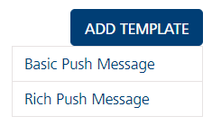
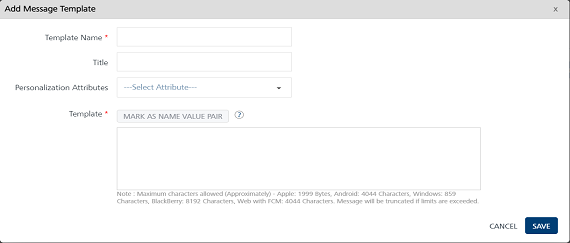
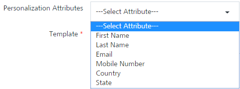
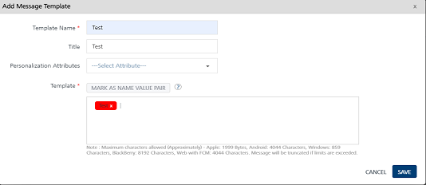
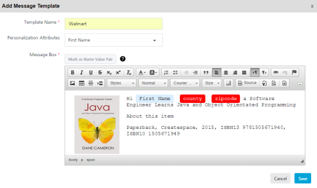
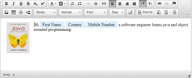
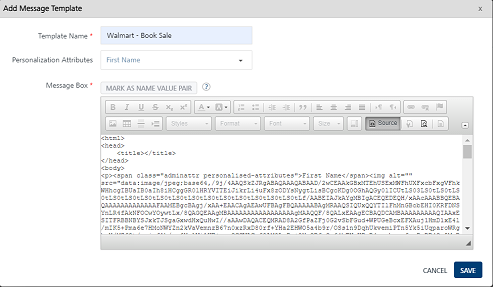
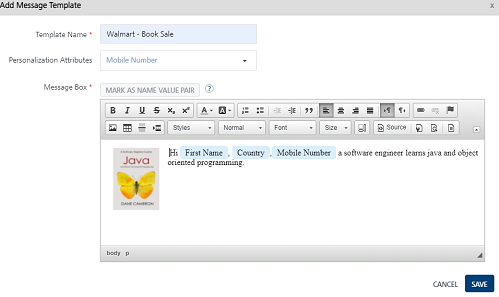
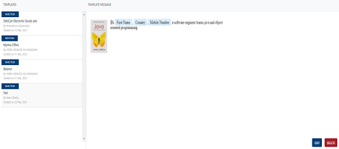

                             

Adding Push Templates
=====================

To add a push template, follow these steps:

1.  In the **Push Template** home page, click the **Add Template** button.
2.  The **Add Template** button displays two options:
    
    *   [Basic Push Message](#basic-push-message)
    *   [Rich Push Message](#rich-push-message)
    
    
    
    Basic Push Message
    ------------------
    
3.  Select the option as **Basic Push Message**.
4.  The **Add Push Template** window appears. Enter details for the following fields:
    
    
    
    1.  **Template Name**: Enter the template name in the **Template Name** field.
    2.  **Template Title**: Title of the template to be used.
    3.  **Personalization Attributes**: Select the attributes from the **Personalization Attributes** drop-down list to customize the **Push Template**.
        
        
        
        > **_Important:_** The **Personalization Attributes** list includes all the system-defined attributes along with the user-defined attributes added under **Settings** > **Configuration** > **User Attributes**.
        
        The system inserts the selected attributes at the cursor position in the add push template text box.
        
    4.  **Mark as Name Value Pair**: To set the Name\_Value pair, enter the key words in the **Add Push Template** text box, and click the **Mark as Name Value Pair** button. The marked text becomes highlighted. The text converts to a variable.
        
        
        
        > **_Note:_** Fields with a red asterisk are mandatory.
        
    
    Rich Push Message
    -----------------
    
5.  Select the **Rich Push Message** option.
    
    The **Add Push Template** window appears. Enter details for the following fields:
    
    1.  **Template Name**: Enter the template name in the **Template Name** field.
    2.  **Personalization Attributes**: Select the attributes from the **Personalization Attributes** drop-down list to customize the **Push Template**.
        
        
        
        The system inserts the selected attributes at the cursor position in the template message text area.
        
    3.  **Mark as Name Value Pair**: To set the Name\_Value pair, enter the key words in the **Add Push Template** text box, and click the **Mark as Name Value** Pair button. The marked text becomes highlighted. The text converts to a variable.
        
        
        
    4.  **Rich Text Editor Tool Bar**:  You can use the rich text editor at the top of the message window to customize the text.
        
        
        
    5.  To write.html code in the rich push template, do the following:
        1.  Click the **Source** button. The HTML toolbar is disabled.
            
            
            
        2.  Enter the.html tags to customize the source code.
        3.  To preview the HTML output, click the **Source** button. The add push template displays the.html output on screen.
            
            
            
6.  Click **Cancel** if you do not want to save the push template. The system displays the **Push Template** page.
7.  Click **Save**. The push template appears in the message list-view on the **Templates** home page. The system displays the confirmation message that the template is added successfully.
    
    
