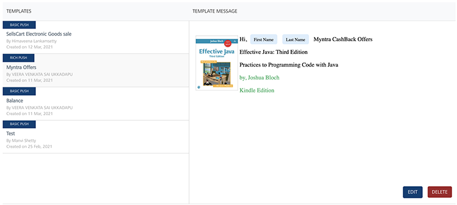

                              

Deleting Push Templates
=======================

As an administrator, you can delete a push template as required.

To delete a push template, follow these steps:

1.  Select the required templates in the left pane.
    
    
    
2.  Click the **Delete** button.
    
    The system displays the **Confirm Delete** dialog asking if you want to delete the selected push template.
    
3.  Click **Cancel** if you do not want to delete the push template.
4.  Click **OK** to continue.
    
    The system displays the confirmation message that the template deleted successfully. The deleted template is no longer displayed in the templates list-view.
    

  
| Rev | Author | Edits |
| --- | --- | --- |
| 7.2 | AU | AU |
