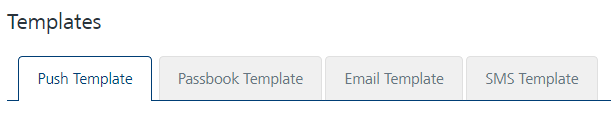

                            

Templates
=========

Templates define the structure and content of the messages (push, email, SMS, and passes). Generally a template comprises user attributes, name-value pairs, and a text message. You can customize the content while sending messages to users. The advantage of templates is that you can send messages to multiple users with similar content in a pre-defined format.

Under **Settings**, click **Templates**. The **Templates** screen appears with the four tabs **Message Template**, **Passbook Template**, **Email Template**, and **SMS Template**. By default, the **Message Template** tab is set to active.

> **_Important:_** As a user, you must have the following permissions to access the Templates home page and perform different tasks based on the role:  
  
\- ROLE\_TEMPLATES\_ALL  

Select a link in the list to view:

*   [Push Template](Message_Template_tab.md)
*   [Passbook Template](../PassBook_Template/Passbook_Template.md)
*   [Email Template](../Email_Template/Email_Template.md)
*   [SMS Template](../SMS_Template/SMS_Template.md)
