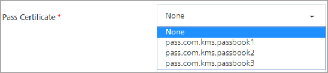
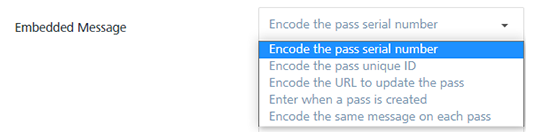
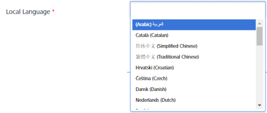
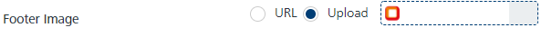

                              

Adding Passbook Templates
=========================

You can create the following pass templates:

*   **Boarding Pass Template**: This template is appropriate for passes used with transit systems such as train tickets, airline boarding passes, and other types of transit. Typically each pass corresponds to a single trip with a specific starting and ending point.
*   **Coupon Pass Template**: This template is appropriate for coupons, special offers, and other discounts.
*   **Event Ticket Template**: This template is appropriate for passes used to gain entry to an event like a concert, a movie, a play, or a sporting event.
*   **Store Cards Pass Template**: This template is appropriate for store loyalty cards, discount cards, point’s cards, and gift cards.
*   **Membership Pass Template**: This template is appropriate for storing membership cards.

To add a Passbook Template, follow these steps:

1.  Click the **Add Pass Template** button to open the **Add Passbook Template** screen.
    
    The **Add Passbook Template** screen appears. By default, the **Basic step** is set to active.
    
    
    
2.   Adding a **Passbook Template** involves following procedure:
    
    1.  [Entering Basic Details](#entering-basic-details)
    2.  [Entering Appearance Details](#entering-appearance-details)
    3.  [Entering Front Layout Details](#entering-front-layout-details)
    4.  [Entering Back Layout Details](#entering-back-layout-details)
    5.  [Entering Relevance Details](#entering-relevance-details)
    6.  [Entering Languages Details](#entering-languages-details)
    7.  [Entering Rules Details](#entering-rules-details)
    
    > **_Note:_** When you create a new pass, options relevant to the specific pass type are displayed.
    
    ### Entering Basic Details.
    
    1.  **Select Pass Type**: You can view five blank Pass Type templates on screen. The distinct design of the template is at the top edge of the pass: Event tickets have a small cutout, and coupons have a perforated edge.
        
        
        
    2.  Based on your requirement, click the required template.
        
        > **_Note:_** The preview of the Pass Template can be seen on the right side.
        
        
        
        The **Front view** and **Back view** of the selected **Pass template** are displayed as a thumbnail.
        
        
        
        > **_Note:_** By default, the **Front view** is set to active. You can view the **Back view** through the **Forward arrow**. You can view the Front part through the **Backward arrow**.
        
    3.  **Template Name**: Enter an appropriate name for the **Pass Template**.
    4.  **Organization Name**: Enter the name of the organization that issues the pass type.
    5.  **Pass Description**: Enter a description for the pass that defines its objective.
    6.  **Pass Certificate**: Select the required certificate from the drop-down list. By default, the option is set to **None**.
        
        
        
        > **_Note:_** Log in to _developer.apple.com_  to create a pass certificate.
        
    7.  **Pass Serial Number**: The serial number is a string that uniquely recognizes the pass within the scope of its pass type. Select the required **Pass Serial Number** option from the drop-down list. By default, the option is set to an auto-generated serial number.
        
        > **_Note:_** Serial number uniquely identifies the pass. No two passes with the same pass type identifier can have the same serial number
        
        
        
    8.  **Group Identifier**: Enter the unique pass group identifier. The option is applicable only for boarding and event passes.
        
        > **_Note:_** Based on your requirement as a pass sender, you can define a group name. For example, a user has booked flight tickets through makemytrip.com, so you as an admin from makemytrip defines a group identifier as makemytripBoarding. All passes with the group identifier as makemytripBoarding are grouped on the device.  
        You can also define different logical groups for sending multiple passes.  
          
        If a grouping identifier is specified, passes with the same style, pass type identifier, and grouping identifier are displayed as a group. Otherwise, passes are grouped automatically.
        
    9.  **Pass Timezone**: Based on your location, select the timezone from the drop-down list.
        
        
        
    10. **App Linking**: App Links is an open standard for deep-linking between mobile apps. Enter following details for App Linking if needed:
        
        1.  **iTunes Identifier(s)**: Enter the iTunes Store item identifiers for the associated app.
        2.  **App Launch URL**: Enter a URL, which needs to be passed to the associated app when launching the app.
        3.  **Custom JSON Data**: Enter the user information in custom JSON data.
        
        
        
        > **_Note:_** Custom JSON data pertains to customer information for companion apps. The data is not displayed to the user.  
        For example, a pass for a cafe can include information about the user’s favorite drink and sandwich in a machine-readable form for the companion app to read, making it easy to place an order from the app.
        
        1.  **Send Notification when Pass Issued**: Select the option as **SMS** or **Email** when a pass is issued.
            
            The **SMS** and **Email** checkbox option fields appear.
            
            > **_Note:_** By default, the latest pass is sent to the user by push message subscription.
            
            *   **SMS**: Select the SMS option. The system displays the **SMS Template** drop-down list and the **SMS Message** text field.
                
                
                
                1.  **SMS Template**: Select the required template from the drop-down list.
                2.  **SMS Message**: Enter a message.
            *   **Email**: Select the Email option. The system displays the Email Template drop-down list, Email Subject text field, and the Email Message text field.
                
                
                
                1.  **Email Template**: Select the required template from the drop-down list.
                2.  **Email Subject**: Enter an appropriate subject for the email message.
                3.  **Email Message**: Enter the message.
                
                > **_Note:_** You need predefined Email and SMS templates to compose messages. However, you can compose a new message from the text boxes provided.
                
                > **_Important:_** Using #Email Pass link in the composed email message, will auto embed a link to download the pass.  
                Similarly for SMS: #SMS Pass Link in the composed SMS message, will auto embed a link to download the pass.  
                
    11. Click **Next** to continue.

### Entering Appearance Details.

The **Add  Pass Template – Appearance** screen appears.

Adding **Pass Template – Appearance** involves the following details:

1.  **Background Color**: To modify the default background color, click in the **Background** **Color** field.
    
    A pop-up window of color swaths appears.
    
2.  Select the color you want from the color palette.
    
    The color value "#XXXXX" appears in the **Background Color** field. The color preview appears in the front view of the **Pass template**.
    
    
    
3.  **Label Text Color**: To modify the default label text color, click in the **Label Text Color** field.
    
    A pop-up window of color swaths appears.
    
4.  Select a color from the color palette.
    
    The color value "#XXXXX" appears in the **Label Text Color** field.
    
    
    
5.  **Value Text Color**: To modify the default text color value, click in the **Value Text Color** field.
    
    A pop-up window of color swaths appears.
    
6.  Select a color from the color palette.
    
    The color value "#XXXXX" appears in the **Label Text Color** field. The color preview appears in the **Label Text** field of the Pass template.
    
    
    
7.  **Icon Image**: You can insert an icon image in the pass template through the two options: URL and Upload.
    1.  **URL**: Enter the URL, from where you can upload the image.
    2.  **Upload**: Select the **Upload** option.
        
        The **\+ Add** button to upload the image appears.
        
    3.  Click **Plus Add** to navigate to the location of icon and select it.
        
        
        
        The selected icon appears in the placeholder.
        
        
        
        > **_Note:_** To remove the image, place your mouse over the image. The X icon appears in the extreme right corner of the image. Click the icon to remove the image.
        
8.  **Logo Image**: You can insert a logo image in the pass template through the two options: URL and Upload.
    1.  **URL**: Enter the URL, from where you can upload the image.
    2.  **Upload**: Select the **Upload** option.
        
        The **\+ Add** button to upload the image appears.
        
    3.  Click **+Add** to navigate to the location of logo and select it.
        
        The selected logo appears in the placeholder. The preview appears at the specified location in the pass template.
        
        
        
        > **_Note:_** To remove the image, place your mouse over the image. The X icon appears in the extreme right corner of the image. Click the icon to remove the image.
        
9.  **Footer Image**: You can insert a footer image in the pass template through two options: URL and Upload.
    1.  **URL**: Enter the URL, from where you can uplaod the image.
    2.  **Upload**: Select the **Upload** option.
        
        The **\+ Add** button to upload the image appears.
        
        
        
    3.  Click **+Add** to navigate to the location of image and select it.
        
        The selected image appears in the placeholder. The preview appears at the specified location in the pass template.
        
        
        
        > **_Note:_** To remove the image, place your mouse over the image. The X icon appears in the extreme right corner of the image. Click the icon to remove the image.
        
        > **_Note:_** Based on the selected pass type, the images option varies as Follows:
        
        | Pass Template Type | Image options |
        | --- | --- |
        | Boarding Pass | Icon Image Logo ImageFooter Image |
        | Coupon Pass/ Store Card | Icon ImageLogo Image Strip Image |
        | Event Ticket | Logo ImageBackground ImageThumbnail Image |
        | Membership | Icon ImageLogo ImageThumbnail Image |
        
10. **Suppress Shine Effect**: To remove the shining effect from the uploaded image, select the checkbox.
    
    > **_Note:_** Fields with a red asterisk are mandatory fields.
    
    > **_Note:_**  The Supress Shining effect option is available only for the storecard passes.
    
11. Click **Next** to continue.

### Entering Front Layout Details.

The **Add  Pass Template – Front Layout** screen appears.

Adding **Pass Template – Front Layout** involves following details:

> **_Important:_** You can click pointers displayed on the right side of the Pass Template to navigate the respective sections, such as Header, Primary, Secondary and Barcode.

*   [Header](#header)
*   [Primary](#primary)
*   [Auxiliary](#auxiliary)
*   [Secondary](#secondary)
*   [Barcode](#barcode)

#### Header

1.  **Header**: By default, fields pertaining to Header are displayed on the screen. Enter details for the following fields:
    1.  **Logo Text**: Enter a text for logo.
    2.  **Header Field Name 1**: Enter a name for the Header Field Name. The name should be unique throughout the pass.
    3.  **Field Label**: Enter a value for the field label.
    4.  **Field Data**: Enter a value for the field data.
        
        > **_Note:_** The entered value appears in the Label placeholder on front layout of the pass template.  
        You can align the text left, center, or right in the field.
        
    5.  **Change Message**: Enter a change message in the **Change Message** field.
        
        
        
2.  **Advance Settings**: Based on your requirement, select the option from the **Data Type** drop-down list.
    
    *   [Text](Passbook_Template.md#Text)
    *   [Number](Passbook_Template.md#Number)
    *   [Currency](Passbook_Template.md#Currency)
    *   [Date or Date and Time](Passbook_Template.md#Date)
    
    ##### Text
    
    Based on your requirement, select the advanced data type as Text.
    
    ##### Number
    
    1.  Select the advanced data type as **Number**. The **Number Format** drop-down list appears.
    2.  Based on your requirement, select the option as **Decima**l, **Percentage**, **Scientific** or **Spell Out**.
        
        
        
    
    ##### Currency
    
    1.  Select the advanced data type as **Currency**. The **Currency** drop-down list appears.
    2.  Based on your requirement, select the required currency from the drop-down list.
        
        
        
    
    ##### Date or Date and Time
    
    1.  Select the advanced data type as **Date** or **Date and Time**. The **Date/Time Format** drop-down list, **Display relatively** checkbox and **Ignore timezone** checkbox appear.
    2.  Based on your requirement, select the Date/Time Format as **Short**, **Medium**, **Long**, **Full** or **None**.
    3.  **Display relatively:** If checked, the label’s value is displayed as a relative date; otherwise, it is displayed as an absolute date.
    4.  **Ignore timzone**: To ignore the current timezone, select the checkbox.
        
        
        
3.  Based on your requirement, click the **Add Field** button to add additional header fields
4.  Click the **Delete** icon to remove the added fields.
    
    #### Primary
    
    Click the **Primary** pointer displayed on the left side of the pass template.
    
5.  The primary fields appear. Enter details for the following fields:
    1.  **Transit Type**: The transit type option is available for the boarding passes only. Select the required mode of transit from the drop-down list. The available options are: Generic, Train, Bus, Boat, and Air.
        
        
        
    2.  **Primary Field Name 1**: Enter a name for the Primary Field Name 1.
    3.  **Field Label**:  Enter details for the following fields:
        *   **Value**: Enter a value for the field label.
    4.  **Field Data**: Enter details for the following fields:
        *   **Value**: Enter a value for the field label.
    5.  **Field Data**: Enter details for the following fields:
        *   **Value**: Enter a value for the field label.
        *   **Change Message**: Enter a change message in the **Change Message** field.
6.  **Advance Settings**: For more details refer, [Advance Settings](#Advance_Settings:_)
7.  Based on your requirement, click the **Add Field** button to add additional header fields.
    
    
    
8.  Click the **Delete** icon to remove the added fields.
    
    
    
9.  Click the ****Auxillary**** pointer displayed on the left side of the pass template.
    
    #### Auxiliary
    
10. The auxiliary fields appears. Enter details for the following fields:
    1.  **Auxiliary Field Name 1**: Enter a name for the Auxiliary Field Name 1.
    2.  **Field Label**: Enter details for the following field:
        *   **Value**: Enter a value for the field label.
    3.  **Field Data**: Enter details for the following field:
        
        *   **Value**: Enter a value for the field data. The added text appears in the auxillary section of the pass template.
        *   **Change Message**: Enter a change message in the change message field.
        
        
        
11. Advance Settings: For more details refer, [Advance Settings](#Advance_Settings:_)
    
    #### Secondary
    
12.  Click the ****Secondary**** pointer displayed on the left side of the pass template. The secondary fields appear. Enter details for the following fields:
    1.  **Secondary Field Name 1**: Enter a name for the Secondary Field Name 1.
    2.  **Field Label**: Enter details for the following field:
        *   **Value**: Enter a value for the field label.
    3.  **Field Data**: Enter details for the following field:
        *   **Value**: Enter a value for the field label.
        *   **Change Message**: Enter a change message in the **Change Message** field.
13. **Advance Settings**: For more details refer to, [Advance Settings](#Advance_Settings:_)
14. Based on your requirement, click the **Add Field** button to add fields.
15. Click the **Delete** icon to remove the added fields.
    
    #### Barcode
    
16. Click **Barcode** pointer displayed on the left side of the pass template. The Barcode fields appear. Enter details for the following fields:
    1.  **Barcode Type**:  By default, the barcode type is set to UTF-8 Code. Based on your requirement, select the required barcode type.
        
        > **_Note:_** The Aztec, and QR are the square type barcodes. The PF417 is a rectangular type barcode. Select the **Do not display a barcode** option, if a barcode should not be displayed.
        
        
        
    2.  **Embedded Message**: The options are displayed in the following table:
        
        | Embedded Message | Description |
        | --- | --- |
        | \- Encode Pass Serial Number- Encode the pass unique ID | The system uses the Pass Serial Number and Pass Unique ID, as the barcode message |
        | \- Encode the URL to update the pass | The system uses the pass update URL as the barcode message |
        | \- Enter when a pass is created | Enter the message when the template is used in the pass distribution |
        | \-Encode the same message on each pass | Enter the message. The system uses the same message for all the passes generated using the template. |
        
        
        
    3.  **Alternative Text**: The text appears below the barcode. The **Alternative Text** is useful when the ability to scan barcodes is not available.
        
        
        
    4.  **Embedded Format**: Text encoding helps to convert the message from a string representation to a data representation to render the barcode. The value is typically iso-8859-1, but you may use another encoding that is supported by your barcode scanning infrastructure.
        
        
        
        The following images displays the Front Layout of a boarding pass.
        
        
        
17. Click **Next** to continue.
    

### Entering Back Layout Details

The **Add Pass Template – Back Layout** screen appears.

1.  **Enable Automatic Updates**: To update the passbook template automatically, select the checkbox.
    
    > **_Important:_** If you select the **Enable Automatic Updates** checkbox, passes can receive the future updates.   
    When automatic updates are enabled, the passbook interacts with Engagement server for the latest passes. By default, the passbook interacts only with HTTPS servers, so make sure you work under HTTPS mode when distributing passes with automatic updates. Otherwise passes may not get installed on the devices.
    
2.   Enter details for the following fields:
    
    1.  **Field Name 1**: Enter a text for the **Field Name 1**.
    2.  **Field Label**: Enter a value for the **Field Label**.
    3.  **Field Data**: Enter a value for the **Field Data**.
    4.  **Change Message**: Enter a change message in the **Change Message** field.
    
    
    
3.  **Advance Settings**: Based on your requirement, select the option from the **Data Type** drop-down list.
    
    *   [Text](Passbook_Template.md#Text)
    *   [Number](Passbook_Template.md#Number)
    *   [Currency](Passbook_Template.md#Currency)
    *   [Date or Date and Time](Passbook_Template.md#Date)
    
    ##### Text
    
    1.  Based on your requirement, select the advanced data type as Text.
    
    ##### Number
    
    1.  Select the advanced data type as **Number**, the **Number Format** drop-down list appears.
    2.  Based on your requirement, select the option as **Decima**l, **Percentage**, **Scientific** or **Spell Out**.
    
    ##### Currency
    
    1.  Select the advanced data type as **Currency**, the **Currency** drop-down list appears.
    2.  Based on your requirement, select the required currency from the drop-down list.
    
    ##### Date or Date and Time
    
    1.  Select the advanced data type as **Date** or **Date and Time**, the **Date/Time Format** drop-down list and **Display relatively** checkbox and **Ignore timezone** checkbox appears.
    2.  Based on your requirement, select the Date/Time Format as **Short**, **Medium**, **Long**, **Full** or **None**.
    3.  **Display relatively**: If checked, the label’s value is displayed as a relative date; otherwise, it is displayed as an absolute date.
    4.  **Ignore timzone**: Select the checkbox to ignore the current timezone. If checked, the time and date are displayed in the given time zone (pass timezone), not in the user’s current time zone.
4.  **Autolink of**: The field is used to decide what type of data has to be auto linked. By default, all are auto inked.
    
    
    
5.  Based on your requirement, click the required fields to auto link.
    
    
    
6.  Click the **Add Field** button to add additional fields.
7.  Click the **Delete** icon to remove the added fields.
8.  Click **Next** to continue.

### Entering Relevance details.

The **Add Pass Template – Relevance** screen appears.

1.  To add **Pass Template – Relevance** enter details for the following fields:
    1.  **Lockscreen Relevance**: Select details for the following fields:
    
    *   **Show on lockscreen at**: Click in the **Show on lockscreen field** to open the **Calendar** menu.
        
        The **Calendar** menu displays the current date as highlighted.
        
        
        
    *   Select the required date from the calendar menu and click **Done**.
        
        The selected date with time appears in the **Show on lockscreen at** field.
        
        
        
    *   **Ignore Timezone**: If you want to ignore the current time zone, then select the checkbox.
        
        > **_Note:_** A Passbook is time and location enabled, so you can configure passes to display on the user’s Lock Screen at the appropriate time and place such as, when the user reaches the airport or walks into a store. Each time the user wakes their device, Passbook checks the relevance of passes and any relevant pass is displayed on the Lock Screen.
        
    
    3.  **Location Relevance**: Select details for the following fields:
        *   **Show on Location at**: Select the required location from the drop-down list.
            
            
            
            The selected location appears in **Select on location at** field.
            
        *   **Relevant text**: Enter the text to be displayed on the lock-screen when the pass is relevant to the location.
        *   **Maximum Distance**: Enter the maximum distance in meters for the selected location.
        *   If you need to select another location, then click the **Plus** icon. Click the **Delete** icon to remove the added field.
    4.  **Beacon Relevance**: Select details for the following fields:
        
        *   **Select Beacon**: Select the required beacon from the drop-down list.
            
            
            
            The selected beacon appears in **Beacon Relevance.**
            
        *   **Relevant text**: Enter the text to be displayed on the lock-screen when the pass is relevant to the location.
        *   Click the **Plus** icon to select the beacon. Click the **Delete** icon to remove the added field
        
        > **_Note:_** There is a limitation of only allowing 10 beacon or geo locations per pass.
        
2.  Click **Next** to continue.

### Entering Languages details.

The **Add Pass Template – Languages** screen appears.

Based on a user’s requirement, a pass can be localized in many languages. Unless a specific language is specified, the pass displays field labels and data as provided by default. Dates, numbers and currency data are always displayed according to user’s language and region preference.

Based on a user’s preference, Icon image, Logo image and Footer images are also localized. To localize the pass for multiple languages, select the desired language and provide translation. You can also provide a separate image for each language.

1.  To add **Pass Template – Languages**, enter details for the following fields:
    1.  **Pass Language**: Select the required language from the drop-down list. By default, it is set to English.
        
        
        
    2.  **Original Text**: Enter the text you need to translate for the end-user.
    3.  Click **Add Row** to add additional rows to enter text that needs to be translated.
    4.  **Local Language**: Click in the **Local Language** field.
        
        The **Local Language** drop-down list appears.
        
        
        
        *   Select the required local language from the drop-down list.
            
            The fields associated with the local language appears below:
            
            
            
2.  **Text** field: Enter the text here in the local language. Based on the selected local language, the text string is displayed.
3.  **Icon Image**: You can insert icon image in the pass template through two options. URL and Upload.
    1.  **URL**: Enter the URL, from where you can download the image.
    2.  **Upload**: Select the **Upload** option.
        
        The **\+ Add** button to upload the image appears.
        
    3.  Click **\+ Add** to navigate to the location of icon and select it.
        
        The selected icon appears in the place-holder. The preview appears at the specified location in the pass template.
        
        
        
        > **_Note:_** To remove the image, place your mouse over the image. The X icon appears in the extreme right corner of the image. Click the icon to remove the image.
        
4.  **Logo Image**: You can insert the logo image in the pass template through two options.URL and Upload.
    1.  **URL**: Enter the URL, from where you can download the image.
    2.  Upload: Select the **Upload** option.
        
        The **\+ Add** button to upload the image appears.
        
    3.  Click **+Add** to navigate to the location of logo and select it.
        
        The selected logo appears in the place-holder. The preview appears at the specified location in the pass template.
        
        
        
5.  **Footer Image**: You can insert the footer image in the pass template through two options.URL and Upload.
    1.  **URL**: Enter the URL, from where you can download the image.
    2.  **Upload**: Select the **Upload** option.
        
        The **\+ Add** button to upload the image appears.
        
    3.  Click **+Add** to navigate to the location of the image and select it.
        
        The selected image appears in the place-holder. The preview appears at the specified location in the pass template.
        
        
        
6.  Click **Next** to continue.

### Entering Rules details

The **Add Pass Template – Rules** screen appears.

1.  To add **Pass Template – Rules**, enter details for the following fields:
    1.  **Date restriction**: Based on your requirement, you can define the viability of your pass. By default, the option is set to **Pass is permanently available**.
    2.  If you wish a pass to available permanently, you can retain this option.
        
        
        
    3.  **Void Passes**: If you select the option as void, then once a pass expires, a notification is sent to the user that after a certain date the pass is expired.
        
        > **_Important:_** Void passes condition is applicable only for iOS7 passes.
        
    4.  If you want that pass should be expired after a certain date, select the option as **Do not issue passes after a date**.
        
        The **Stop issuing passes after** field appears.
        
    5.  To select the required date, click into **Stop issuing passes after** field.
        
        The **Calendar** menu appears. The Calendar menu displays the current data as highlighted.
        
        
        
    6.  Select the required date from the **Calendar** menu and click **Done**.
    7.  The selected date appears in the **Stop issuing passes after field.**
    8.  **Auto Expire**: If you want that the pass should expire automatically after a certain date, then click in the **Auto Expire** field.
        
        > **_Note:_**  Auto expire passes will effect only iOS7 passes.  
        
        The **Calendar** menu appears. The Calendar menu displays the current date as highlighted.
        
    9.  Select the required date from the **Calendar** menu and click **Done**.
        
        The selected date appears in the **Stop issuing passes after field.**
        
2.  Click **Back** to update any details.
3.  Click **Submit**.
    
    The newly created template is added in the display list of passbook template on **Passbook Template** screen. The system displays the confirmation message that pass template is created successfully.
    
    > **_Note:_** Fields with a red asterisk are mandatory fields.
    

  
