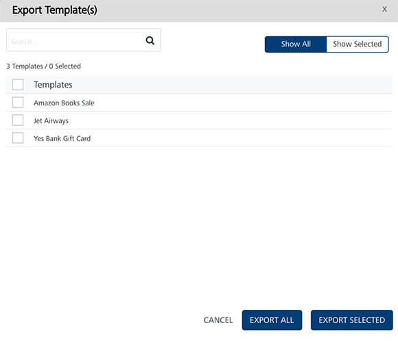
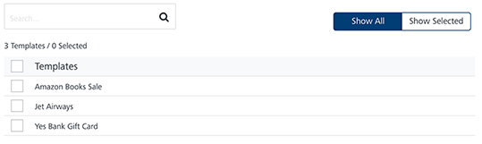
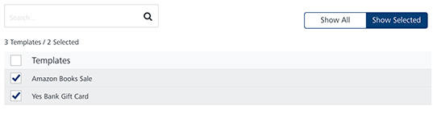
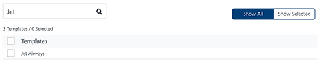

                           

Exporting Passbook Templates
============================

You can export Pass templates from Engagement services using the **Export Template** button. The feature enables you to do bulk export of **Pass templates** at a time.

**To export Pass templates, follow these steps**:

1.  In the **Pass Template** screen, click the **Export Template** button.
    
    The **Export Template(s)** window appears.
    
    
    
2.  The **Export Templates(s)** window displays the following details:
    *   **Show All**: The **Show All** tab displays all the pass templates in the list-view. By default, the **Show All** tab is set to active.
        
        
        
    *   **Show Selected**: The **Show Selected** tab displays the selected pass templates in the list-view. Select the check-box next to the **Templates** header to select all the pass templates.
        
        
        
    *   **Search** field: Enter a key-word in the search field to search for a particular pass template.
        
        The required pass template appears in the list-view.
        
        
        
    *   **Export All**: Helps you export all the pass templates present in the Engagement server to a zip file.
    *   **Export Selected**: Helps you export selected pass templates present in the Engagement server to a zip file.
    *   **Cancel**: Click **Cancel** to close the window.
3.  Based on your requirement, click **Export All** or **Export Selected**.
    
    The system downloads pass templates in a zip file format on your system.
