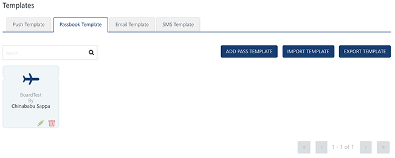
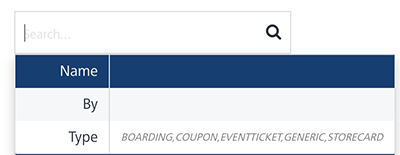
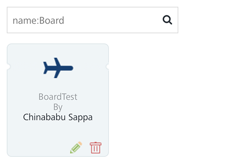
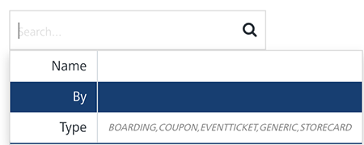
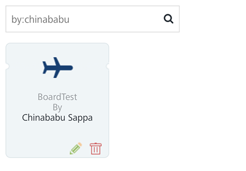
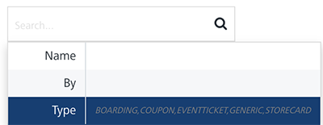
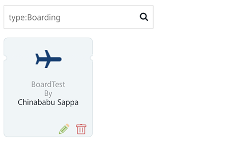
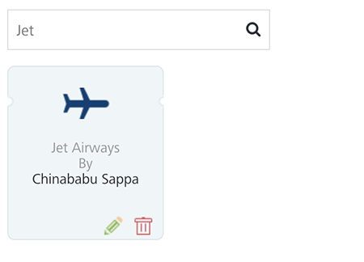

                              

Passbook Template
=================

As an administrator, you add passbook templates to easily create, distribute, update, and manage content for **Apple Passbook**.

From the **Settings** section, click **Template** from the left panel. The **Templates** page appears with the four tabs: **Push Template**, **Passbook Template**, **Email Template**, and **SMS Template**. 

The **Passbook Template** home page displays the following details:

*   **Add Pass Template** button: The button helps you add new passbook templates.
*   **Import Template** button: The button helps you import passbook templates.
*   **Export Template** button: The button helps you export passbook templates.
*   **Search** field: Click in the search field to view options to search for passbook templates. You can search passbook templates based on the following criteria:
    
    *   **Name**: Enter the passbook template name in the search field and click **Enter**.
        
        
        
        The passbook template appears on the home page. To view the Passbook Template page, clear the search field and click Enter.
        
        
        
    *   **By**: Enter the name of the template's creator in the search field.
        
        
        
        The passbook template appears on the home page. To view the Passbook Template page, clear the search field and click Enter.
        
        
        
    *   **Type:** Enter the type of the passbook message template in the search field.
        
        
        
        The passbook template appears on the home page. To view the Passbook Template page, clear the search field and click Enter.
        
        
        
    *   **Searching without Labelling with Multiple Parameters**: Enter the required parameters with a space in the search field. For example, the following image displays search result for two Pass templates based on entered parameters.
        
        
        
    
    The passbook template view displays the following details:
    
    | Passbook Template Element | Description |
    | --- | --- |
    | Templates | Template NameName of the creator who creates the templateType of the template, such as boarding, coupon, generic store card, and event ticket |
    | Delete button | The button helps you delete the passbook template |
    | Edit button | The button helps you view and edit the template |
    

You can do the following tasks from the **Passbook Template** screen:

*   [Adding Passbook Templates](Add_passbook.md)
*   [Modifying Passbook Templates](Modify_passbook.md)
*   [Exporting Passbook Templates](Export_passbook.md)
*   [Importing Passbook Templates](Import_passbook.md)
*   [Deleting Passbook Templates](Delete_passbook.md)

  
| Rev | Author | Edits |
| --- | --- | --- |
| 7.3 | AU | AU |
