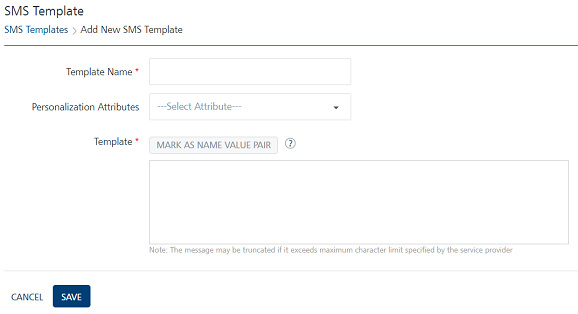
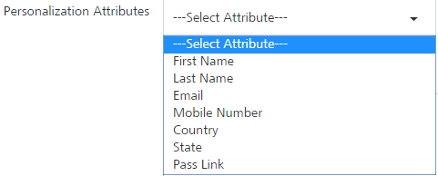
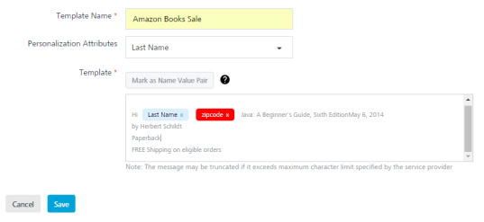

                           

Adding SMS Templates
====================

You add SMS templates to use the same SMS template again and again for multiple campaigns and events with different content.

To add an SMS Template, follow these steps:

1.  In the **SMS Template** home page, click **Add SMS Template**.
    
    The **SMS Template** page appears.
    
    
    
2.  Enter details for the following fields:
    *   **Template Name**: Enter an appropriate name for the template.
    *   **Personalization Attributes**: Select the required attributes from the drop-down list.
        
        
        
        The system inserts the selected attributes at the cursor position in the **Message Box** text area.
        
    *   To set the Name\_Value pair, enter the key words in the SMS message text box and click the **Mark as Name Value Pair** button.
        
        The marked text becomes highlighted. The text converts to a variable.
        
        
        
3.  If you do not want to add the SMS template, click **Cancel** to close the window. The system displays the **SMS Template** home page.
4.  Click **Save**. The newly added SMS template appears in the list view with the confirmation message that SMS template created successfully.
