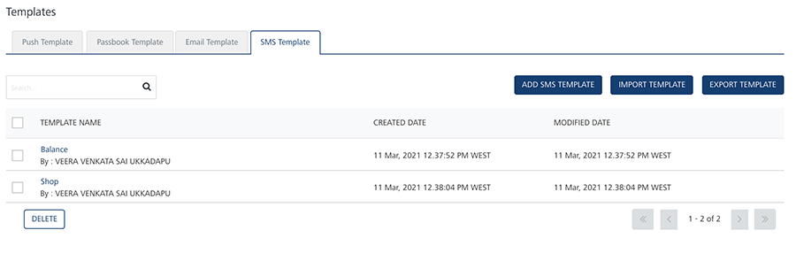
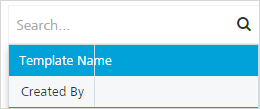
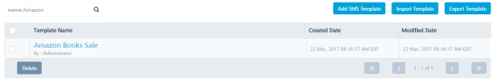
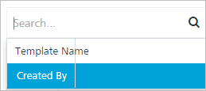
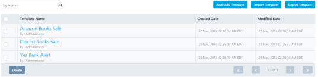

                              

SMS Template
============

As an administrator, you add various SMS templates to use in campaigns and events. The SMS templates save creation time, because you can use the same template for sending similar SMS message to users.

From the **Settings** section, click **Template** from the left panel. The **Templates** page appears with the four tabs including **Push Template**, **Email Template**, **SMS Template** and **Passbook Template**. Click **SMS Template** to open the **SMS Template** home page.

The **SMS Template** home page displays the following details:

*   **Add SMS Template**button: The button helps you to add SMS templates to the list.
*   **Import Template** button: The button helps you import SMS templates.
*   **Export Template** button: The button helps you export SMS templates.
*   **Search** field: Click in the search field to view options to search an SMS template. You can search SMS templates based on the following criteria:
    *   **Template Name**: Enter the SMS template name in the search field and click **Enter**.
        
        
        
        The SMS message template appears on the home page. To clear your search result, click in the search field to view the **SMS Template** page.
        
        
        
    *   **Created By**: Enter the creator's name in the search field and click **Enter**.
        
        
        
        The SMS message template appears on the home page. To clear your search result, click in the search field to view the **SMS Template** page.
        
        
        

The **SMS Template** list-view includes the following details:

  
| SMS Template | Description |
| --- | --- |
| Template Name | Displays the following details:-The SMS template name- The SMS template creator's name |
| Created Date | Displays the date and time when the SMS template is created |
| Modified Date | Displays the date and time when the SMS template is last modified |
| Delete button | The button helps you delete SMS templates |
| Display controls | By default, the number range is set to 20 so that only 20 templates are displayed in the list-view. You can view more screens by navigating through the **Forward** arrow icon. You can move back through the **Backward** arrow icon |

  
You can do the following tasks from the **SMS Template** screen:

*   [Adding SMS Templates](Adding_sms_temp.md)
*   [Modifying SMS Templates](Modifying_sms_temp.md)
*   [Exporting SMS Templates](Exporting_sms_temp.md)
*   [Importing SMS Templates](Importing_sms_temp.md)
*   [Deleting SMS Templates](Deleting_sms_temp.md)

  
| Rev | Author | Edits |
| --- | --- | --- |
| 7.3 | AU | AU |
