                             

Use Case Scenario: Three
========================

Yes Bank wants to send push, Email, SMS or pass notifications to customers, when customers do any transaction, for example: a customer deposits some amount through on-line banking.

Solution
--------

You need to setup an event in Engagement server that runs when a customer do any online transaction. The event triggers an alert message on a user’s device (email, SMS, or push message).

Description
-----------

Lisa serves as an account manager in Yes Bank and wants to send alert messages to customers when they do any transaction, for example: a customer withdraws some amount from ATM.

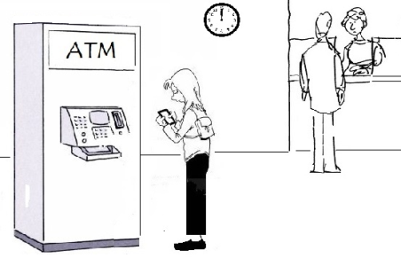

Prerequisites
-------------

Following prerequisites should be fulfilled before sending an event to customers:

*   [Creating Applications in Engagement Server](#adding-applications-in-engagement-server)
*   [Adding Event Types](#adding-event-types)
*   [Adding Email Configuration](#adding-email-configuration)
*   [Adding SMS Configuration](#adding-sms-configuration)
*   [Adding Pass Configuration](#adding-pass-configuration)
*   [Adding Templates (push, SMS, email and pass)](#adding-templates-push-sms-email-and-pass)
*   [Adding Events](#creating-events)

Adding Applications in Engagement Server
----------------------------------------

Lisa needs an app to add new customers, and send events through push messages. The app should be developed cross platforms so the event can be received on all the devices (Android, Web, Windows, and iOS). In this section, Lisa learns how to create an app in Engagement server and enable it to send events to customers. There are two basic steps to create an app.

*   [App Info](#app-info)
*   [Settings](#settings)

### App Info

Lisa enters a name for the app such as, **Yes Bank** and selects the app category from the drop-down list. Lisa clicks **Generate** to auto generate the Application ID.

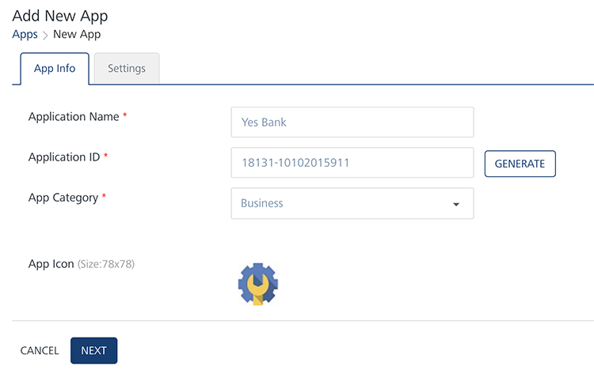

### Settings

Under the **Settings** section, Lisa needs to choose at least one platform (Apple, Android, Windows or Web) to save and publish the Yes Bank app successfully.

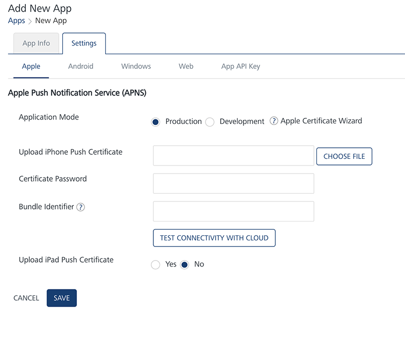

After entering the required platform details, Lisa saves the app. The default status of a newly added app in Engagement server is unpublished. Lisa needs to publish the app as only published apps can be used for sending messages to customers.

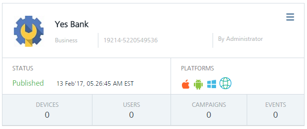

For more details about how to add a new app, refer: [Adding Apps](../../../../Foundry/vms_console_user_guide/Content/Apps/Adding_an_Application.md)

Adding Event Types
------------------

The event type is set when a new event is created and the name is commonly used to refer the specific event. Lisa adds a new event as Yes Bank.

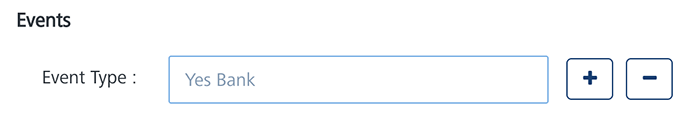

For more details about how to add a new event, refer: [Adding Event Types](../../../../Foundry/vms_console_user_guide/Content/Administration/General_-_Settings.md#Event)

Adding Email Configuration
--------------------------

Lisa needs to configure the email settings in the Engagement server to send email notifications to customers. To configure the email account, Lisa needs to know the protocol to connect, the port number, and the security mode to enable secure connections.

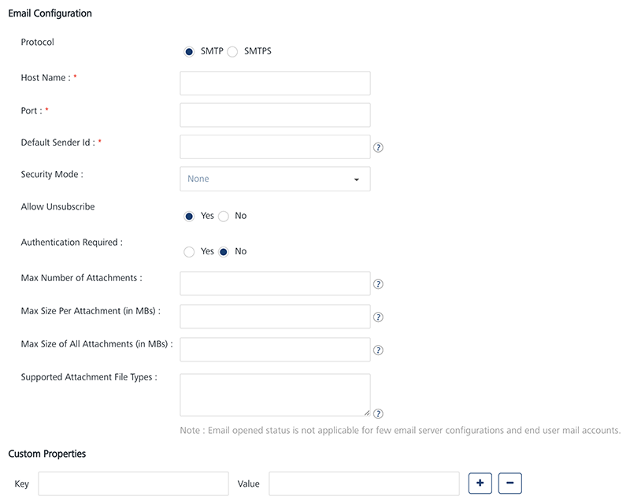

For more details about how to configure the email account, refer: [Adding Email Configuration](../../Content/Administration/Email_Configuration.md)

Adding SMS Configuration
------------------------

Lisa needs to configure a SMS service to send SMS notifications to customers. Currently, SMS aggregators such as, Clickatell, Nexmo and Twilio can be integrated with Engagement server. Engagement server uses the credentials provided by the SMS service provider to connect to the specific SMS service.

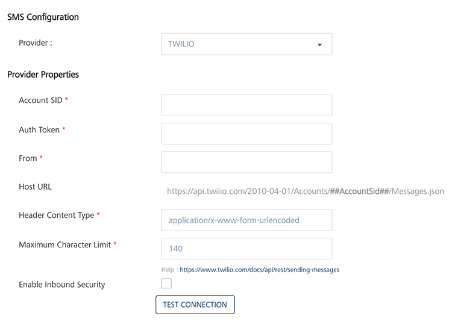

For more details about how to configure the SMS service provider's account, refer: [Adding SMS Configuration](../../../../Foundry/vms_console_user_guide/Content/Administration/SMS_Configuration.md)

Adding Pass Configuration
-------------------------

As a prerequisite, Lisa needs to upload a pass certificate to send pass notifications. A pass certificate is used for pass signing and sending pass updates to customers.

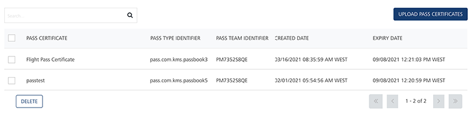

For more details about how to configure passes, refer: [Adding Pass Certificates](../../../../Foundry/vms_console_user_guide/Content/Administration/Pass_Configuration.md)

Adding Templates (push, SMS, email and pass)
--------------------------------------------

A Template is a pre-set layout, which can be used to send campaigns quickly with standardized content to all the targeted customers. There are four channels (sms, email, push and passes) available to send campaign to the customers. In this section Lisa learns how to create templates for all the channels to send campaigns to customers.

### Push Message

Lisa wants to send push messages to customers for their banking transactions. Push messages are received on customer's mobile phones. Typically, a push message can be an alert of an event, which happens with a customer's bank account. The event can be a withdrawal of money from an ATM or a payment from the customer's credit card. It can be also an alert to customer that some payment is due.

Lisa also wants to send one-time password (OTPs) push notifications. Typically Banks send OTPs to combat cyber scams. OTPs are sent to a customer's mobile phone to complete transactions using mobile banking. The OTP is valid for a relatively short period and expires once it is used.

Lisa can use two types of push templates.

*   **Basic Push Message**: The Basic push template does not include an image and a rich text message. Usually basic push template is used for the all kinds of alert messages to customers.
    
    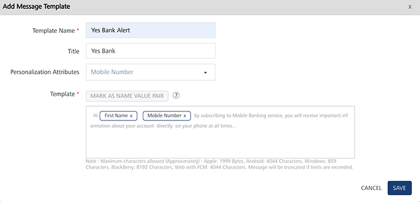
    
*   **Rich Push Message**: The rich push template includes an image with a rich text message content.
    
    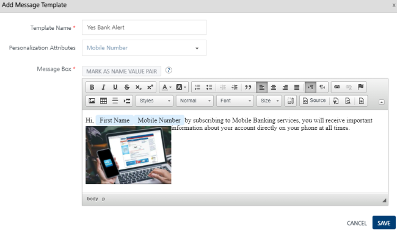
    

For more details about how to create a push template, refer: [Adding Push Template](../../../../Foundry/vms_console_user_guide/Content/Message_Template/Adding_Message_Templates.md)

### SMS Message

SMS is a really simple and accessible way of engaging customers. Usually customers receive text messages on a daily basis and are aware of this notification mechanism. So Lisa feels that SMS is a direct way to communicate the bank alerts to customers. Lisa can use tailor-made SMS message template that are supported by the Engagement server, to cater Yes Bank requirements.

Lisa can send following types of SMS notifications to customers to efficiently manage the bank accounts.

*   Current account balance
*   ATM withdrawal notifications
*   Due payment dates, overdraft alerts

Lisa can use tailor-made SMS message template for Yes Bank.

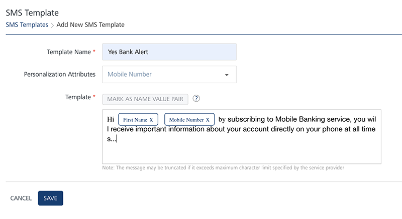

For more details about how to create SMS message template, refer: [Adding SMS Template](../../../../Foundry/vms_console_user_guide/Content/SMS_Template/SMS_Template.md#Adding)

### Email Message

Lisa wants to send banking transaction alerts through emails to those customers who have not registered their mobile number. Lisa can send following types of alerts to banking customers via emails:

  
| Alert Types | Description |
| --- | --- |
| Checking and Saving Alerts | \- Balance in customer cards, such as gift cards |
| Debit Card Alerts | \- ATM cash withdrawals- Declined transactions |
| Credit Card Alerts | \- Payment due or overdue.- Payments scheduled or processed.- Unusual activity with customer's account, such as large cash withdrawal from ATM. |

Lisa can use the tailor-made email message templates to send email alerts to customers.

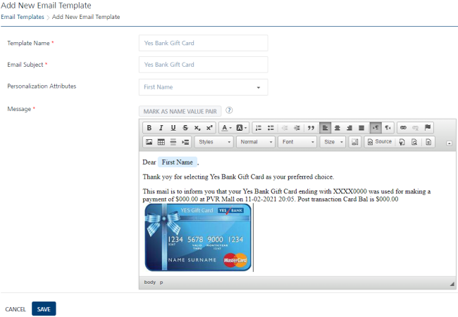

For more details about how to create an email message template, refer [Adding Email Templates](../../../../Foundry/vms_console_user_guide/Content/Email_Template/Email_Template.md#Adding)

### Pass Message (Store Card)

Engagement services offers a powerful platform to promote events through mobile passes. Lisa can send **Store Cards** and connect with lots of iOS users who use Apple to manage their digital passes.

Lisa can deploy new mobile passes to customers by leveraging existing channels like email and SMS and promote new events through store cards. Lisa can also use tailor-made pass templates to send attractive store card updates to customers.

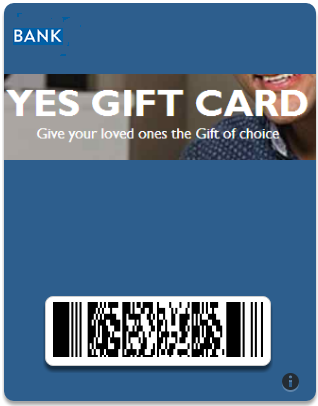

For more details about how to create Pass message template, refer: [Adding Pass Templates](../../../../Foundry/vms_console_user_guide/Content/PassBook_Template/Passbook_Template.md#dding_a_Passbook_Template)

Creating Events
---------------

In this section Lisa learns how to create and send an event to customers. Lisa visits the **Events** page and clicks **Add Event** to open the **Add Event** page. The **Add Event** procedure includes two basic steps:

*   [Event Information](#event-information)
*   [Define Message](#define-message)

### Event Information

Lisa needs to enter following information on the **Add Event** page:

*   **Event ID**: This field displays the system-generated event identification number. Lisa cannot modify the generated event ID.
*   **Name**: Lisa needs to enter a logical name for the event. If Lisa does not enter an event name, the system displays an error message.
*   **Owner**: The field displays an event creator's name. Lisa cannot change the owner details.
*   **Description**: Lisa needs to enter the event description. If Lisa does not enters the description, the system displays an error message.
*   **Event Type**: Lisa needs to select the event type, such as Yes Bank from the Event Type drop-down list.
    
    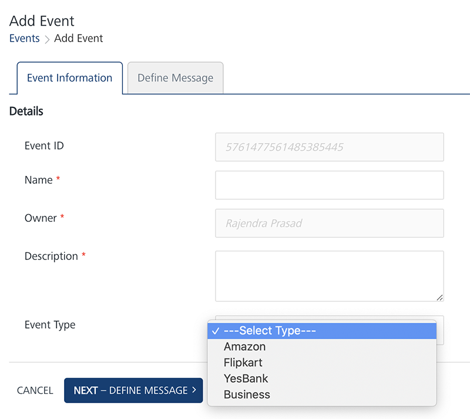
    

### Define Message

Lisa can choose push message, email, SMS or passbook channel to define message text for the **Yes Bank** event.

After selecting a template, Lisa can change the text message without affecting the template. As a result any changes in the template are saved for this event only and does not change the default template. This allows Lisa to use the same template multiple times without worrying about changes from event to event.

To know more about Templates, refer: [Adding Templates (push, SMS, email and pass)](#adding-templates-push-sms-email-and-pass)

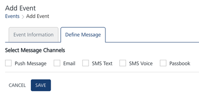

Based on requirement, Lisa can select any channel to send event notifications to bank customers. Lisa can send alert messages, such as ATM transaction to customers through push messages and SMS. Lisa can also introduce to Apple store cards (gift cards) to customers.

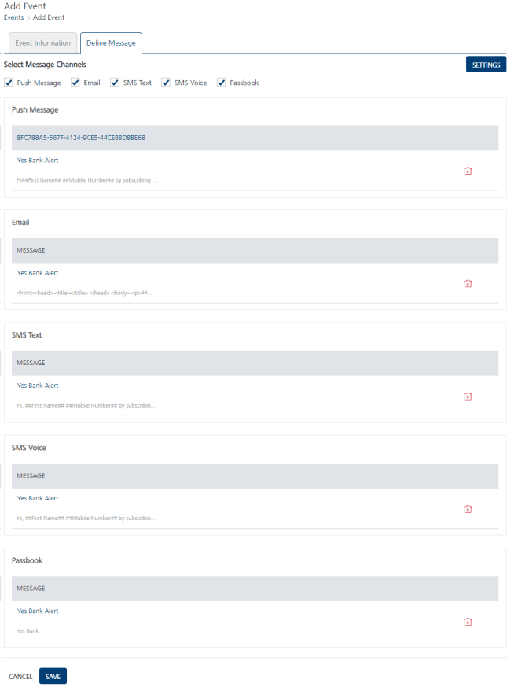

For more details about how to define event messages, refer: [Defining Event Messages](../../../../Foundry/vms_console_user_guide/Content/Events/Adding_an_Event.md#define-message)

  
| Rev | Author | Edits |
| --- | --- | --- |
| 7.3 | AU | AU |
