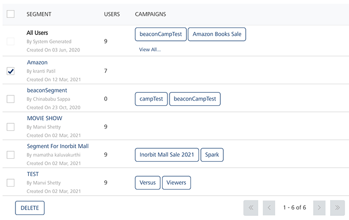

                             

Deleting Segments
=================

As an administrator, you can delete any segment as required. You cannot delete a segment associated with a campaign.

To delete a segment, follow these steps:

1.  Select the check box next to the segment from the list view on the **Segments** page. You can select one segment to delete or all segments to delete.
    
      
    
2.  Click **Delete**.
    
    The **Confirm Delete** dialog box appears, asking if you want to delete the selected segments.
    
3.  Click **Cancel** if you do not want to delete the segment. The system returns to the Segments home page.
4.  Click **OK** to continue.
    
    The system displays a confirmation message that segments not used in any campaign are deleted successfully. The deleted segment is removed from the grid view.
