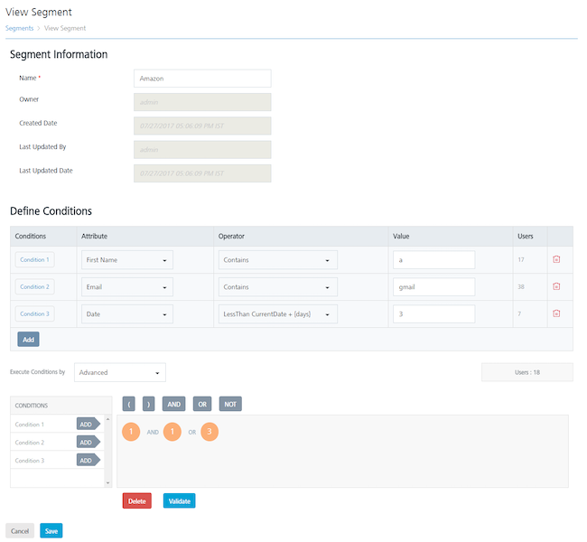

                              

Modifying Segments
==================

You can view and update segments. For example, you may need to modify the name of a segment.

To view or modify a segment, follow these steps:

1.  On the **Segments** page, under the **Segment** column in the list view, click the required segment.
    
    The **View Segment** page appears. The View Segment page includes two sections: **Segment Information** and **Define Conditions**.
    
    
    
    Segment Information
    -------------------
    
2.  Based on your requirement, you can update the following details under the Segment Information section:
    
    | Segment Element | Description | Modification Allowed |
    | --- | --- | --- |
    | Name | The name of the segment. | Yes |
    | Owner | The name of the owner who created the segment. | No |
    | Created Date | The date when the campaign was created. | No |
    | Last Updated By | The name of the resource who last updated the segment. | No |
    | Last Updated Date | The last date when the segment was updated. | No |
    
    Define Conditions
    -----------------
    
3.  You can modify the segment definition if required. For more information about adding users to a segment, see [Adding a Segment.](Adding_a_Segment.md)
4.  Click the **Cancel** button to exit from the window without saving any information. The system displays the **Segments** home page.
5.  Click the **Save** button to update the segment definition.
    
    The updated segment appears in the list view. The system displays the confirmation message that the segment is updated successfully.
