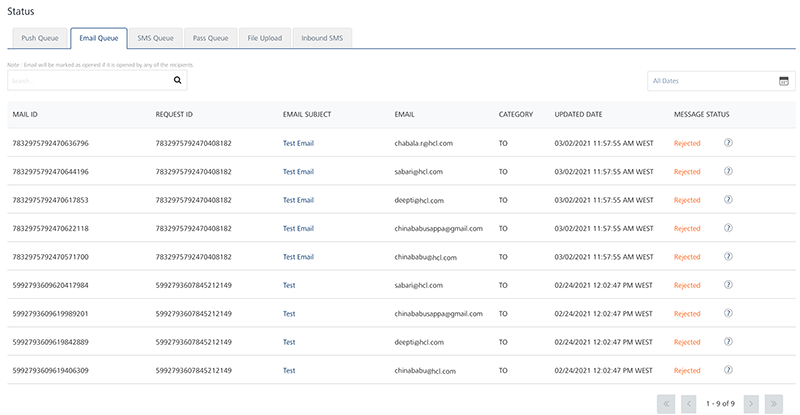
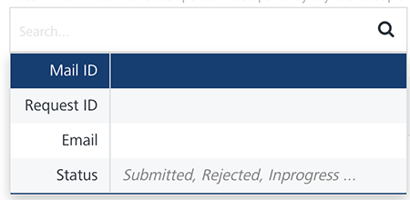
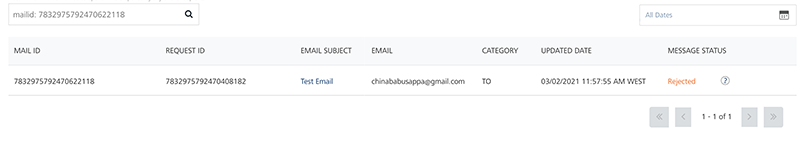
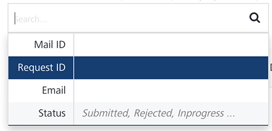
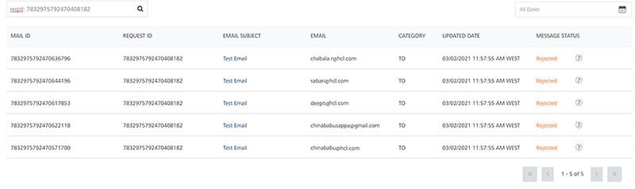
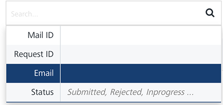
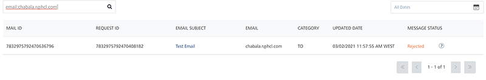
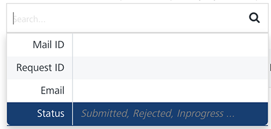
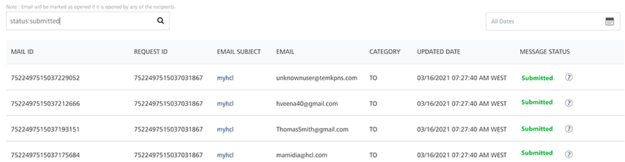

                            

Email Queue
===========

The **Email Queue** page displays the status of an email message for every user subscribed to the email service. The **Status** column displays the message status. Under the **Status** column, hover over an icon next to the **Status** to view more details related to the message status. For example, you can view reasons for the **Undelivered**, **Rejected** and **Cancelled** email messages. For more details, refer [Status Messages](#Status_email).

The **Email Queue** page displays the following details:

*   **All Dates** calendar: To use **All Dates**, see [All Dates](../Dashboard/Dashboard.md#All_Dates)
*   **Search** field: Click in the **Search** field to view options to search an email. You can search email messages based on the following criteria:
    *   **Mail ID**: Enter the mail ID in the **Search** field and click **Enter**.
        
        
        
        The email message appears in the list-view.
        
        
    *   **Request ID**: Enter the **Request ID** in the **Search** field and click **Enter**.
        
          
        
        
        The email message appears in the list-view.
        
        
        
    *   **Email**: Enter the email in the **Search** field and click **Enter.**
        
        
        
        The email message appears in the list-view.
        
        
        
    *   **Status**: Enter the status in the **Search** field such as, **Submitted**, **Rejected** or **In-progress**.
        
        
        
        The email message appears in the list-view.
        
        
        
        > **_Note:_** To clear your search result, click in the **Search** field to view the **Status** page.
        

The **Email Queue** list-view displays the following details:

  
| Email Message Element | Description |
| --- | --- |
| Mail ID | The column displays the unique ID for emails |
| Request ID | The column displays the unique ID assigned to email messages |
| Email Subject |  The column displays the subject for email messages |
| Email | The column displays the email ids of the senders |
| Category | The column displays the category under which the email is sent to the recipients, such as To, Carbon Copy (CC) or Blind Carbon Copy (BCC) |
|  Updated Date | The column displays the time stamp details:- When an email message is updated |
| Message Status | The column displays the current message status |
| Display controls | By default, the number range is set to 20 so that only 20 email messages are displayed in the list-view. You can view more screens by navigating through the forward arrow icon. You can move back through the backward arrow icon. |

*   **Status**: The column displays the current status of the email message. You can use the filter from the **Search** drop-down list to sort the email messages based on the status. The following table explains the status messages:
    
    | Status | Description |
    | --- | --- |
    | **Initial** | The Engagement services initiated the message to be sent to the email subscriber |
    | **Submitted** | The Engagement services sent the message to the email subscriber |
    | **Undelivered** | The Engagement server could not deliver the email since it is already expired. |
    | **Rejected** | The Engagement services tried to send the email message, but it is rejected by the email server |
    | **Cancelled** | The Engagement services did not send the email message as it was cancelled |
    | **Opened** | The email subscriber opened the message sent through the Engagement services |
