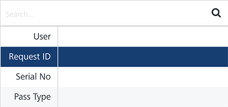
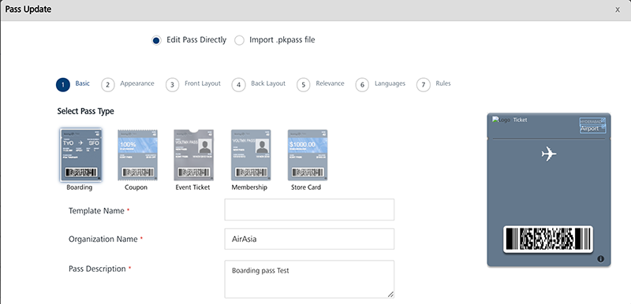

                             

Pass Queue
==========

The **Pass Queue** page displays the status of a pass message for every single subscriber. Click **View All** under the **Pass Status** column to see the status of all passes that are in the system for the selected user. All the passes sent to a user for a pass type with a serial number are grouped and displayed under a single row in the **Pass Status** list-view. For more details refer, [Pass Status](#pass-status).

The **Pass Queue** page displays the following details:

*   **All Dates** calendar: To use All Dates, see [All Dates](../Dashboard/Dashboard.md#All_Dates)
*   **Search** field: Click in the **Search** field to view options to search a pass. You can search passes based on the following criteria:
    *   **User**: Enter the user name in the **Search** field and click **Enter**.
        
        
        
        The pass details appears in the list-view.
        
        
        
    *   **Request ID**: Enter the request ID in the **Search** field and click **Enter**.
        
        
        
        The pass details appears in the list-view.
        
        
        
    *   **Serial No**: Enter the **Serial No**. in the **Search** field and click **Enter**.
        
        
        
        The pass details appears in the list-view.
        
        
        
    *   **Pass Type**: Enter the pass type in the **Search** field and click **Enter**.
        
        
        
        The pass details appears in the list-view.
        
        
        
        > **_Note:_** To clear your search result, click in the **Search** field to view the **Status** page.
        

The **Pass Queue** list view displays the following details:

  
| Pass Element | Description |
| --- | --- |
| User Name | The column displays the user name that attempted to send the pass. |
| Request ID | The column displays the request ID. A request ID is used to retrieve the metadata relating to a pass. |
| Pass Serial Number | The column displays an assigned serial number to a pass. |
| Pass Type | The column displays the different pass types. |
| Pass Status | To view all the status details with respect to a specific pass type, click the **View Al**l link under the **Pass Status** column. |
| Updated Date | The column displays the time stamp details:- When each message is submitted to send- A message is updated |
| Action | The column is used to update a pass status if needed. When you update a pass, you need to update data in a database before sending it to a user. If you try to update the pass that is sent already to the user, the system displays an error message stating that pass is not eligible for the update. |
| Display Controls | By default, only 20 passes are displayed in the list-view. You can view more screens by navigating through the forward arrow icon. You can move back through the backward arrow icon. |

Pass Status
-----------

To view the **Pass Status** for a specific pass serial number, follow these steps:

1.  Click the **View All** link under the **Pass Status** column.
    
    The **Pass Status** window appears.
    
    
    
    The **Pass Status** window displays the following details:
    
    | Pass Status | Description |
    | --- | --- |
    | Pass ID | The unique ID assigned to a pass |
    | Barcode Message |  Barcode encodes the passes' unique ID and allows validation and bars against fraud or unwarranted uses |
    | Channel | You can distribute passes through different channels, such as email, SMS, and the push message. The channel column displays the selected channel type by a user. To view the pass status, based on a channel type, select the required channel type from the drop-down list. If no record is found, then no record found message is displayed |
    | Channel Status | The channel status column displays the current channel status. To know more about the channel status, see [Channel Status](#channel-status) |
    | Pass Status | The pass status column displays the current pass status. |
    
    ### Channel Status
    
    To view the details based on channel status, select the required channel status from the drop-down list. If no record is found, then no record found message is displayed. The following table lists all Channel statuses and corresponding description.
    
    | Status | Description |
    | --- | --- |
    | Initial | Indicates that the Engagement services has initiated the message to be sent |
    | Submitted | Indicates that the Engagement services has sent message to the cloud platform |
    | Queue | Indicates that the Engagement services has sent message but it is in a queue before being acknowledged and accepted by the cloud platform |
    | Queue Full | Indicates that the Engagement services has sent message however the cloud platform is already busy and still waiting for acknowledgment |
    | Undelivered | Indicates that the Engagement services tried sending message but it was undelivered to the cloud platform due to any possible reasons. For example, GCM key was missing for Google cloud |
    | Rejected | Indicates that the Engagement services tried sending message but it was rejected by the cloud platform. For example, GCM key is expired. |
    | Cancelled | Indicates that the Engagement services cancelled the sent message before it reaches the respective cloud platform. |
    | Opened | Indicates that subscriber of the application opened the message sent by the Engagement services |
    | Not Attempted | Indicates that the Engagement services did not try sending the message because no subscribers registered for the chosen application. |
    
    > **_Important:_** The pass is marked as opened:  
    \- If the pass is downloaded from the link given in SMS or email  
    \- If the pass is auto updated on the device by a push message mechanism.  
    If the pass is downloaded from the link given in email or SMS, it is marked as opened but not necessary that the pass is installed.  
    When you download a pass, the pass book prompts to add the pass in the passbook. Based on your choice, you may add the pass to the device.  
    

Pass Update
-----------

Based on a requirement, a user can update the data, such as updating a designated location and time that helps Volt MX Foundry Engagement Services to determine when to send the pass to the end-user's device. If a user updates the data, the pass immediately displays changes to the corresponding fields. You can update a pass only before sending it to a user.

> **_Note:_** You can update only unsent scheduled passes. When you click the update link, a pass eligible for update is loaded on the screen, and you can modify the same.

To update a Pass, follow these steps:

1.  Click the **Update** link under the **Action** column.
    
    The **Pass Update** window appears.
    
    
    
2.  Based on your requirements, update the required fields. For more details, refer [Adding a Passbook Template](../PassBook_Template/Passbook_Template.md#Modifyin).
3.  Click **Cancel** to close the window.
4.  Click **Update** to update the pass details in the database.
    
    System displays the confirmation message that request is queued successfully and the request id for reference is XXXXXXXXXXXXXXXXXXX
    
    > **_Important:_** You cannot process already processed passes.
